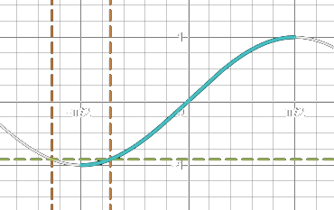
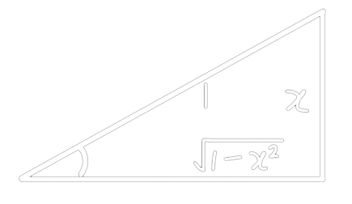

<!-- omit in toc -->
# Table of Contents

- [Number and Sets](#number-and-sets)
    - [(Non)Pos vs (Non)Neg](#nonpos-vs-nonneg)
    - [Set Notation](#set-notation)
    - [Set Category](#set-category)
    - [Absolute Value](#absolute-value)
    - [Punctured Interval](#punctured-interval)
- [Inequality](#inequality)
    - [Rational](#rational)
    - [Absolute](#absolute)
- [Function](#function)
    - [Domain & Range](#domain--range)
    - [Vertical Line Test](#vertical-line-test)
    - [One-to-One Function](#one-to-one-function)
    - [Equality](#equality)
    - [Operation](#operation)
        - [Odd/Even](#oddeven)
        - [Inverse](#inverse)
    - [Composition](#composition)
    - [Exponential](#exponential)
        - [Convert to `exp(x)`](#convert-to-expx)
        - [Inequality](#inequality-1)
    - [Trignometry Example](#trignometry-example)
        - [Solve `sin()`](#solve-sin)
        - [Solve `cos()`](#solve-cos)
        - [Solve `cot()` (or `tan()`)](#solve-cot-or-tan)
        - [Convert Angle Beforehand](#convert-angle-beforehand)
        - [Careful of aTrig Range](#careful-of-atrig-range)
        - [Draw Triangle](#draw-triangle)

# Number and Sets
*(lecture)*
## (Non)Pos vs (Non)Neg
$$\begin{aligned}
    \text{positive: }x\gt0&\quad\text{nonpositive: }x\le0\\
    \text{negative: }x<0&\quad\text{nonnegative: }x\ge0
\end{aligned}$$

## Set Notation
> $S=\{x\in\text{category}|\text{condition}\}$

- $A\cap B=A\text{ and }B$
- $A\cup B=A\text{ or }B$

| Set Notation               | Interval Notation |
| :------------------------- | :---------------: |
| $\{x\in\R\vert a\le x<b\}$ |      $[a,b)$      |
| $\{x\in\R\vert a\le x\}$   |   $[a,\infty)$    |

## Set Category
$$\begin{aligned}
    \R&\quad\text{Real}&&\N&\quad\text{Natural}\\
    \Bbb{Q}&\quad\text{Rational}&&\Bbb{C}&\quad\text{Complex}\\
    \Z&\quad\text{Integers}&&\empty&\quad\text{Empty}\\
\end{aligned}$$

## Absolute Value
> $|a|=\begin{cases}
    a&\text{if }a\ge0\\
    -a&\text{if }a\lt0
\end{cases}$
- distance between 2 real numbers is $\text{dist}(a,b)=|b-a|$
- distance between $P$ and $Q$ is $\text{dist}(P,Q)=\sqrt{(x_1-x_2)^2+(y_1-y_2)^2}$

## Punctured Interval
punctured interval of radius $\delta$ around $a$
|           |              Open              |         Closed          |
| :-------: | :----------------------------: | :---------------------: |
| Geometric | $(a-\delta,a)\cup(a,a+\delta)$ |  $(a-\delta,a+\delta)$  |
| Algebraic | $0\lt\vert x-a\vert\lt\delta$  | $\vert x-a\vert<\delta$ |

# Inequality
*(lecture)*
## Rational
**don't cross multiply**
$$\begin{aligned}
    \frac pq&<\frac rs\\
    \frac pq-\frac rs&<0\\
    \frac{ps-rq}{qs}&<0
\end{aligned}$$
- then find critical points and test values

## Absolute
split $|f(x)|\lt a$ to
- $f(x)\lt a$
- $-a\lt f(x)$

# Function
*(textbook)*
> a function $f$ from a set $A$ to a set $B$ is an assignment $f$ that associates to each element $x$ of the **domain** set $A$ exactly 1 element $f(x)$ of the **codomain** set $B$ 
> $f:A\to B$

## Domain & Range
*(lecture)*
$$f:\R\to\R\text{ defined by }f(x)=x^2\\
\begin{aligned}
 \text{Domain}(f)&=\{x\in\R\}\\
 \text{Range}(f)&=\{y\in\R|y\ge0\}\\
 \text{Codomain}(f)&=\{x\in\R\}\\
\end{aligned}$$
- example
$$f(x)=\frac1{\sqrt{x^2-1}}\\
f(x)\text{ is defined if}\begin{cases}
    \sqrt{x^2-1}&\neq0\\
    x^2-1&\ge0
\end{cases}\Rarr x^2-1\gt0\\
\begin{aligned}
    x^2-1&\gt0\\
    x^2&\gt1\\
    |x|&\gt1\\
    x&\in(-\infty,1)\cup(1,\infty)=\text{Dom}(f)\\
\end{aligned}$$

## Vertical Line Test
> Graph represents a **explicit** function iff every *vertical line* intersects the graph in **at most 1 point**

## One-to-One Function
> $f$ is *one-to-one* if $\forall a,b\in\text{Dom}(f), a\neq b\implies f(a)\neq f(b)$

## Equality
*(lecture)*

<blockquote>
two functions are equal iff

1. $f(x)=g(x)\quad\forall x\in\text{Dom}(f)$
2. $f(x)$ and $g(x)$ are defined on the same domain
</blockquote>

$$\begin{aligned}
    f(x)&=\frac{x^2-1}{x-1}&g(x)&=x+1\\
    \text{Dom}(f)&=\R\setminus\{1\}&\text{Dom}(g)&=\R\\
\end{aligned}\\
\begin{aligned}
    \because&\text{Dom}(f)\neq\text{Dom}(g)\\
    \therefore&f(x)\neq g(x)
\end{aligned}$$

## Operation
### Odd/Even
> even if $f(-x)=f(x)$ 
> odd if $f(-x)=-f(x)$

$$f(x)=x^3+3\\
f(-x)=-x^3-3\neq f(x)\neq-f(x)\\
\therefore\text{neither}$$

### Inverse
<blockquote>

$f$ is inverse of $g$ if 
1. $f\circ g=x\quad\forall x\in\text{Dom}(f)$
2. $g\circ f=x\quad\forall x\in\text{Dom}(g)$

$f$ has an inverse iff $f$ is one-to-one
</blockquote>

to find inverse
1. do $y=f(x)$
2. interchange $x$ and $y$
3. solve for $y$

## Composition
*(lecture)*

> $f\circ g=f(g(x))$ 
> $\text{Dom}(f\circ g)=\{x\in\text{D}_g|g(x)\in\text{D}_f\}$ where $\text{D}_f=\text{Dom}(f)$

## Exponential
*(lecture)*

### Convert to `exp(x)`
$$-2(3^x)=\left(e^{\ln-2}\right)\left(e^{\ln3^x}\right)=-\left(e^{\ln-2}\right)\left(e^{x\ln3}\right)=-e^{\ln2+x\ln3}$$

### Inequality
$$\begin{aligned}
    \ln\left(\frac{x-1}2\right)&\gt0\\
    \frac{x-1}2&\gt1\quad\text{(}f(x)=e^x\text{both side)}\\
    x&\gt3\quad\text{Answer: }x\in(3,\infty)
\end{aligned}$$

## Trignometry Example
*(lecture)*

### Solve `sin()`
$\sin(x)=\textcolor{lime}{\sin(\pm\pi-x)}+2\pi n$
$$\begin{aligned}
    4\sin^2x&=1\\
    4\sin^2x-1&=0\\
    (2\sin x-1)(2\sin x+1)&=0\\
\end{aligned}\\
\,\\
\begin{aligned}
    2\sin x-1&=0&2\sin x+1&=0\\
    2\sin x&=1&\sin x&=-\frac12\\
    \sin x&=\frac12&\sin(-x)&=\frac12\\
    x_1&=\frac\pi6+\textcolor{lime}{2\pi n}&x_1&=-\frac\pi6+\textcolor{lime}{2\pi n}\\
    x_2&=\left(\textcolor{aqua}{\pi-\frac\pi6}\right)+\textcolor{lime}{\textcolor{lime}{2\pi n}}\quad\because\text{odd}&x_2&=\left(\textcolor{aqua}{\frac\pi6-\pi}\right)+\textcolor{lime}{2\pi n}\quad\because\text{odd}
\end{aligned}\\
\begin{aligned}
    \therefore x_1&=\pm\frac\pi6+\textcolor{lime}{2\pi n}\\
    x_2&=\pm\frac{5\pi}6+\textcolor{lime}{2\pi n}\\
    n&\in\Z
\end{aligned}$$

### Solve `cos()`
$\cos(x)=\textcolor{lime}{\cos(-x)}+2\pi n$
$$\begin{aligned}
    \cos x&=\frac{\sqrt3}2\\
    x_1&=\pi/6+\textcolor{lime}{2\pi n}\\
    x_2&=\textcolor{aqua}{-\pi/6}+\textcolor{lime}{2\pi n}\quad\because\text{even}\\
    \therefore x&=\pm\pi/6+\textcolor{lime}{2\pi n},n\in\Z
\end{aligned}$$

### Solve `cot()` (or `tan()`)
$\tan(x)=\textcolor{lime}{\tan(x)+\pi n}$
$$\begin{aligned}
    \sqrt3\cot(3x)+1&=0\\
    \cot(3x)&=-\frac1{\sqrt3}\\
    3x&=\text{atan}(-\sqrt3)+\textcolor{lime}{\pi n},n\in\Z\\
    3x&=\frac{2\pi}3+\textcolor{lime}{\pi n}\\
    x&=\frac{2\pi}9+\frac{\textcolor{lime}{\pi n}}3,n\in\Z
\end{aligned}$$

### Convert Angle Beforehand
$$\begin{aligned}
    \sin\left(-\frac{3\pi}4\right)&=\sin\left(\frac{3\pi}4-\pi\right)=\sin\left(-\frac\pi4\right)\\
    &=-\sin\left(\frac\pi4\right)=\frac{\sqrt2}2
\end{aligned}$$

### Careful of aTrig Range
$$\text{asin}(\sin(-2))=\text{asin}(\sin(2-\pi))=2-\pi\\
\because-2\lt\textcolor{aqua}{-\pi/2}\lt2-\pi$$

### Draw Triangle
$$\cos(\text{asin\,}x)=\sqrt{1-x^2}$$

