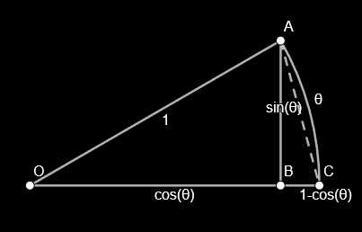

<!-- omit in toc -->
# Continuity
- [Definition](#definition)
- [Proof](#proof)
  - [Continuous at a Point](#continuous-at-a-point)
  - [Continuous on a Domain](#continuous-on-a-domain)
    - [Example ∆](#example-)
    - [Example |a|/2](#example-a2)
- [Continuity of Functions](#continuity-of-functions)
  - [Constant](#constant)
  - [Linear](#linear)
  - [`sin()` (Sandwich)](#sin-sandwich)
  - [Exponential](#exponential)
- [E/IVT](#eivt)
  - [IVT Proof](#ivt-proof)
- [Infimum and Supremum](#infimum-and-supremum)
  - [Axioms](#axioms)
  - [Sup-ε Theorem](#sup-ε-theorem)
  - [Inf-ε Theorem](#inf-ε-theorem)

# Definition
> $f$ is *continuous* at $x=c$ if $\lim\limits_{x\to c}f(x)=f(c)$ 
> $f$ is *left* continuous at $x=c$ if $\lim\limits_{x\to c^-}f(x)=f(c)$  ($c^+$ for *right*)

- *removable discontinuity*
    - $\exists\lim\limits_{x\to c}f(x)\neq f(c)$
- *jump discontinuity*
    - $\exists\lim\limits_{x\to c^-}f(x)\neq\lim\limits_{x\to c^+}f(x)$
- *infinite discontinuity*
    - $\lim\limits_{x\to c^\pm}f(x)=\pm\infty$

# Proof
## Continuous at a Point
1. plugin $a$ in $\lim\limits_{x\to a}f(x)=f(a)$
2. prove $\forall\varepsilon>0\enspace\exist\delta>0\text{ st }|x-a|<\delta\Rarr|f(x)-f(a)|<\varepsilon$

## Continuous on a Domain
1. state $\lim\limits_{x\to a}f(x)=f(a),\;\forall a\in\text{Dom}(f)$
2. prove $\forall\varepsilon>0\enspace\exist\delta>0\text{ st }|x-a|<\delta\Rarr|f(x)-f(a)|<\varepsilon$

### Example ∆
$\lim\limits_{x\to a}x^3=a^3\quad\forall a\in\R$
$$\forall\varepsilon>0\enspace\exist\delta>0\text{ st }|x-a|<\delta\Rarr|x^3-a^3|<\varepsilon$$

- aside
  $$|x^3-a^3|=|x-a||x^2+xa+a^2|\le|x-a|(|x|^2+|x||a|+|a|^2)\\
  \begin{aligned}
    \text{assume }&|x-a|<1\\
    \therefore\;&|x|=|x-a+a|\le|x-a|+|a|<1+|a|\quad(\Delta)\\
  \end{aligned}\\
  \begin{aligned}
      \therefore\;|x|^2+|x||a|+|a|^2&\le(1+|a|)^2+\textcolor{aqua}{|a|(1+|a|)}+\textcolor{lime}{|a|^2}\\
      &<(1+|a|)^2+\textcolor{aqua}{(1+|a|)^2}+\textcolor{lime}{(1+|a|)^2}\\
      &=3(1+|a|)^2\\
  \end{aligned}\\
  \begin{aligned}
      \therefore\;|x-a|(|x|^2+|x||a|+|a|^2)\le|x-a|\cdot3(1+|a|)^2&<\varepsilon\\
      |x-a|&<\frac\varepsilon{3(1+|a|)^2}=\delta
  \end{aligned}$$
- proof
  $$\text{given }\varepsilon>0,\text{ let }\delta=\text{min}\left\{1,\frac\varepsilon{3(1+|a|)^2}\right\}\\
  \begin{aligned}
  \therefore\;|x-a|<\delta\Rarr|x^3-a^3|=|x-a||x^2+xa+a^2|&<3(1+|a|)^2|x-a|\\
  &=3(1+|a|^2)\delta\\
  &=\frac{3\varepsilon(1+|a|)^2}{3(1+|a|)^2}=\varepsilon\quad\blacksquare
  \end{aligned}$$

### Example |a|/2
$\lim\limits_{x\to a}\frac1x=\frac1a$

$$\forall\varepsilon>0\enspace\exist\delta>0\text{ st }|x-a|<\delta\Rarr\left|\frac1x-\frac1a\right|<\varepsilon$$

- aside
  $$\left|\frac1x-\frac1a\right|=\frac{|x-a|}{|x||a|}<\varepsilon\Rarr|x-a|<\varepsilon|x||a|\\
  \begin{aligned}
      \text{assume }|x-a|&<\frac{|a|}2\\
       |x|-|a|\le|x-a|&<\frac{|a|}2\\
       |x|-|a|&<\frac{|a|}2\\
       |x|&<\frac{3|a|}2\\
  \end{aligned}\\
  \therefore\;|x-a|<\varepsilon|x||a|<\frac{3a^2}2\varepsilon=\delta$$
- proof
  $$\text{given }\varepsilon>0,\text{ let }\delta=\text{min}\left\{\frac{|a|}2,\frac{3a^2}2\varepsilon\right\}\\
  \therefore\;|x-a|<\delta\Rarr\left|\frac1x-\frac1a\right|=\frac{|x-a|}{|x||a|}<\frac\delta{|x||a|}<\frac{2\delta}{3a^2}=\frac{2(3a^2/2)\varepsilon}{3a^2}=\varepsilon\quad\blacksquare$$

# Continuity of Functions
## Constant
$\lim\limits_{x\to c}k=k\qquad\forall\varepsilon>0\enspace\exist\delta>0\text{ st }0<|x-c|<\delta\Rarr|k-k|<\varepsilon$

$$\text{given }\varepsilon>0\\|k-k|=0<\varepsilon\quad\blacksquare$$

## Linear
$\lim\limits_{x\to c}(mx+b)=mc+b$

$$\forall\varepsilon>0\enspace\exist\delta>0\text{ st }0<|x-c|<\delta\Rarr|(mx+b)-(mc+b)|<\varepsilon$$

- aside:
  $$\begin{aligned}
      |(mx+b)-(mc+b)|=|m||x-c|&<\varepsilon\\
      |x-c|&<\frac\varepsilon{|m|}=\delta
  \end{aligned}$$
- proof:
  $$\begin{aligned}
      \text{given }\varepsilon>0\text{ let }\delta=\frac\varepsilon{|m|}\\
  \therefore\;0<|x-c|<\delta\Rarr|(mx+b)-(mc+b)|&=|m||x-c|=|m|\delta\\
  &=|m|\frac\varepsilon{|m|}=\varepsilon\quad\blacksquare
  \end{aligned}$$

## `sin()` (Sandwich)
$\lim\limits_{x\to c}\sin x=\sin c$

1. prove $\lim\limits_{\theta\to0}\sin\theta=0$
   $$\begin{aligned}
       \because\;&|\text{arc}AC|=\theta\quad|AB|=\sin\theta\\
       \therefore\;&0\le|AB|\le|\text{arc}AC|\\
       &0\le\sin\theta\le\theta\\
       \therefore\;&\lim\limits_{\theta\to0}0\le\lim\limits_{\theta\to0}\sin\theta\le\lim\limits_{\theta\to0}\theta\\
       &0\le\lim\limits_{\theta\to0}\sin\theta\le0\\
       \therefore\;&\lim\limits_{\theta\to0}\sin\theta=0
   \end{aligned}$$
2. prove $\lim\limits_{\theta\to0}\cos\theta=1$
   $$\begin{aligned}
       \because\;&|AC|^2=|AB|^2+|BC|^2=\sin^2\theta+(1-\cos\theta)^2\\
       \therefore\;&|AC|=\sqrt{\sin^2\theta+(1-\cos\theta)^2}=\sqrt{2-2\cos\theta}\\
       \because\;&0\le|AC|\le\theta\\
       \therefore\;&0\le\sqrt{2-2\cos\theta}\le\theta\\
       &-2\le-2\cos\theta\le\theta^2-2\\
       &1-\frac{\theta^2}2\le\cos\theta\le1\\
       \therefore\;&\lim\limits_{\theta\to0}{1-\frac{\theta^2}2}\le\lim\limits_{\theta\to0}\cos\theta\le\lim\limits_{\theta\to0}1\\
       &1\le\lim\limits_{\theta\to0}\cos\theta\le1\\
       \therefore\;&\lim\limits_{\theta\to0}\cos\theta=1
   \end{aligned}$$
3. prove $\lim\limits_{x\to c}\sin x=\sin c$
   $$\begin{aligned}
       \lim\limits_{x\to c}\sin x&=\lim\limits_{h\to0}\sin(h+c)=\lim\limits_{h\to0}(\sin h\cos c+\sin c\cos h)\\
       &=0\cdot\cos c+\sin c\cdot1=\sin c\quad\blacksquare
   \end{aligned}$$

## Exponential
$\lim\limits_{x\to c}e^x=e^c$
- prerequisite
  $$\begin{aligned}
      \lim\limits_{h\to0}(1+h)^{\frac1h}&=\lim\limits_{n\to\infty}(1+\frac1n)^n=e\\
      \lim\limits_{h\to0}\frac{e^h-1}h&=1
  \end{aligned}$$
- proof
  $$\begin{aligned}
      \lim\limits_{x\to c}e^x&=\lim\limits_{h\to0}e^{h+c}=\lim\limits_{h\to0}e^c\cdot\lim\limits_{h\to0}e^h=e^c\lim\limits_{h\to0}\left(\frac{e^h-1}h\cdot h+1\right)\\
      &=e^c(1\cdot0+1)=e^c\quad\blacksquare
  \end{aligned}$$

# E/IVT

- **E**xtreme **V**alue **T**heorem 
  if $f$ is continuous on $[a,b]\implies\exist M,m\in[a,b]\text{ st }f(M)$ is the *max* value and $f(m)$ is the *min* value of $f(x)$ for $x\in[a,b]$
- **I**nterediate **V**alue **T**heorem 
  if $f$ is continuous on $[a,b]\implies\forall f(a)<K<f(b)\enspace\exist c\in(a,b)\text{ st }f(c)=K$
  - $f$ can change sign at $x=c\text{ iff }\textcolor{aqua}{f(c)=0}\lor \textcolor{lime}{f(c)\text{ DNE}}\lor\textcolor{coral}{f(c)\text{ discontinues}}$

## IVT Proof
$$\text{let }g(x)=f(x)-K\\
\begin{aligned}
    &\therefore\;\forall f(a)<K<f(b)\Rarr\begin{cases}
        g(a)=f(a)-K<0\\
        g(b)=f(b)-K>0
    \end{cases}\\
    &\therefore\;\text{(lemma)}\exist c\in(a,b)\text{ st }g(c)=f(c)-K=0\\
    &\therefore\;f(c)=K\quad\blacksquare\\
\end{aligned}$$

# Infimum and Supremum
- for finite sets
    - $\text{Inf }S=\text{min}\{S_n\}$
    - $\text{Sup }S=\text{max}\{S_n\}$
- for infinite sets
    - $\text{Inf }S=\lim\limits_{n\to-\infty}S_n$
    - $\text{Sup }S=\lim\limits_{n\to\infty}S_n$

## Axioms
> every nonempty set of real numbers that is bounded from above has a Supremum 
> every nonempty set of real numbers that is bounded from below has a Infimum

## Sup-ε Theorem
> let $M=\text{Sup }S$ and $\varepsilon>0\quad\therefore\;\exist s\in S\text{ st }M-\varepsilon<s\le M$

- proof
  $$\begin{aligned}
      &\because\;\text{Sup }S=M\\
      &\therefore\;s\le M
  \end{aligned}\\
  \begin{aligned}
      \text{assume }&\neg\exist s\in S\text{ st }M-\varepsilon<s\\
      \therefore\;&\forall s\in S\enspace s\le M-\varepsilon\\
      \therefore\;&\text{Sup }S=M-\varepsilon\\
      &\text{contradicts the initial assumption that }\text{Sup }S=M\\
      \therefore\;\exist s\in&S\text{ st }M-\varepsilon<s\le M
  \end{aligned}$$

## Inf-ε Theorem
> let $m=\text{Inf }S$ and $\varepsilon>0\quad\therefore\;\exist s\in S\text{ st }m\le s<m+\varepsilon$

- proof
  $$\begin{aligned}
      &\because\;\text{Inf }S=m\\
      &\therefore\;s\ge m
  \end{aligned}\\
  \begin{aligned}
      \text{assume }&\neg\exist s\in S\text{ st }s<m+\varepsilon\\
      \therefore\;&\forall s\in S\enspace m+\varepsilon\le s\\
      \therefore\;&\text{Inf }S=m+\varepsilon\\
      &\text{contradicts the initial assumption that }\text{Inf }S=M\\
      \therefore\;\exist s\in&S\text{ st }m\le s<m+\varepsilon
  \end{aligned}\\
