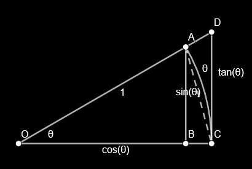

<!-- omit in toc -->
# Limit Laws
- [Basic Laws](#basic-laws)
  - [Constant](#constant)
  - [Addition](#addition)
  - [Reciprocal](#reciprocal)
  - [Application](#application)
    - [Factorise](#factorise)
    - [Sandwich Trig](#sandwich-trig)
    - [Trig Sub](#trig-sub)
- [Sandwich Theorem](#sandwich-theorem)
  - [Application](#application-1)

# Basic Laws
## Constant
$$\lim\limits_{x\to c}kf(x)=k\lim\limits_{x\to c}f(x)$$

## Addition
$$\lim\limits_{x\to c}(f\pm g)=\lim\limits_{x\to c}f(x)+\lim\limits_{x\to c}g(x)=L+M$$

- given
  $$\begin{aligned}
      \lim\limits_{x\to c}f(x)=L\quad&\forall\varepsilon_1>0\enspace\exist\delta_1>0\text{ st }0<|x-c|<\delta_1\Rarr|f(x)-L|<\varepsilon_1\\ 
      \lim\limits_{x\to c}g(x)=M\quad&\forall\varepsilon_2>0\enspace\exist\delta_2>0\text{ st }0<|x-c|<\delta_2\Rarr|g(x)-M|<\varepsilon_2\\
  \end{aligned}$$
- prove
  $$\lim\limits_{x\to c}(f+g)=M+L\\
  \forall\varepsilon>0\enspace\exist\delta>0\text{ st }0<|x-c|<\delta\Rarr|f+g-L-M|<\varepsilon$$
- proof
  $$\text{given }\varepsilon>0,\text{ let }\delta=\text{min}\{\delta_1,\delta_2\},\enspace\varepsilon_1=\varepsilon_2=\varepsilon/2\\ 
  \therefore\;0<|x-c|<\delta\Rarr\\
  +\begin{aligned}
      -\varepsilon/2<f&-L<\varepsilon/2\\ 
      -\varepsilon/2<g&-M<\varepsilon/2\\ 
      -\varepsilon<f+g&-L-M<\varepsilon
  \end{aligned}\\ 
  \therefore\;|f+g-L-M|<\varepsilon\quad\blacksquare$$

## Reciprocal
$$\lim\limits_{x\to c}\frac1g=\frac1{\lim\limits_{x\to c}g}=\frac1M$$

- prove
  $$\forall\varepsilon>0\enspace\exist\delta>0\text{ st }0<|x-c|<\delta\Rarr\left|\frac1g-\frac1M\right|<\varepsilon$$
- aside
  $$\begin{aligned}
      \left|\frac1g-\frac1M\right|=\frac{|g-M|}{|g||M|}<&\varepsilon\\ 
      |g-M|<&|g||M|\varepsilon
    \end{aligned}\\
    \text{choose }\delta_1\text{ st }0<|x-c|<\delta_1\Rarr|g-M|<\frac{|M|}2\\ 
    \begin{aligned}
      \therefore\;|g|-|M|&\le|g-M|<\frac{|M|}2\\ 
      |g|&<\frac{3|M|}2\\ 
      |g-M|&<\frac{3M^2}2\varepsilon
    \end{aligned}\\ 
    \text{choose }\delta_2\text{ st }0<|x-c|<\delta_2\Rarr|g-M|<\frac{3M^2}2\varepsilon$$
- proof
  $$\text{given }\varepsilon>0,\text{ let }\delta=\text{min}\{\delta_1,\delta_2\}\\ 
  \therefore\;0<|x-c|<\delta\Rarr\left|\frac1g-\frac1M\right|=\frac{|g-M|}{|g||M|}<\frac{3M^2\varepsilon}2\cdot\frac2{3|M|}\cdot\frac1{|M|}=\varepsilon\quad\blacksquare$$

## Application
### Factorise
$$\lim\limits_{x\to2}\frac{2-x}{4-x^2}=\lim\limits_{x\to2}\frac{\cancel{2-x}}{\textcolor{aqua}{\cancel{(2-x)}(2+x)}}=\lim\limits_{x\to2}\frac1{2+x}=\frac14$$

$$\lim\limits_{x\to0}\frac{e^{2x}+e^x-2}{e^x-1}=\lim\limits_{x\to0}\frac{\textcolor{aqua}{\cancel{(e^x-1)}(e^x+2)}}{\cancel{e^x-1}}=e^0+2=3$$

### Sandwich Trig
$\lim\limits_{x\to0}(e^x-1)\sin(1/x)$
$$\begin{aligned}
  -1&\le\sin(1/x)\le1\\ 
  -(e^x-1)&\le\textcolor{aqua}{(e^x-1)\sin(1/x)}\le(e^x-1)\\
  \lim\limits_{x\to0}-(e^x-1)&\le\lim\limits_{x\to0}\textcolor{aqua}{(e^x-1)\sin(1/x)}\le\lim\limits_{x\to0}(e^x-1)\\ 
  0&\le\lim\limits_{x\to0}\textcolor{aqua}{(e^x-1)\sin(1/x)}\le0\\ 
  \therefore\;&\lim\limits_{x\to0}(e^x-1)\sin(1/x)=0
\end{aligned}$$

### Trig Sub
$$\lim\limits_{x\to0}\frac{\sin5x}x=5\lim\limits_{x\to0}\frac{\sin5x}{5x}=5\lim\limits_{5x\to0}\frac{\sin5x}{5x}=5$$
$$\lim\limits_{x\to\infty}x\sin(1/x)=\lim\limits_{1/x\to0}\frac{\sin(1/x)}{1/x}=1$$

# Sandwich Theorem
> $$\begin{aligned}&\textcolor{aqua}{\lim\limits_{x\to c}g(x)\le\textcolor{coral}{\lim\limits_{x\to c}f(x)}\le\lim\limits_{x\to c}h(x)}\land\textcolor{lime}{\lim\limits_{x\to c}g(x)=\lim\limits_{x\to c}h(x)=L}\\\implies&\lim\limits_{x\to c}f(x)=L\end{aligned}$$

## Application
$\lim\limits_{x\to0}\frac{\sin x}x=1$

- proof
  $$\begin{aligned}
      \because\;&S_\Delta OAC=\frac{\sin\theta}2\\ 
      &S_\cup OAC=\pi r^2\cdot\frac\theta{2\pi}=\frac\theta2\\ 
      &S_\Delta ODC=\frac{\tan\theta}2\\ 
    \end{aligned}\\ 
    \begin{aligned}
      \therefore\;S_\Delta OAC&\le S_\cup OAC\le S_\Delta ODC\\ 
      \frac{\sin\theta}2&\le\frac\theta2\le\frac{\tan\theta}2\\ 
      1&\le\frac\theta{\sin\theta}\le\frac1{\cos\theta}\\ 
      \cos\theta&\le\frac{\sin\theta}\theta\le1\\ 
      \lim\limits_{\theta\to0}\cos\theta&\le\lim\limits_{\theta\to0}\frac{\sin\theta}\theta\le1\\ 
      1&\le\lim\limits_{\theta\to0}\frac{\sin\theta}\theta\le1\\ 
  \end{aligned}\\ 
  \therefore\;\lim\limits_{\theta\to0}\frac{\sin\theta}\theta=1\quad\blacksquare$$

$\lim\limits_{x\to0}\frac{1-\cos x}x=0$
$$\begin{aligned}
    \lim\limits_{x\to0}\frac{1-\cos x}x&=\lim\limits_{x\to0}\frac{1-\cos^2x}{x(1+\cos x)}=\lim\limits_{x\to0}\frac{\sin^2x}{x(1+\cos x)}\\ 
    &=\lim\limits_{x\to0}\frac{\sin x}x\lim\limits_{x\to0}\frac{\sin x}{1+\cos x}=1\cdot\frac02=0
\end{aligned}$$

