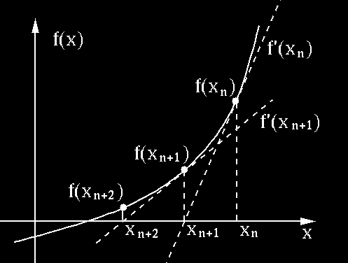
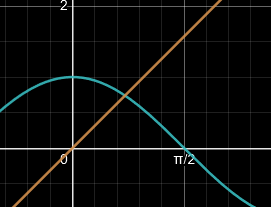
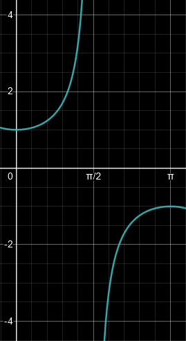
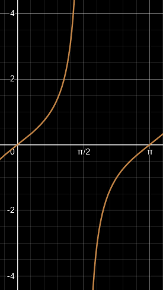

<!-- omit in toc -->
# Table of Contents
- [Definition](#definition)
  - [One-Sided](#one-sided)
  - [Leibniz](#leibniz)
- [Linearisation](#linearisation)
  - [Approximation](#approximation)
  - [Newton's Method](#newtons-method)
    - [Example](#example)
    - [Caution](#caution)
- [Rules](#rules)
  - [Constant](#constant)
  - [Power](#power)
  - [Coefficient](#coefficient)
  - [Sum](#sum)
  - [Product](#product)
  - [Quotient](#quotient)
  - [Chain](#chain)
  - [Implicit](#implicit)
    - [Linearisation](#linearisation-1)
  - [Exponential](#exponential)
  - [Logarithmic](#logarithmic)
  - [Trigonometric](#trigonometric)
    - [ArcTrig](#arctrig)
  - [Hyperbolic](#hyperbolic)
    - [ArcHyp](#archyp)
- [Strategies](#strategies)
  - [Use `ln()` for Factorised](#use-ln-for-factorised)
  - [Double Derivative](#double-derivative)
  - [Piece-wise](#piece-wise)
  - [Root](#root)
  - [(Ab)Use Variables](#abuse-variables)
  - [Simplify Hyperbolic](#simplify-hyperbolic)
  - [Hyp Algebra](#hyp-algebra)
- [Normal Line](#normal-line)

# Definition
> $$f'(x)=\lim\limits_{h\to0}\frac{f(x+h)-f(x)}h=\lim\limits_{x\to a}\frac{f(x)-f(a)}{x-a}$$

- $f'(a)$ exists $\implies f$ is *differentiable* at $x=a\implies f$ is *continuous* at $x=a$

## One-Sided
> $$f'_-(x)=\lim\limits_{h\to0^-}\frac{f(x+h)-f(x)}h\quad f'_+(x)=\lim\limits_{h\to0^+}\frac{f(x+h)-f(x)}h$$

## Leibniz
> given $f(x)$, $x$, $\Delta x$, find $\Delta y$ and $dy$

$$\begin{aligned}
  f'(x)&=\frac{dy}{dx}\approx\frac{\Delta y}{\Delta x}=\frac{f(x+\Delta x)-f(x)}{\Delta x}\\
  \therefore\;\Delta y&=f(x+\Delta x)-f(x)\\
  dy&=f'(x)dx\\
\end{aligned}$$

# Linearisation
> the *tangent line* of $f$ at $x=a$ is
> $$L(x)=f(a)+f'(a)(x-a)$$

## Approximation
- approx $\sqrt{16.1}$
  $$(\sqrt{x})'=\lim\limits_{h\to0}\frac{\sqrt{x+h}-\sqrt x}h=\lim\limits_{h\to0}\frac{x+h-x}{h(\sqrt{x+h}+\sqrt x)}=\frac1{2\sqrt x}\\
  \therefore\;L(x)=\sqrt a+\frac1{2\sqrt a}(x-a)\\
  \text{let }a=16\\
  \therefore\;L(16.1)=4+\frac18(16.1-16)=4.0125$$

## Newton's Method

> $$x_{n+1}=x_n-\frac{f(x_n)}{f'(x_n)}$$

1. choose $x_0$ by **IVT**
2. find $f'(x)$
3. do iterations until accuracy reached

### Example
approx root of $f(x)=x^3-2x-5$ (3 decimals)
1. IVT
   $$\begin{aligned}
       \because\;&f(1)=-6<0\quad f(3)=15>0\\
       \therefore\;&\text{let }x_0=2\in(1,3)
   \end{aligned}$$
2. find derivative
   $$f'=\lim\limits_{h\to0}\frac{f(x+h)-f(x)}h=...=3x^2-2$$
3. iterate (need to find same decimals twice)
   $$\begin{aligned}
       &x_1=x_0-\frac{f(x_0)}{f'(x_0)}=...\approx2.1000\\
       &x_2=x_1-\frac{f(x_1)}{f'(x_1)}=...\approx2.0946\\
       &x_3=x_2-\frac{f(x_2)}{f'(x_2)}=...\approx\textcolor{aqua}{2.0946}
   \end{aligned}$$

### Caution
1. make sure IVT works
2. to choose $x_0$ for $\cos x-x=0$
   - $\cos x=x$ 
     
   - $\because$ intersection in $(0,\pi/2)$  
   - $\therefore$ choose $x_0=1\in(0,\pi/2)$

# Rules

## Constant
> $$\forall c\in\R\quad(c)'=0$$

$$\begin{aligned}
  f(x)&=c\\
  f'(x)&=\lim\limits_{x\to c}\frac{c-c}{x-c}\\
  &=\lim\limits_{x\to c}\frac0{x-c}=0\quad\blacksquare
\end{aligned}$$

## Power
> $$\forall n\in\N\quad (x^n)'=nx^{n-1}$$

$$\begin{aligned}
  (x^n)'&=\lim\limits_{x\to a}\frac{x^n-a^n}{x-a}\\
  &=\lim\limits_{x\to a}\frac{(x-a)(x^{n-1}+x^{n-2}a+x^{n-3}a^2+...+a^{n-1})}{x-a}\\
  &=\lim\limits_{x\to a}(\overbrace{x^{n-1}+x^{n-2}a+x^{n-3}a^2+...+a^{n-1}}^n)\\
  &=x^{n-1}+x^{n-2}x+x^{n-3}x^2+...+x^{n-1}\\
  &=nx^{n-1}\quad\blacksquare
\end{aligned}$$

## Coefficient
> $$(cf)'=cf'$$

$$\begin{aligned}
  (cf)'(x)&=\lim\limits_{x\to a}\frac{cf(x)-cf(a)}{x-a}\\
  &=\lim\limits_{x\to a}c\frac{f(x)-f(a)}{x-a}\\
  &=c\lim\limits_{x\to a}\frac{f(x)-f(a)}{x-a}\\
  &=cf(x)'
\end{aligned}$$

## Sum
> $$(f+g)'=f'+g'$$

$$\begin{aligned}
  (f+g)'(x)&=\lim\limits_{x\to a}\frac{f(x)+g(x)-f(a)-g(a)}{x-a}\\
  &=\lim\limits_{x\to a}\frac{f(x)-f(a)+g(x)-g(a)}{x-a}\\
  &=\lim\limits_{x\to a}\left(\frac{f(x)+f(a)}{x-a}+\frac{g(x)-g(a)}{x-a}\right)\\
  &=\lim\limits_{x\to a}\frac{f(x)-f(a)}{x-a}+\lim\limits_{x\to a}\frac{g(x)-g(a)}{x-a}\\
  &=f'(x)+g'(x)
\end{aligned}$$

## Product
> $$(fg)'=f'g+fg'\\(uvw)'=u'vw+uv'w+uvw'$$

$$\begin{aligned}
  (fg)'(x)&=\lim\limits_{x\to a}\frac{\textcolor{aqua}{f(x)g(x)-f(a)g(a)}}{x-a}\\
  &=\lim\limits_{x\to a}\frac{\textcolor{aqua}{f(x)g(x)}\textcolor{lime}{-f(a)g(x)+f(a)g(x)}\textcolor{aqua}{-f(a)g(a)}}{x-a}\\
  &=\lim\limits_{x\to a}\frac{(f(x)-f(a))g(x)+f(a)(g(x)-g(a))}{x-a}\\
  &=\lim\limits_{x\to a}\frac{f(x)-f(a)}{x-a}\lim\limits_{x\to a}g(x)+\lim\limits_{x\to a}f(a)\lim\limits_{x\to a}\frac{g(x)-g(a)}{x-a}\\
  &=f'(x)g(x)+f(x)g'(x)\quad\blacksquare
\end{aligned}$$

## Quotient
> $$\left(\frac fg\right)'=\frac{f'g-fg'}{g^2}$$

$$\begin{aligned}
  \left(\frac fg\right)'&=\left(f\cdot\frac1g\right)'=\frac{f'}g+f\left(\frac1g\right)'=\frac{f'}g-\frac {fg'}{g^2}=\frac{f'g-fg'}{g^2}
\end{aligned}$$

## Chain
> $$(f\circ u)'=f'(u)u'\quad\frac{df}{dx}=\frac{df}{du}\frac{du}{dx}$$

$$\begin{aligned}
  (f\circ g)'(x)&=\lim\limits_{x\to a}\frac{f(g(x))-f(g(a))}{x-a}\\
  &=\lim\limits_{x\to a}\frac{f(g(x))-f(g(a))}{g(x)-g(a)}\frac{g(x)-g(a)}{x-a}\\
  \because\;&g(x)\text{ is continuous}\\
  \therefore\;&=\lim\limits_{g(x)\to g(a)}\frac{f(g(x))-f(g(a))}{g(x)-g(a)}\lim\limits_{x\to a}\frac{g(x)-g(a)}{x-a}\\
  &=f'(g(x))g'(x)\quad\blacksquare
\end{aligned}$$

## Implicit
> 1. diff each term *in terms of $x$*
> 2. put all $y'$ on one side
> 3. isolate $y'$ (optional)

$$\begin{aligned}
  x^2+xy-y^3&=4\\
  (x^2+xy-y^3)'&=(4)'\\
  2x+y+xy'-3y^2y'&=0\\
  y'(x-3y^2)&=-2x-y\\
  y'&=\frac{2x+y}{3y^2-x}
\end{aligned}$$

### Linearisation
> $$L(x)=b+y'(a,b)(x-a)\quad b=y(a)$$

find tangent lines for $y^2=x^3-4x$ where $x=a=-1$
  1. find $b=y(a)$
  $$\begin{aligned}
    (y(-1))^2&=(-1)^3-4(-1)=3\\
    y(-1)&=\pm\sqrt3=b\\
  \end{aligned}$$
  2. find $y'$
  $$\begin{aligned}
    (y^2)'&=(x^3-4x)'\\
    2yy'&=3x^2-4\\
    y'&=\frac{3x^2-4}{2y}\\
  \end{aligned}$$
  3. find $y'(a,b)$ and $L(x)$
  $$\begin{aligned}
    y'(-1,\sqrt3)&=\frac{3(-1)^2-4}{2\sqrt3}=\frac{-1}{2\sqrt3}\\
    \textcolor{aqua}{L_1(x)}&=\sqrt3-\frac1{2\sqrt3}(x+1)\\
    y'(-1,-\sqrt3)&=\frac{3(-1)^2-4}{-2\sqrt3}=\frac1{2\sqrt3}\\
    \textcolor{aqua}{L_2(x)}&=-\sqrt3+\frac1{2\sqrt3}(x+1)\\
  \end{aligned}$$

## Exponential
> $$(a^u)=(\ln a)a^uu'\quad\textcolor{aqua}{a>0}$$

$$\begin{aligned}
  \because\;&\lim\limits_{h\to0}\frac{e^h-1}h=1\\
  \therefore\;&(e^x)'=\lim\limits_{h\to0}\frac{e^{x+h}-e^x}h=e^x\lim\limits_{h\to0}\frac{e^h-1}h=e^x\quad\blacksquare
\end{aligned}\\
\begin{aligned}
  (a^x)'=(e^{x\ln a})'=e^{x\ln a}(x\ln a)'=(\ln a)a^x
\end{aligned}$$

## Logarithmic
> $$(\log_au)'=\frac{u'}{(\ln a)u}\quad(\ln u)'=(\ln|u|)'=\frac{u'}u\quad\textcolor{aqua}{1\ne a>0}$$

$$\begin{aligned}
  x&=a^{\log_ax}\\
  1&=a^{\log_ax}(\ln a)(\log_ax)'\\
  1&=x\ln a(\log_ax)'\\
  (\log_ax)'&=\frac1{(\ln a)x}
\end{aligned}$$

$$\begin{aligned}
  x&=e^{\ln x}\\
  1&=e^{\ln x}(\ln x)'\\
  1&=x(\ln x)'\\
  (\ln x)'&=\frac 1x
\end{aligned}$$

## Trigonometric
> $$\begin{aligned}
>   (\sin x)'&=\cos x&& (\cos x)'=-\sin x&&(\tan x)'=\sec^2x\\
>  (\csc x)'&=-\csc x\cot x&&(\sec x)'=\sec x\tan x&&(\cot x)'=-\csc^2x\\
> \end{aligned}$$

$$\begin{aligned}
  (\cos x)'&=\lim\limits_{h\to0}\frac{\cos(x+h)-\cos x}h=\lim\limits_{h\to0}\frac{\cos x\cos h-\sin x\sin h-\cos x}h\\
  &=\cos x\lim\limits_{h\to0}\frac{\cos h-1}h-\sin x\lim\limits_{h\to0}\frac{\sin h}h\\
  &=\cos x\cdot0-\sin x\cdot1=-\sin x
\end{aligned}$$

### ArcTrig
> $$\begin{aligned}
>   (\text{asin }u)'&=\frac{u'}{\sqrt{1-u^2}}&&(\text{atan }u)'=\frac{u'}{1+u^2}&&(\text{asec }u)'=\frac{u'}{|u|\sqrt{u^2-1}}\\
>   (\text{acos }u)'&=-(\text{asin }u)'&&(\text{acot }u)'=-(\text{atan }u)'&&(\text{acsc }u)'=-(\text{asec }u)'
> \end{aligned}$$

- $(\arcsin x)'$ (inverse)
  $$\begin{aligned}
    \sin(\text{asin }x)&=x\\
    (\sin(\text{asin }x))'&=1\\
    \cos(\text{asin }x)(\text{asin }x)'&=1\\
    (\text{asin }x)'&=\frac1{\cos(\text{asin }x)}\\
    &=\frac1{\sqrt{1-\sin^2(\text{asin }x)}}\\
    &=\frac1{\sqrt{1-x^2}}
  \end{aligned}$$
- $(\arctan x)'$ (impl)
  $$\begin{aligned}
    y=\text{atan }x\implies x&=\tan y\\
    1&=\sec^2yy'\\
    y'&=\frac1{\sec^2y}=\frac1{1+\tan^2y}=\frac1{1+x^2}
  \end{aligned}$$
- $(\text{arcsec }x)'$ (draw graph)
  |      `sec(x)`       |      `tan(x)`       |
  | :-----------------: | :-----------------: |
  |  |  |

  $$\begin{aligned}
    y=\text{asec }x\implies x=&\sec y,\quad y\in[0,\pi]\setminus\{\pi/2\}\\
    1=&\sec(y)\tan(y)y'\\
    y'=&\frac1{\sec y\tan y}=\frac1{x\tan y}\\
    \because\;\tan^2y=\sec^2y-1\implies\tan y=&\pm\sqrt{\sec^2y-1}\\
    \tan y=&\pm\sqrt{x^2-1}\\
    \therefore\;y\in[0,\pi/2)\Rarr\tan y>0\implies y'=&\frac1{x\sqrt{x^2-1}}\\
    y\in(\pi/2,\pi]\Rarr\tan y<0\implies y'=&\frac1{-x\sqrt{x^2-1}}\\
    \therefore\;y'=&\frac1{|x|\sqrt{x^2-1}}
  \end{aligned}$$

## Hyperbolic
> $$\sinh(x)=\frac{e^x-e^{-x}}2\quad\cosh(x)=\frac{e^x+e^{-x}}2\quad\tanh(x)=\frac{\sinh(x)}{\cosh(x)}\\
> \cosh^2x-\sinh^2x=1\\\,\\
> \begin{aligned}
>  (\sinh x)'&=\cosh(x)&&(\text{csch }x)'=-\text{csch }(x)\text{ coth}(x)\\
>  (\cosh x)'&=\sinh(x)&&(\text{sech }x)'=-\text{sech }(x)\tanh(x)\\
>  (\tanh x)'&=\text{sech}^2(x)&&(\text{coth }x)'=-\text{csch}^2(x)\\
> \end{aligned}$$

- $(\cosh x)'$ (ez)
  $$(\cosh x)'=\left(\frac{e^x+e^{-x}}2\right)'=\frac{e^x-e^{-x}}2=\sinh(x)$$

### ArcHyp
> $$(\text{asinh }u)'=\frac{u'}{\sqrt{u^2+1}}\quad(\text{acosh }u)'=\frac{u'}{\sqrt{u^2-1}}\quad(\text{atanh }u)'=\frac{u'}{1-u^2}$$

- $(\text{asinh }x)'$ inverse, same steps as $(\text{asin }x)'$

# Strategies
## Use `ln()` for Factorised
$$\begin{aligned}
  y&=\frac{\textcolor{aqua}{(x+2)^3}\textcolor{lime}{(x^2-1)^4}}{\textcolor{aqua}{(x+5)}\textcolor{lime}{(x-7)^3}\textcolor{aqua}{(x^2+x+1)^5}}\\
  \ln|y|&=\textcolor{aqua}{3\ln|x+2|}+\textcolor{lime}{4\ln|x^2-1|}-\textcolor{aqua}{\ln|x+5|}-\textcolor{lime}{3\ln|x-7|}-\textcolor{aqua}{5\ln|x^2+x+1|}\\
  \frac{y'}y&=\frac3{x+2}+\frac{4(x^2-1)'}{x^2-1}-\frac1{x+5}-\frac3{x-7}-\frac{5(x^2+x+1)'}{x^2+x+1}\\
  y'&=y\left(\frac3{x+2}+\frac{8x}{x^2-1}-\frac1{x+5}-\frac3{x-7}-\frac{5(2x+1)}{x^2+x+1}\right)
\end{aligned}$$

## Double Derivative
$$\begin{aligned}
  (x+x^2+x^3)''=(1+2x+3x^2)'=2+6x
\end{aligned}$$

## Piece-wise
$$y=\begin{cases}
  x^2& x<1\\
  1+\ln x& x\ge1
\end{cases}$$

1. is $y$ continuous
   - $x^2$ is polynomial
     - $\therefore\;y=x^2$ continuous for $x<1$
   - $\ln x$ is continuous for $x>0$
     - $\therefore\;y=1+\ln x$ is continuous for $x\ge1$
   - $\lim\limits_{x\to1^-}x^2=1;\lim\limits_{x\to1^+}(1+\ln x)=1=y(x)$
     - $\therefore\;y(x)$ is continuous at $x=1$
2. is $y$ diffable
   - $y'(x^-)=2x\implies y'(1^-)=2$
   - $y'(x^+)=1/x\implies y'(1^+)=1$
   - $\therefore\;y'(x^-)\ne y'(x^+)$ 
     $\therefore\;y'(1)\text{ DNE}$
3. conclude
   $$y'=\begin{cases}
     2x&x<1\\
     \text{DNE}&x=1\\
     1/x&x>1
   \end{cases}$$

## Root
$$\begin{aligned}
  y&=\sqrt{x\ln|2^x+1|}\\
  y'&=\frac{(x\ln|\overbrace{2^x+1}^u|)'}{2y}=\frac1{2y}\left(\ln u+\frac{xu'}u\right)\\
  &=\frac{u\ln u+xu'}{2uy}=\frac{u\ln u+x2^x\ln 2}{2uy}\\
  &=\frac{2^x+1\ln(2^x+1)+(\ln 2)2^xx}{2(2^x+1)\sqrt{x\ln(2^x+1)}}
\end{aligned}$$

## (Ab)Use Variables
$$\begin{aligned}
  y&=\sin^2(\cos\sqrt{\text{atan }(yx)})&&A=2\sin(\cos\sqrt{\text{atan }(yx)})\\
  y'&=A(\sin(\cos\sqrt{\text{atan }(yx)}))'&&B=\cos(\cos\sqrt{\text{atan }(yx)})\\
  &=AB(\cos\sqrt{\text{atan }(yx)})'&&C=-\sin\sqrt{\text{atan }(yx)}\\
  &=ABC(\sqrt{\text{atan }(yx)})'&&D=\frac1{2\sqrt{\text{atan }(yx)}}\\
  &=ABCD(\text{atan }(yx))'&&E=\frac1{y^2x^2+1}\\
  &=ABCDE(yx)'&&(yx)'=y'x+y\\
  y'&=ABCDExy'+ABCDEy\\
  &=\frac{ABCDEy}{1-ABCDEx}
\end{aligned}$$

## Simplify Hyperbolic
$$\begin{aligned}
    y&=\sqrt[4]{\frac{1+\tanh x}{1-\tanh x}}\\
    \frac{1+\tanh x}{1-\tanh x}&=\frac{1+\frac{\sinh x}{\cosh x}}{1-\frac{\sinh x}{\cosh x}}=\frac{\cosh x+\sinh x}{\cosh x-\sinh x}=\frac{e^x+e^{-x}+e^x-e^{-x}}{e^x+e^{-x}-e^x+e^{-x}}=e^{2x}\\
    y'&=\left(\sqrt[4]{e^{2x}}\right)'=(e^{x/2})'=\frac{e^{x/2}}2
\end{aligned}$$

## Hyp Algebra
- $\text{asinh }x=\ln(x+\sqrt{x^2+1})$
  $$\begin{aligned}
    \text{asinh }x=y\implies x&=\sinh(y)=\frac{e^y-e^{-y}}2\\
    2x&=e^y-e^{-y}\\
    e^y-2x-e^{-y}&=0\\
    e^{2y}-2xe^y-1&=0\\
    e^y&=\frac{2x\pm\sqrt{4x^2+4}}2=x\pm\sqrt{x^2+1}\\
    \because\;e^y&>0\implies x\pm\sqrt{x^2+1}>0\\
    x&<\sqrt{x^2+1}\\
    \therefore\;e^y&=x+\sqrt{x^2+1}\\
    y&=\ln(x+\sqrt{x^2+1})
  \end{aligned}$$
- if $x=\ln(\sec\theta+\tan\theta)$ then $\sec\theta=\cosh x$
  $$\begin{aligned}
    \cosh x&=\frac{e^x+e^{-x}}2=\frac12\left(e^{\ln(\sec\theta+\tan\theta)}+e^{-\ln(\sec\theta+\tan\theta)}\right)\\ 
    &=\frac12\left(\sec\theta+\tan\theta+\frac1{\sec\theta+\tan\theta}\right)\\ 
    &=\frac12\left(\sec\theta+\tan\theta+\frac{\sec\theta-\tan\theta}{\sec^2\theta-\tan^2\theta}\right)\\ 
    &=\frac12(\sec\theta+\tan\theta+\sec\theta-\tan\theta)\\ 
    &=\sec\theta
  \end{aligned}$$

# Normal Line
> $$y=f(a)-\frac{x-a}{f'(a)}$$