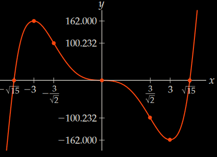

<div id="left">

<!-- omit in toc -->
# Application of Derivative
- [Theorems](#theorems)
    - [Critical Point (CP)](#critical-point-cp)
    - [EVT](#evt)
        - [Extrema](#extrema)
        - [Example](#example)
    - [Rolle](#rolle)
    - [MVT](#mvt)
- [Curve Sketching](#curve-sketching)
    - [Example](#example-1)
    - [Example Slant](#example-slant)
- [L'Hôpital](#lhôpital)

</div>

# Theorems

## Critical Point (CP)
> $x=c$ where $f'(c)=0$ or $f'(c)$ DNE

- critical point means one of the following
    - change *increase/decrease*
        - local/global max
        - local/global min
    - change concave *up/down*
        - inflection point

## EVT
> if $f$ is *continuous on $[a,b]$*, then $f$ **has an abs max and an abs min** at $[a,b]$

### Extrema
<blockquote>

- $\exists\delta>0\enspace\forall x\in(c-\delta,c+\delta)\text{ st }f(c)\ge f(x)\iff$ *local max* at $x=c$
- $\exists\delta>0\enspace\forall x\in(c-\delta,c+\delta)\text{ st }f(c)\le f(x)\iff$ *local min* at $x=c$
</blockquote>

- proof **Fermats Theorem**<br>if *c is local extremum* and *$f'(c)$ exists*, then **$f'(c)=0$** (e.g. max)
    - $f(x)$ has local max at $x=c$ means
      $$\exists\delta>0\enspace\forall x\in(c-\delta,c+\delta)\text{ st }f(c)\ge f(x)$$
    $$\begin{aligned}
        \because\;&\forall x\in[c,c+\delta)\enspace f(x)-f(c)\le0\Rightarrow x-c\ge0\\
        \therefore\;& f'(c^+)=\lim\limits_{x\to c}\frac{f(x)-f(c)}{x-c}\le0\\
        \because\;&\forall x\in(c-\delta,c]\enspace f(x)-f(c)\le0\Rightarrow x-c\le0\\
        \therefore\;&f'(c^-)=\lim\limits_{x\to c}\frac{f(x)-f(c)}{x-c}\le0\\
        \because\;&f'(c)\text{ exists}\\
        \therefore\;&f'(c^-)=f'(c^+)=0=f'(c)\quad\blacksquare
    \end{aligned}$$
### Example
- find abs min and abs max of $f(x)=x^2=27x+1$ at $[-1,6]$
    1. $\because f(x)$ is polynomial
        - $\therefore$ is continuous on $[-1,6]$
        - $\therefore$ has an abs max and an abs min
    2. find cp on $(1,6)$
        - $f'(x)=3x^2-27$
        - $f'(x)=0$<br>
          when $x_1=-3\not\in(-1,6)\quad x_2=3\in(1,6)$
        - $f'(x)$ DNE<br> no such points
    3. compare with bound
        - $f(-1)=-53\\f(3)=27\\f(6)=55$
        - $\therefore$ abs max at $x=6$, abs min at $x=3$
## Rolle
> if $f$ is *continuous on $[a,b]$* and *diffable on $(a,b)$* and *$f(a)=f(b)=0$*, then **$\exists c\in(a,b)\enspace f'(c)=0$**

- proof (EVT)
    - assume diffable on $(a,b)$ and continuous on $[a,b]$
    - $\because f(a)=f(b)$
    - (EVT) $\therefore\exists c\in[a,b]$ st $x=c$ is an absolute extrema
    - $\therefore x=c$ is also a local extrema
    - (Fermat's Theorem) $\therefore f'(c)=0$

## MVT
> if $f$ is *continuous on $[a,b]$* and *diffable on $(a,b)$*, then
> $$\textcolor{#66ccff}{\exists c\in(a,b)\quad\frac{f(b)-f(a)}{b-a}=f'(c)}$$

- proof
  - assume $f$ is cont on $[a,b]$ and diffable on $(a,b)$
  - let $l$ be the secant line from $(a,f(a))$ to $(b,f(b))$
    $$l=\frac{f(b)-f(a)}{b-a}(x-a)+f(a)$$
  - let $g=f-l$  
    $$g=f(x)-\frac{f(b)-f(a)}{b-a}(x-a)+f(a)$$
  - $\because f$ and $l$ are both cont on $[a,b]$ and diffable on $(a,b)$<br>
    $\therefore g$ is cont on $[a,b]$ and diffable on $(a,b)$
  - $\because$
    $$\begin{aligned}
        &g(a)=f(a)-\frac{f(b)-f(a)}{b-a}(a-a)-f(a)=0\\
        &g(b)=f(b)-\frac{f(b)-f(a)}{b-a}(b-a)-f(a)=0\\
    \end{aligned}$$
    (Rolle's) $\therefore\exists c\in(a,b)\quad g'(c)=0$
  - $\because$
    $$\begin{aligned}
        g'&=\left(f(x)-\frac{f(b)-f(a)}{b-a}(x-a)+f(a)\right)'\\
        &=f'(x)-\frac{f(b)-f(a)}{b-a}(1-0)+0\\
        &=f'(x)-\frac{f(b)-f(a)}{b-a}\\
    \end{aligned}$$
    $\therefore$
    $$\begin{aligned}
        g'(c)=0&=f'(c)-\frac{f(b)-f(a)}{b-a}\\
        f'(c)&=\frac{f(b)-f(a)}{b-a}\quad\blacksquare
    \end{aligned}$$

# Curve Sketching
1. $\text{Dom}(f)$
2. *intercepts*
    - when $x=0$, find $f(x)$
    - when $f(x)=0$ find $x$
3. *symmetry*
    - check if $f(-x)=f(x)$ or $f(-x)=-f(x)$
4. asymptotes
    - *VA* approach both side to $a$ where $f(a)$ DNE
    - *SA*
        - $y=mx+b$<br>
          $m=\lim\limits_{x\to\pm\infty}\frac{f(x)}x$<br>
          $b=\lim\limits_{x\to\pm\infty}(f-mx)$
    - (only if $m=0$) *HA* approach to $-\infty$ and $\infty$
    - do $\text{HA}=f(x)$ to see if intersection exists
5. *cp ip*
    - use $f'(x)=0$ to get cps
    - use $f''(x)=0$ to get ips
6. test signs
    - use $f(x)$ to test `+` or `-` on intervals divided by y-int and VA
    - use $f'(x)$ to test `↗` or `↘` (divided by cps)
    - use $f''(x)$ to test `∪` or `∩` (divided by ips)
7. draw graph

## Example
$$\begin{aligned}
    f(x)&=x^5-15x^3=x^3(x-\sqrt{15})(x+\sqrt{15})\\
    f'(x)&=5x^4=5x^2(x+3)(x-3)\\
    f''(x)&=20x^3-90x=10x(\sqrt2x-3)(\sqrt2x+3)
\end{aligned}$$

1. polynomial $\therefore\text{Dom}(f)=\mathbb{R}$
2. $f(x)=0$ when *$x=0$* and *$x=\pm\sqrt{15}\approx\pm3.87$*<br>
   $f(0)=0$
3. $\because f(-x)=(-x)^5-15(-x)^3=-x^5+15x^3=-f(x)$<br>
   $\therefore f(x)$ is odd<br>
   $\therefore$ only need to consider $[0,\infty)$<br>
4. $\because\text{Dom}(f)=\mathbb{R}\quad\therefore$ no VA<br>
   $\because\lim\limits_{x\to\infty}f(x)=\infty\quad\therefore$ no HA<br>
   no SA
5. $f'(x)=0$ when *$x=0$* and *$x=\pm3$*<br>
   $f''(x)=0$ when *$x=0$* and *$x=\pm\frac3{\sqrt2}\approx\pm2.12$*
6. (test values, then) chart
   ```
      0             2.12     3    3.87
   ───┼────────────────────────────┼────────>
      │f(1) < 0                    │f(4) > 0
   f  │             neg            │  pos
   ───┼──────────────────────┼─────┴────────
      │f'(1) < 0             │f(4) > 0      
   f' │          ↘          min      ↗
   ───┼──────────────┼───────┴──────────────
      │f''(1) < 0    │f''(3) > 0
   f''│       ∩      IP          ∪
   ───┴──────────────┴──────────────────────

                              🭿
   0 ─── 2.12 ─── 3 ─── 3.87 ───>
      🭾        🭼     🭿        
   ```
7. draw graph (with left side mirrored)<br>
   

## Example Slant
$$\begin{aligned}
    y&=\sqrt{x^2+4x}=|x|\sqrt{1+4/x}\\
    y'&=\frac{x+2}{\sqrt{x^2+4x}}=\frac{x+2}{\sqrt{x(x+4)}}\\
    y''&=\frac{-4}{(x^2+4x)^{3/2}}=\frac{-4}{(x(x+4))^{3/2}}
\end{aligned}$$

1. $\because x(x+4)\ge0$<br>
   $\therefore\text{Dom}(f)=(-\infty,-4]\cup[0,\infty)$
2. $f(x)=0$ when $x=0$ and $x=-4$<br>
   $f(0)=0$
3. no symmetry
4. no VA<br>
   $\begin{aligned}
       m_1&=\lim\limits_{x\to-\infty}\frac{|x|\sqrt{1+4/x}}x=\lim\limits_{x\to-\infty}\frac{-x\sqrt{1+4/x}}x=-1\\
       b_1&=\lim\limits_{x\to-\infty}(f+x)=\lim\limits_{x\to-\infty}\frac{(f+x)(f-x)}{f-x}=\lim\limits_{x\to-\infty}\frac{4x}{|x|\sqrt{1+4/x}-x}=-2\\
       \text{LSA}&:y=-x-2\\
       m_2&=\lim\limits_{x\to\infty}\frac{|x|\sqrt{1+4/x}}x=\lim\limits_{x\to\infty}\frac{x\sqrt{1+4/x}}x=1\\
       b_2&=\lim\limits_{x\to\infty}(f-x)=\lim\limits_{x\to\infty}\frac{(f-x)(f+x)}{f+x}=\lim\limits_{x\to\infty}\frac{4x}{|x|\sqrt{1+4/x}+x}=2\\
       \text{RSA}&:y=x+2
   \end{aligned}$<br>
   no HA
5. ...
# L'Hôpital
> if $f,g$ are diffable and $g(c)\ne0$
> $$\lim\limits_{x\to c}\frac fg=\lim\limits_{x\to c}\frac{f'}{g'}$$
