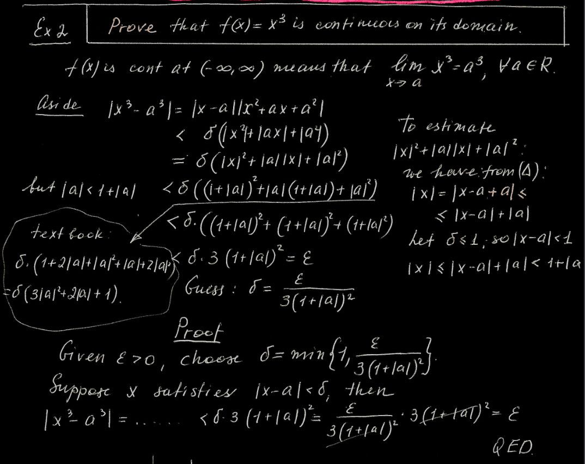
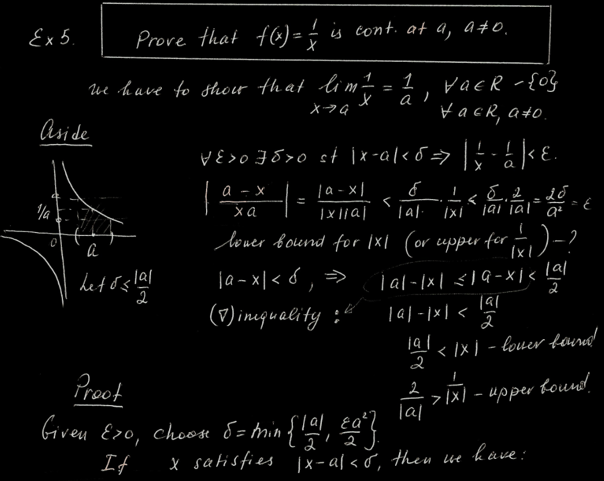

<div id="left">

<!-- omit in toc -->
# Final Review
- [Formulas](#formulas)
  - [Leibniz](#leibniz)
  - [Linearisation](#linearisation)
  - [Newton](#newton)
    - [Caution](#caution)
- [Deriv](#deriv)
  - [Hyperbolic Algebra](#hyperbolic-algebra)
  - [Curve Sketching](#curve-sketching)
  - [Example](#example)
- [Theorems](#theorems)
  - [EVT](#evt)
  - [Rolle](#rolle)
  - [MVT](#mvt)
  - [Infimum and Supremum](#infimum-and-supremum)
    - [Axioms](#axioms)
    - [Sup-ε Theorem](#sup-ε-theorem)
  - [Inf-ε Theorem](#inf-ε-theorem)
- [Cont](#cont)
  - [Exp](#exp)
  - [Sandwich](#sandwich)
  - [Assume x3](#assume-x3)
  - [Frac Upper](#frac-upper)

</div>

# Formulas
## Leibniz
$$\begin{aligned}
  f'(x)&=\frac{dy}{dx}\approx\frac{\Delta y}{\Delta x}=\frac{f(x+\Delta x)-f(x)}{\Delta x}\\
  \therefore\;\Delta y&=f(x+\Delta x)-f(x)\\
  dy&=f'(x)dx\\
\end{aligned}$$

## Linearisation
> $$L(x)=b+y'(a,b)(x-a)\quad b=y(a)$$
- approx $\sqrt{16.1}$
  $$(\sqrt{x})'=\lim\limits_{h\to0}\frac{\sqrt{x+h}-\sqrt x}h=\lim\limits_{h\to0}\frac{x+h-x}{h(\sqrt{x+h}+\sqrt x)}=\frac1{2\sqrt x}\\
  \therefore\;L(x)=\sqrt a+\frac1{2\sqrt a}(x-a)\\
  \text{let }a=16\\
  \therefore\;L(16.1)=4+\frac18(16.1-16)=4.0125$$

## Newton
> $$x_{n+1}=x_n-\frac{f(x_n)}{f'(x_n)}$$

approx root of $f(x)=x^3-2x-5$ (3 decimals)
1. IVT
   $$\begin{aligned}
       \because\;&f(1)=-6<0\quad f(3)=15>0\\
       \therefore\;&\text{let }x_0=2\in(1,3)
   \end{aligned}$$
2. find derivative
   $$f'=\lim\limits_{h\to0}\frac{f(x+h)-f(x)}h=...=3x^2-2$$
3. iterate (need to find same decimals twice)
   $$\begin{aligned}
       &x_1=x_0-\frac{f(x_0)}{f'(x_0)}=...\approx2.1000\\
       &x_2=x_1-\frac{f(x_1)}{f'(x_1)}=...\approx2.0946\\
       &x_3=x_2-\frac{f(x_2)}{f'(x_2)}=...\approx\textcolor{aqua}{2.0946}
   \end{aligned}$$
### Caution
1. make sure IVT works
2. to choose $x_0$ for $\cos x-x=0$
   - $\cos x=x$<br>
     
   - $\because$ intersection in $(0,\pi/2)$
   - $\therefore$ choose $x_0=1\in(0,\pi/2)$

# Deriv
$$\begin{aligned}
  (\sin x)'&=\cos x&& (\cos x)'=-\sin x&&(\tan x)'=\sec^2x\\
 (\csc x)'&=-\csc x\cot x&&(\sec x)'=\sec x\tan x&&(\cot x)'=-\csc^2x\\
\end{aligned}$$
$$\begin{aligned}
  (\text{asin }u)'&=\frac{u'}{\sqrt{1-u^2}}&&(\text{atan }u)'=\frac{u'}{1+u^2}&&(\text{asec }u)'=\frac{u'}{|u|\sqrt{u^2-1}}\\
  (\text{acos }u)'&=-(\text{asin }u)'&&(\text{acot }u)'=-(\text{atan }u)'&&(\text{acsc }u)'=-(\text{asec }u)'
\end{aligned}$$
$$\sinh(x)=\frac{e^x-e^{-x}}2\quad\cosh(x)=\frac{e^x+e^{-x}}2\quad\tanh(x)=\frac{\sinh(x)}{\cosh(x)}\\
\cosh^2x-\sinh^2x=1\\\,\\
\begin{aligned}
 (\sinh x)'&=\cosh(x)&&(\text{csch }x)'=-\text{csch }(x)\text{ coth}(x)\\
 (\cosh x)'&=\sinh(x)&&(\text{sech }x)'=-\text{sech }(x)\tanh(x)\\
 (\tanh x)'&=\text{sech}^2(x)&&(\text{coth }x)'=-\text{csch}^2(x)\\
\end{aligned}$$
$$(\text{asinh }u)'=\frac{u'}{\sqrt{u^2+1}}\quad(\text{acosh }u)'=\frac{u'}{\sqrt{u^2-1}}\quad(\text{atanh }u)'=\frac{u'}{1-u^2}$$

## Hyperbolic Algebra
- $\text{asinh }x=\ln(x+\sqrt{x^2+1})$
  $$\begin{aligned}
    \text{asinh }x=y\implies x&=\sinh(y)=\frac{e^y-e^{-y}}2\\
    2x&=e^y-e^{-y}\\
    e^y-2x-e^{-y}&=0\\
    e^{2y}-2xe^y-1&=0\\
    e^y&=\frac{2x\pm\sqrt{4x^2+4}}2=x\pm\sqrt{x^2+1}\\
    \because\;e^y&>0\implies x\pm\sqrt{x^2+1}>0\\
    x&<\sqrt{x^2+1}\\
    \therefore\;e^y&=x+\sqrt{x^2+1}\\
    y&=\ln(x+\sqrt{x^2+1})
  \end{aligned}$$
- if $x=\ln(\sec\theta+\tan\theta)$ then $\sec\theta=\cosh x$
  $$\begin{aligned}
    \cosh x&=\frac{e^x+e^{-x}}2=\frac12\left(e^{\ln(\sec\theta+\tan\theta)}+e^{-\ln(\sec\theta+\tan\theta)}\right)\\
    &=\frac12\left(\sec\theta+\tan\theta+\frac1{\sec\theta+\tan\theta}\right)\\
    &=\frac12\left(\sec\theta+\tan\theta+\frac{\sec\theta-\tan\theta}{\sec^2\theta-\tan^2\theta}\right)\\
    &=\frac12(\sec\theta+\tan\theta+\sec\theta-\tan\theta)\\
    &=\sec\theta
  \end{aligned}$$
## Curve Sketching
1. $\text{Dom}(f)$
2. *intercepts*
    - when $x=0$, find $f(x)$
    - when $f(x)=0$ find $x$
3. *symmetry*
    - check if $f(-x)=f(x)$ or $f(-x)=-f(x)$
4. asymptotes
    - *VA* approach both side to $a$ where $f(a)$ DNE
    - *SA*
        - $y=mx+b$<br>
          $m=\lim\limits_{x\to\pm\infty}\frac{f(x)}x$<br>
          $b=\lim\limits_{x\to\pm\infty}(f-mx)$
    - (only if $m=0$) *HA* approach to $-\infty$ and $\infty$
    - do $\text{HA}=f(x)$ to see if intersection exists
5. *cp ip*
    - use $f'(x)=0$ to get cps
    - use $f''(x)=0$ to get ips
6. test signs
    - use $f(x)$ to test `+` or `-` on intervals divided by y-int and VA
    - use $f'(x)$ to test `↗` or `↘` (divided by cps)
    - use $f''(x)$ to test `∪` or `∩` (divided by ips)
7. draw graph

## Example
$$\begin{aligned}
    f(x)&=x^5-15x^3=x^3(x-\sqrt{15})(x+\sqrt{15})\\
    f'(x)&=5x^4=5x^2(x+3)(x-3)\\
    f''(x)&=20x^3-90x=10x(\sqrt2x-3)(\sqrt2x+3)
\end{aligned}$$

1. polynomial $\therefore\text{Dom}(f)=\mathbb{R}$
2. $f(x)=0$ when *$x=0$* and *$x=\pm\sqrt{15}\approx\pm3.87$*<br>
   $f(0)=0$
3. $\because f(-x)=(-x)^5-15(-x)^3=-x^5+15x^3=-f(x)$<br>
   $\therefore f(x)$ is odd<br>
   $\therefore$ only need to consider $[0,\infty)$<br>
4. $\because\text{Dom}(f)=\mathbb{R}\quad\therefore$ no VA<br>
   $\because\lim\limits_{x\to\infty}f(x)=\infty\quad\therefore$ no HA<br>
   no SA
5. $f'(x)=0$ when *$x=0$* and *$x=\pm3$*<br>
   $f''(x)=0$ when *$x=0$* and *$x=\pm\frac3{\sqrt2}\approx\pm2.12$*
6. (test values, then) chart
   ```
      0             2.12     3    3.87
   ───┼────────────────────────────┼────────>
      │f(1) < 0                    │f(4) > 0
   f  │             neg            │  pos
   ───┼──────────────────────┼─────┴────────
      │f'(1) < 0             │f(4) > 0
   f' │          ↘          min      ↗
   ───┼──────────────┼───────┴──────────────
      │f''(1) < 0    │f''(3) > 0
   f''│       ∩      IP          ∪
   ───┴──────────────┴──────────────────────

                              🭿
   0 ─── 2.12 ─── 3 ─── 3.87 ───>
      🭾        🭼     🭿
   ```
7. draw graph (with left side mirrored)<br>
   


# Theorems
## EVT
> if $f$ is *continuous on $[a,b]$*, then $f$ **has an abs max and an abs min** at $[a,b]$

## Rolle
> if $f$ is *continuous on $[a,b]$* and *diffable on $(a,b)$* and *$f(a)=f(b)=0$*, then **$\exists c\in(a,b)\enspace f'(c)=0$**

## MVT
> if $f$ is *continuous on $[a,b]$* and *diffable on $(a,b)$*, then
> $$\textcolor{#66ccff}{\exists c\in(a,b)\quad\frac{f(b)-f(a)}{b-a}=f'(c)}$$

## Infimum and Supremum
- for finite sets
    - $\text{Inf }S=\text{min}\{S_n\}$
    - $\text{Sup }S=\text{max}\{S_n\}$
- for infinite sets
    - $\text{Inf }S=\lim\limits_{n\to-\infty}S_n$
    - $\text{Sup }S=\lim\limits_{n\to\infty}S_n$

### Axioms
> every nonempty set of real numbers that is bounded from above has a Supremum<br>
> every nonempty set of real numbers that is bounded from below has a Infimum

### Sup-ε Theorem
> let $M=\text{Sup }S$ and $\varepsilon>0\quad\therefore\;\exist s\in S\text{ st }M-\varepsilon<s\le M$

- proof
  $$\begin{aligned}
      &\because\;\text{Sup }S=M\\
      &\therefore\;s\le M
  \end{aligned}\\
  \begin{aligned}
      \text{assume }&\neg\exist s\in S\text{ st }M-\varepsilon<s\\
      \therefore\;&\forall s\in S\enspace s\le M-\varepsilon\\
      \therefore\;&\text{Sup }S=M-\varepsilon\\
      &\text{contradicts the initial assumption that }\text{Sup }S=M\\
      \therefore\;\exist s\in&S\text{ st }M-\varepsilon<s\le M
  \end{aligned}$$


## Inf-ε Theorem
> let $m=\text{Inf }S$ and $\varepsilon>0\quad\therefore\;\exist s\in S\text{ st }m\le s<m+\varepsilon$

- proof
  $$\begin{aligned}
      &\because\;\text{Inf }S=m\\
      &\therefore\;s\ge m
  \end{aligned}\\
  \begin{aligned}
      \text{assume }&\neg\exist s\in S\text{ st }s<m+\varepsilon\\
      \therefore\;&\forall s\in S\enspace m+\varepsilon\le s\\
      \therefore\;&\text{Inf }S=m+\varepsilon\\
      &\text{contradicts the initial assumption that }\text{Inf }S=M\\
      \therefore\;\exist s\in&S\text{ st }m\le s<m+\varepsilon
  \end{aligned}\\


# Cont

## Exp
$\lim\limits_{x\to c}e^x=e^c$
- prerequisite
  $$\begin{aligned}
      \lim\limits_{h\to0}(1+h)^{\frac1h}&=\lim\limits_{n\to\infty}(1+\frac1n)^n=e\\
      \lim\limits_{h\to0}\frac{e^h-1}h&=1
  \end{aligned}$$
- proof
  $$\begin{aligned}
      \lim\limits_{x\to c}e^x&=\lim\limits_{h\to0}e^{h+c}=\lim\limits_{h\to0}e^c\cdot\lim\limits_{h\to0}e^h=e^c\lim\limits_{h\to0}\left(\frac{e^h-1}h\cdot h+1\right)\\
      &=e^c(1\cdot0+1)=e^c\quad\blacksquare
  \end{aligned}$$

## Sandwich
> $$\begin{aligned}&\textcolor{aqua}{\lim\limits_{x\to c}g(x)\le\textcolor{coral}{\lim\limits_{x\to c}f(x)}\le\lim\limits_{x\to c}h(x)}\land\textcolor{lime}{\lim\limits_{x\to c}g(x)=\lim\limits_{x\to c}h(x)=L}\\\implies&\lim\limits_{x\to c}f(x)=L\end{aligned}$$

## Assume x3


## Frac Upper
