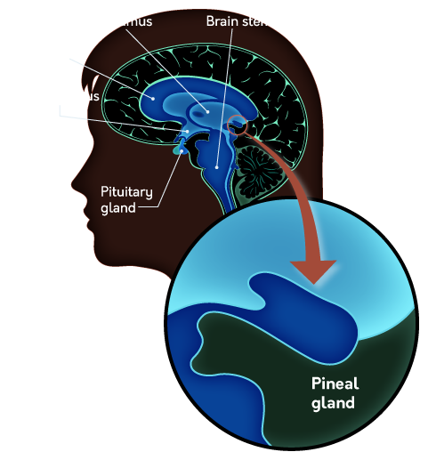

<div id="left">

<!-- omit in toc -->
# What is Psychology
- [Summary](#summary)
- [Introduction](#introduction)
    - [Early Work](#early-work)
    - [Mind, Body, and Behavior](#mind-body-and-behavior)
- [Psychologists](#psychologists)
    - [Basic Research](#basic-research)
    - [Applied Psychology](#applied-psychology)
    - [Clinical Psychology](#clinical-psychology)
- [History](#history)
    - [Influential Themes](#influential-themes)
        - [Nature vs Nurture](#nature-vs-nurture)
        - [Evolutionary Psychology](#evolutionary-psychology)
        - [Mind-Body Connection](#mind-body-connection)
    - [Psychology as a Science](#psychology-as-a-science)
        - [Structuralism](#structuralism)
        - [Functionalism](#functionalism)
        - [Behaviorism](#behaviorism)
        - [Cognitive Revolution](#cognitive-revolution)
    - [Psycholog in the Clinic](#psycholog-in-the-clinic)
        - [Psychoanalysis](#psychoanalysis)
        - [Humanists](#humanists)
- [Modern Approaches](#modern-approaches)
    - [Ultimate and Proximate](#ultimate-and-proximate)
    - [Evolutionary Influences](#evolutionary-influences)
    - [Cultural Influences](#cultural-influences)
    - [Biological Influences](#biological-influences)
    - [Congitive Influences](#congitive-influences)

</div>

# Summary
- Psychology is the scientific study of behavior and mind and is rooted in the disciplines of philosophy and physiology.
- Early philosophers thought that the mind and body were separate, but modern psychologists reject this idea—the mind is understood to be “what the brain does.”
- There are two types of work within psychology: basic and applied. Research (both basic and applied) answers questions about psychology, while applied practice puts those answers to work solving problems in the real world. Clinical practice is a form of applied
- The difference between empiricism and nativism is whether knowledge must be learned or is innate; both are relevant to our understanding of how people understand the world around them.
- The theory of evolution and the concept of natural selection have been very influential in the field of psychology, shaping how we understand the function of the brain.
- Wilhelm Wundt founded the first psychology laboratory at the University of Leipzig in Germany, initiating the formal scientific study of psychology.
- The structuralist movement in psychology sought to break down conscious experience to its most basic elements using systematic introspection, while the functionalist movement preferred to consider psychological processes in terms of their functions.
- William James is considered the “father of American psychology” and helped to widely popularize both psychology and functionalism in North America.
- The behaviorist movement in psychology discounted the study of the mind and mental processes in favor of analyzing only observable behavior; this movement helped refine and improve psychology as a
- The computer helped spark the cognitive revolution in psychology, which was a return to studying mental processes (using computer processing as a metaphor for mental processing).
- Freud made efforts to understand the unconscious mind through psychoanalysis, a method used to treat mental disorders.
- The humanists preferred to consider the treatment of mental illness in terms of helping people become their best selves, contrary to Freud’s darker view of human nature.
- Multiple levels of explanation are often necessary when considering psychological phenomena: Ultimate explanations consider the evolutionary purpose of a phenomenon, functional explanations consider the immediate causes, and process-oriented explanations provide mechanistic explanations (e.g., biological or psychological mechanisms).
- Psychologists today often take an eclectic approach to understanding behavior and mind, applying various perspectives as needed; these perspectives include considering psychological phenomena evolutionarily, culturally, biologically, and cognitively.

# Introduction
> psychology: scientific study of both behavior and mind

## Early Work
- initial thought related to psychology was done by **philosophers** in the philosophy of mind
    - Aristotle introduced the term *tabula rasa* (blank slate) to describe the mind, considering it a place of potential for experience to write upon
- many information was collected by **physiologists**
- because psychology is focused on the *mind* through *behavioral* evidence
    - often considered to be a union of philosophy and physiology
    - many early psychologists attempted to answer the questions asked by philosophers with evidence gathered by physiologists

<blockquote>

- **Pythagorus** believed that "reality" had an underlying mathematical order
- **Earnst Weber** developed *Weber's Law*, which shows that the mind follows a mathematical order
- **Herman Von Ebbinghaus** developed the *forgetting curve*, which links psychology to mathematics
- these early psychological results suggested that the mind works in a way that can be captured in mathematics
    - helped convince others that psychology could be science
</blockquote>

## Mind, Body, and Behavior
- psychology uses **sciencific method**
    - this method is rooted in a philosophical tradition called **empiricism** (view that knowledge arises directly from what we observe and experience)
    - psychology is inherently *observational* in nature
- but psychology is interested in *mind* (contents of conscious experience), which is entirely **unobservable**
    - psychologists use **behavior** to make *inferences* about the mind (how reliable these inferences are is up for debate)
    - **observable behavior** are the primary form of evidence in psychology
- **dualism**: philosophical position that the **mind** and the **body** are separate entities
    - described by 17th century **Rene Descartes**
    - mind is inherently immaterial
    - *reflex*: the body acts without conscious action (without the mind)
        - where conscious movement involves signals from the brain, reflexes are handled entirely by the spinal cord
    - but dualism removes psychology from the realm of scientific inquiry
    - pineal gland (small, pine cone-shaped) 
<blockquote>
<table><thead><tr>
    <th>Aristotle</th>
    <th>Descartes</th>
</tr></thead>
<tbody><tr>
<td>

```
(Humans: Rational Soul
    (Animals: Sensitive Soul
        (Plants: Vegetative Soul
        Reproduction, Growth)
    Mobility, Sensation)
Thought, Reflection)
```
</td><td>

```
mind: spiritual
      ⇃↾
body: physical
```
</td></tr>
<tbody></table>

- Descartes (end 1700s):
    - body is physical, therefore can be studied scientifically
    - animals are only biological machines that reacts to the nature
        - won't feel pain bc they are machines (eg crushed car)
        - vivisection + animal experience
- Galvani (biologist):
    - apply electrical current to a frog leg makes it contracts
    - just like machine
- Broca
    - found **Broca's area** where if damaged, can understand language but can't produce
</blockquote>


# Psychologists
## Basic Research
> attempt to understand the fundamental principles that govern **behavior** and **mind**<br>
> find **causes**

| Fields                  | Focus                                                                                           | Example                                                                            |
| ----------------------- | ----------------------------------------------------------------------------------------------- | ---------------------------------------------------------------------------------- |
| Abnormal                | how and why **unsusal patterns** develop                                                        | how depression might develop after a traumatic event                               |
| Behavioral Genetics     | linking **individual differences** in behavior to genetic factors                               | genetic markers for autism, schizophrenia                                          |
| Congnitive              | how people **process information** in general                                                   | how people transform sensations by the eyes into an understandable image           |
| Comparative             | **non-human animal** behavior, often looking for commonalities with humans                      | if a certain chemical affects eating behavior in mice before studying it in humans |
| Developmental           | how and why behavior changes **across the lifespan**                                            | how childern learn to speak, why memory declines in old age                        |
| Behavioral Neuroscience | linking specific behavior patterns to **physical components in the brain**                      | linking the processing of faces to a specific area of brain cortex                 |
| Personality             | how and why **people differ**, how these differences may influence behavior                     | how extraversion predicts specific behavior patterns                               |
| Social                  | how people understand **themselves and others**, how behavior can be influenced by other people | how and why people are persuaded by an argument                                    |

- reseach should be conducted on a wide variety of individuals
    - otherwise can lead to skewed results

## Applied Psychology
> to solve practical problems by changing behavior (eg resolve mental health, improve workplace efficiency/educational outcome)<br>
> find **solutions**
- divisions (a psychologist can be in many of them)
    - **applied reseach**
        - to discover a new/more efficient way to solve specific problems
    - **applied practice**
        - actual application of techniques to the problems
    - **translational research**
        - to translate basic findings into practical solutions

| Field                           | Focus                                                                     |
| ------------------------------- | ------------------------------------------------------------------------- |
| Consumer Behavior               | the decisions **consumers** make                                          |
| Educational                     | improve learning in various **educational** settings                      |
| Forensic &amp; Legal            | apply psychological principles to features of the **legal** system        |
| Human Factors                   | Design products/processes to improve usefulness or comfort for the people |
| Health                          | improve long-term physical health andh healthcare                         |
| Industrial &amp; Organizational | improve member performance, motivation                                    |
| Political                       | understand the role of psychology in the political process                |
| School                          | improve the academic and social experiences of children in school         |

<blockquote>

- authentic learning
    - what the student does may actually have an impact after the activity
    - make learning more engaging because it continues to exist
</blockquote>

## Clinical Psychology
> identify, prevent, relieve distress or dysfunction that is psychological is origin (basically just applied psy focused on mental health)

- **clinical** psychologists are contrasted with **psychiatrists** (medical doctors focused on the diagnosis and treatment of mental illness)
    - psychiatrists: **have different training**, need to complete medical school, can prescribe medication
    - they work together
- **conseling** psychologists
    - deal with less severe mental illness
    - help people deal with ongoing life problems


# History
## Influential Themes
### Nature vs Nurture
> to what extent is the human experience shaped by nature, and to what extent doesnt the environment play a role?

- opposite of empiricism: **nativism** (some forms of knowledge are innate)
    - aka **biological determinism**
- optical illusions exists even in newly-sighted people: not all knowledge is a result of experience

### Evolutionary Psychology
> **Charles Darwin**: over the course of many generations, traits that tend to be advantageous for survival and reproduction generally spread through a population more easily than not advantageous<br>

- *adaptive* traits tend to spread throughout a population by **natural selection**
    - variations of **phenotypes/genotypes**: different members of a population have all kinds of individual variations
    - many variations are **heritable**
    - **the struggle for existence**: populations can have way more offspring that resources
    - variations in **survival &amp; reproductive rates**
- modes of selections
    - **directional**: from one extreme to another (white moth to black moth)
    - **stablising**: selects the majority (~~light baby~~(too vulnerable) medium baby ~~heavy baby~~(hard to deliver))
    - **disruptive**: favors both ends of spectrum
    - **sexual**: makes themselves attractive to the opposite sex or defeat the same-sex rivals
    - **artifical**: wolf => dog

### Mind-Body Connection
> **phrenology**: study of the shape of the human skull to associate brain areas with specific characteristics, thoughts, or abilities

## Psychology as a Science
### Structuralism
> **Wihelm Wundt**(DEU) established the first psychological lab

- WW(chemist,physicist) wanted to break **mind** down into fundamental pieces: **structuralism**
    - *introspection* was developed by WW to understand mental process by relying on participants' **self-reports**

### Functionalism
> **William James**(USA) thinks understanding of the **function of behavior** or mental process is more important

- introspection got criticised WJ in North America
- func movement was heavily influenced by Darwin ([theory of evolution](#2-evolutionary-psychology))

### Behaviorism
> **John Watson**(USA) suggests the only topic of psychological study is **observable behavior**, and mind is beyond the scope

- introspection get skeptical => not a scientific fashion
- **B.F. Skinner** was one of the leading thinkers in behaviorist psychology
    - studied **operant conditioning**: how behavior can be modified using a system of rewards and punishments

<blockquote>

- **Eugenics** movement was a reflection of a strong bias towards the power of **nature**
</blockquote>

### Cognitive Revolution
> shift away from the strict behaviorism<br>
> invention of computer was part of the motivation

- **cognitive**: algorithms of the mind
- **neuroscience**: hardware of the mind
- **behavior**: actions supported by the mind


## Psycholog in the Clinic
### Psychoanalysis
> **Sigmund Freud** developed *psychoanalysis* that seeks to help clients gain more insight into their **unconscious** thought, behaviors, and motivations

- focus on unconscious urges related to sexual frustration and aggression

### Humanists
> **Carl Rogers** and **Abraham Maslonw** respond to Freud's dark view of the human condition: **humanistic** psychology proposes that people have free will and the capacity to realise their own potential

- focus an positive aspects of the human condition (eg creativity, choice)

# Modern Approaches
> clinics use the *eclectic approach*: use different therapeutic approaches based on their effectiveness for the current situation

## Ultimate and Proximate
> there are mulitple ways to explain a psy phenomenon

- levels of explanation:
    - **ultimate**: *why* a psy phe occurs by appealing to its role in the process of evolution<br>eg baby cries ==(evolutionary role)=> signal to caregivers
    - **proximate**: describe an *immediate* cause:
        - **functional**: identify a specific problem as the cause<br>eg get a caregiver to provide food
        - **process-oriented**: how a specific mental/physical process explains a psy phe<br>eg experience of fear => tears in the eyes
- U and P explanations and **complementary** as they explain different aspects of the same phe
    - not all phe are products of evolutions

## Evolutionary Influences
- not everything can be explained with evolution
    - how does helping someone else (altruism) improve your own survibility
- evolutionary psychologists' claims are hard to verify because it's difficult to know **exactly what happened in the past**

## Cultural Influences
> **culture**: shared set of beliefs, attitudes, behaviors, and customs belonging to a specific group of people

- early work on cultural influences focused on finding **psychological universals** that exist across cultures
- **intersectional approach**: how multiple social identities intresect at the level of the individual person to alter their experiences

## Biological Influences
> [process-oriented](#1-ultimate-and-proximate) explanations are typically **biological** (descriptions of the physical processes to explain a psychological process)

## Congitive Influences
> primarily *process-oriented* expls about mental processes

- psychologists investigate the role of **informamtion processing** on a situation