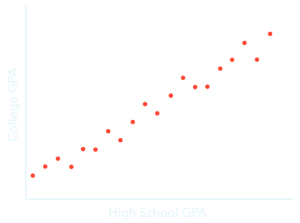
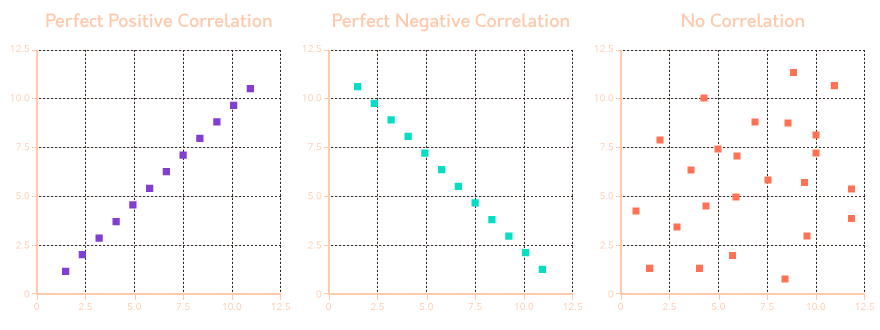

<div id="left">

<!-- omit in toc -->
# Methods
- [Summary](#summary)
- [Introduction](#introduction)
- [The Scientific Method](#the-scientific-method)
- [Descriptive Methods](#descriptive-methods)
    - [Naturalistic Observation](#naturalistic-observation)
    - [Participant Observation](#participant-observation)
    - [Case Study](#case-study)
    - [Surveys](#surveys)
- [Research Ethics for Human](#research-ethics-for-human)
    - [The Tuskegee Syphilis Study](#the-tuskegee-syphilis-study)
    - [General Ethical Principles](#general-ethical-principles)
        - [Beneficece and Non-maleficence](#beneficece-and-non-maleficence)
        - [Fidelity and Responisbility](#fidelity-and-responisbility)
        - [Integrity](#integrity)
        - [Justice](#justice)
        - [Respect Rights and Dignity](#respect-rights-and-dignity)
    - [Practice of Ethical Research](#practice-of-ethical-research)
        - [The FB Emotional Contagion Experiment](#the-fb-emotional-contagion-experiment)
    - [Special Ethical Considerations](#special-ethical-considerations)
        - [Vulnerable Populations](#vulnerable-populations)
        - [Deception](#deception)
- [Correlation](#correlation)
    - [Direction](#direction)
    - [Strength](#strength)
    - [Misleading](#misleading)
- [Experimental Methods](#experimental-methods)
    - [Hypothesis](#hypothesis)
    - [Experimental Variables](#experimental-variables)
    - [Sample Selection](#sample-selection)
    - [Experimental/Control Groups](#experimentalcontrol-groups)
    - [In/External Validity](#inexternal-validity)
- [Making Sense of the Data](#making-sense-of-the-data)
    - [Central Tendency](#central-tendency)
    - [Spread of Data](#spread-of-data)
    - [Inferential Statistics](#inferential-statistics)
    - [Drawing Conclusions](#drawing-conclusions)

</div>

# Summary

- The steps of the scientific method are (1) identifying the problem, (2) gathering information, (3) generating a hypothesis, (4) designing and conducting experiments, (5) analyzing data and formulating conclusions, and (6) restarting the process at step 3 by taking what you’ve learned into consideration.
- The difference between naturalistic and participant observation is whether the researcher is a part of the environment while making their observations about it.
- Bias can appear in observational research in many ways, including when participants change their behavior in response to being observed (known as <em>reactivity </em>or the <em>Hawthorne effect</em>) and when multiple observers disagree about what they’ve observed.
- Case studies are an in-depth way to gather a large amount of detailed information about a single person or a handful of individuals; however, case studies may not be generalizable to larger populations.
- Populations need to be sampled effectively, preferably using random sampling techniques; sampling error/bias can occur when the people who participate in a study are not representative of the intended population.
- The way people respond to questions in research studies is influenced by multiple factors, including but not limited to the wording of questions, the desire to answer in socially desirable ways, a general tendency to agree or say yes to questions, and a tendency to think of ourselves as better than average.
- Five ethical principles have been developed by the American Psychological Association (APA) to guide research with human subjects: (1) beneficence and nonmaleficence, (2) fidelity and responsibility, (3) integrity, (4) justice, and (5) respect for people’s rights and dignity.
- Ethical research in psychology should strive to have the most potential benefits to society with the fewest potential harms, not take advantage of participants, and be truthful with both participants in the study and the wider scientific community.
- Vulnerable populations (including those with impaired decision-making skills and those who are vulnerable by virtue of their circumstances) must be treated with particular care; informed consent is especially important in these groups.
- Deception in psychological research is only warranted in special circumstances, and participants must be fully debriefed about any deception that occurred after they finish participating in the study.
- A correlation describes the relationship between two or more variables and can be positive, negative, or zero (unrelated).
- Correlations have both strength and direction; strength describes how closely two variables are related, while direction describes whether the variables increase and decrease together (a positive relationship) or are inversely related, meaning that if one increases the other variable decreases (a negative relationship).
- Correlation coefficients are calculated to describe the strength and direction of a correlation.
- Correlation is not the same as causation: At times, correlation coefficients are misleading or confounding variables can make two variables appear causally related when they, in fact, are not.
- Experiments are conducted to determine whether manipulating an independent variable causes changes in a measured dependent variable.
- Independent variables are manipulated by researchers (resulting in “experimental” and “control” groups), while changes in a dependent variable or “outcome measure” represent the effect of the researchers’ manipulation.
- Placebo effects can occur if a person believes in a cause-and-effect relationship; these effects represent the power of participants’ expectations in an experimental setting and can be mitigated by the use of placebo groups.
- Internal validity exists in an experiment when a cause-and-effect relationship can be established; extraneous (confounding) variables threaten our ability to claim that an independent variable causes a change in a dependent variable.
- External validity describes the extent to which the results of an experiment are generalizable to other people, other settings, other time periods, or other contexts.
- Descriptive statistics are used when we want to report on our results descriptively: Measures of central tendency (e.g., mean, median, and mode) attempt to find a number that best represents the data, while measures of variability (e.g., standard deviation and variance) help describe the distribution or “spread” of the data.
- The mean is the average score in a data sample, the median is the “middle” score if the scores were rank-ordered from lowest to highest, and the mode is the most common score.
- Standard deviation describes the average distance from the mean score in a data set; this helps us understand whether scores are all very close to the mean or more spread out.
- Inferential statistics allow us to make inferences about whether differences exist between two (or more) sets of data; for example, whether or not a true difference is likely to exist between experimental and control groups. Such differences could be statistically significant depending on the results of the analyses used on the data.

# Introduction
> psychologists had few methods other than *logic and reasoning* (**rationalism**)<br>
> now, using experimental methods, researchers gather facts and observations of phenomena to form *scientific theroies* (rational explanations to describe and predict future behavior)

# The Scientific Method
> common approach is which researchers methodologically answer questions

1. identify the problem
2. gather information
3. generate a hypothesis<br>(the predicted outcome of an experiment or research study)
4. design and conduct experiments
5. analyze data and formulate conclusions
6. restart the process

# Descriptive Methods
> any means to capture, report, record, or *describe* a group<br>
> interested in identifying "*what is*", without necessarily understanding "*why it is*"

## Naturalistic Observation
> observation of behavior as it happens in an natural environment<br>
> in the scientific process, it suggests potentially interest

- differences
    - **naturalistic** observation: lack of manipulation
    - **field** experiments: manipulates and controls the conditions in natural settings
- can be captured
    - **qualitatively** (collect opinions, notes)
    - **quantitatively** (measure/count specific behaviors)
- benefit
    - can often help generate new ideas about an observed phenomeon
    - better understand behavior exactly as it happens in the real world
    - *ecologically valid*: product of genuine reactions
- disadvantage: lack control over the environment
    - not always sure of *what* is influencing behavior
- important: stay as unobstrusive as possible
    - behavior changes once they realise they are being observed: **reactivity** aka *Hawthorne effect*

## Participant Observation
> researcher becomes part of the group under investigation

- benefit
    - research is privy to new perspectives and insights that would not be obtainable from naturalistic observation
- drawbacks
    - validity: researcher's views and bias can affect the interpretation of events
    - reliablity: highly dependant on the unique conditions of participation

## Case Study
> in-depth analysis of a unique circumstance or individual

- con: generalise
    - can never be sure the conclusions draw from this particular case can be broadly generalised to other cases

## Surveys
> using questions to collect information on how people think or act

- conducted to a *sample* (subset of *population*)
- biases
    - the questions must be carefully worded to avoid biasing the outcome, otherwise will cause *wording effects*
    - **response bias**: tendency for people to answer the question the way they feel they are expected to answer
        - **acquiescent response bias**: indiscriminately agree regardless of their actual opinion
        - **socially desirable bias**: answer questions that they believe would be seen as acceptable by others
        - **illusory superiority**: describe our own behavior as better than average
        - **volunteer bias**: only a motivated fraction of population respond to a survey or participate in research

# Research Ethics for Human
> set of principles or standards of behavior for psychologists to follow in research

## The Tuskegee Syphilis Study
> was intended to follow the natural progression of syphilis(a contagious desease)

- researchers
    - misled participants about the actual purpose of the study
    - denied medical treatment

## General Ethical Principles
> developed by APA

### Beneficece and Non-maleficence
> research should to good(beneficence) and avoid creating experiments that can intentionally harm(maleficence) participants

- psychologists must carefully weigh the benefits of the reseach against the costs that participants may experience

### Fidelity and Responisbility
> researchers should be honest and reliable with participants

- let participants know ahead of time the potential risks of participation

### Integrity
> psychologists should engage in accurate, honest, and non-biased practices

- always communicate results to colleagues and the public accurately
    - no making up data (fdabrication)
    - no manipulating research data (falsification)

### Justice
> the people who participate in the research process should also be the same people who stand to benefit from the reseach outcomes

- eg study on child development should only include children
    - "child" is an **inclusion criterion**(attribute of participants that is necessary to be a part of research study)
    - "adult" is an **exclusion criterion**
- inclusion + exclusion = **eligibility criteria**

### Respect Rights and Dignity
> should respect and protect participants' rights, privacy, and welfare

- communicate openly and honestly abuot the details before asking for consent
- respect privacyand confidentiality
- keep data private/anonymous
- no coercion

## Practice of Ethical Research
> research projects conducted in the USA must be review by *Instutional Review Broad* (IRB)

- IRB ensures
    - proposed study will use sound research design
    - risks associated with participation in the study are minimised and reasonable
    - benefits of the research outweigh any potential risks
    - all participants can make an informed decision to participate in the study, and that decision may be withdrown at any time without consequence to the participant
    - safeguards are in place to protect the well-being of participants
    - all data collected will be kept private and confidential
- after IRB approval, reseachers must obtain *informed consent* from all participants by describing essential details of the study
    - experimental procedures
    - risks
    - benefits associated with participation in the study
    - how personal information will be protected
    - rights of participants

### The FB Emotional Contagion Experiment
> Facebook users participated in psychology reseach without informed consent: violates **respect for people's rights and dignity**

## Special Ethical Considerations
### Vulnerable Populations
> any group of individuals who may not be able to provide free and informed consent to participate in reseach

- vulnerable populations
    - **decisional impairment**: participant has diminished capacity to provide informed consent
        - mentally disabled children
    - **situational vulnerability**: the freedom of 'choice' to participate in reseach is compromised as a result of undue influence from another source
        - prisoners may feel coerced/obigated to participate out of fear of being punished if they do not
        - people who need money may be inclined to participate
- then, reseacher should consider
    - if the research question could be reasonably carried out using participants without these vulnerabilites, no study should ever be conducted on vulnerable populations
    - when research is carried out with vulnerable populations, researchers should be responsive to the needs, conditions, and priorities of these individuals
    - *decisional impairment*: requires
        1. parents and guardians must provide informed consent on behalf of the participant
        2. the participant must provide **assent** (affirmation permission to take part in the study)
    - *situational vulnerbility*: additional safeguards should be put in place to prevent exploitation
        - eg include an impartial 3rd party to advocate for the individuals

### Deception
> some reseach experiments may seek IRB approval to engage in participant **deception**: withhold information abuot the purpose and procedures of the study during the informed consent process

- to get approve:
    - reseach poses no more than a minimal risk to participants
        - => unlikely to cause emotional or physical discomfort to participants
    - deception doesn't affect the well-being and the rights of the participants throughout the study
    - must provide justification that using deception is the only way to conduct the study
    - after the participant's role in the study is finished, participants should be **debriefed** by reseachers
        - must be told about the deception
        - must be given reasons why this was necessary
        - must be allowed to ask questions and seek clarification
        - to leave the study in a similar mental state as to when they entered the study

# Correlation
> `-1 <= r <= 1` captures the direction and strength of a relationship between variables

one way to represent relationship between variables is **scatterplot**
- if the graph cluster tightly together: strong


## Direction

- **positive correlation**: `r > 0`
    - **neg**:  `r < 0`
- **zero correlation**: no correlation `r == 0`
- **line of best fit**: a straight line through the points

## Strength
> perfect correlation: `abs(r) == 1`

## Misleading
> correlations are not causation
- a 3rd variable may influence one or both variable that we are measuring, therefore influencing the correlation coefficient

# Experimental Methods
## Hypothesis
> prediction about what will happen in research in format of
```py
f'if {do_this}, then {this} will happen'
```
- **consistent** with prior observations or an existing theory
- as **simple** as possible, only cause-and-effect relationship between **2** variables
- **specific**, provied all the details about what to measure, what changes will be made, what effect is expected
- **testable**, state what evidence will be measured and use as a comparasion
- **falsifiable**, have outcomes that could prove the hypothesis false

## Experimental Variables
> manipulate *independent* variable (IV) and measure *dependent* variable (DV)<br>
> *extraneous/confounding* variable is not the focus of study, but may influence the outcomes

## Sample Selection
> select people for experimental and control groups

- *simple* random sample
    - every individual in the population has an equal change of participating
    - if large enough, should approximate the population we wish to study
- *stratified* random sample
    - divide the population by *subgroups*, randomly takes samples in proportion to the population of interest
    - eg subgroup by gender
- *non-random/convenience* sample
    - group of individuals that are only selected because of a *pre-existing condition*

## Experimental/Control Groups
> *experimental* group receives the treatment of interest, the *control* group doesn't

## In/External Validity
> *external* validity is how the result can be applied **beyond** the scope of the experiment, ake *generalisation*

# Making Sense of the Data
## Central Tendency
> *descriptive statistics*: collection of ways to describe the data using quantitative values

- types of central tendency (single point to describe the center)
    - mean (average)
    - median (middle)
    - mode (most frequent)
## Spread of Data
> *variability/range*: `max - min`<br>
> *standard derivation (SD)*: $\sigma$

$$\sigma=\sqrt{\frac{\sum(x-\bar x)^2}{n-1}}$$

| Formula            | Name       |
| ------------------ | ---------- |
| $x-\bar x$         | derivation |
| $\sum(x-\bar x)^2$ | variance   |

## Inferential Statistics
> if the probability `p < 0.05`, it is *unlikely* to happen

## Drawing Conclusions
> reject the *null hypothesis* when `p < 0.05`