

<!-- omit in toc -->
# Biology And Neuroscience
- [Summary](#summary)
- [Intro](#intro)
- [Cells](#cells)
    - [Neurons](#neurons)
        - [Dendrites Receives](#dendrites-receives)
        - [Soma + Axon Send](#soma--axon-send)
    - [Action Potential](#action-potential)
    - [NT and Receptors](#nt-and-receptors)
        - [Drugs](#drugs)
    - [Glial Cells](#glial-cells)
- [Anatomy](#anatomy)
    - [CNS vs PNS](#cns-vs-pns)
        - [PNS](#pns)
- [Central Command Center](#central-command-center)
    - [Life Functions/Reflexes](#life-functionsreflexes)
        - [Medulla](#medulla)
        - [Reticular Activating System](#reticular-activating-system)
    - [Coordinators](#coordinators)
        - [Limbic System](#limbic-system)
        - [Coordinating Movement](#coordinating-movement)
        - [Thalamus](#thalamus)
    - [Neocortex (High-Level)](#neocortex-high-level)
        - [Frontal Lobes](#frontal-lobes)
        - [Parietal Lobes](#parietal-lobes)
        - [Temporal Lobes](#temporal-lobes)
        - [Occipital Lobes](#occipital-lobes)
        - [Brain Laterality](#brain-laterality)
        - [Corpus Callosum](#corpus-callosum)
- [Endocrine System](#endocrine-system)
    - [HPA Axis and Stress](#hpa-axis-and-stress)
- [Research Methods in Neuroscience](#research-methods-in-neuroscience)
    - [What Want to Know?](#what-want-to-know)
        - [How Developed Current Methods](#how-developed-current-methods)
    - [Whan Can Be Measured](#whan-can-be-measured)

# Summary
- The human nervous system is a product of both genetics as well as the environment; genetics provide the blueprint, while the environment helps shape it through a process called neuroplasticity.
- Neurons are the basic building blocks of the nervous system; they send, receive, and relay messages to and from various parts of the body using electrical and chemical processes.
- Neurons are made up of many parts, with the most important for neural transmission being the dendrites, the soma, the axon, and the terminal buttons.
- Action potentials travel along the length of a neuron, allowing for electrical messages to be sent quickly; myelin speeds this transmission along.
- When an action potential reaches the terminal buttons, neurotransmitters are released into the synaptic cleft and act on the postsynaptic cell.
- Despite neurons’ critical role in communication, glial support cells like astrocytes, microglia, and oligodendrocytes are every bit as important to the function of the nervous system.
- Neurons control the flow of electrical activity and produce action potentials by regulating the presence of ions on either side of the cell membrane; this is accomplished through the use of ion channels.
- Neurotransmitters are the chemical component of the electrochemical “language of the brain”; they play important roles in regulating mood, pleasure, movement, memory, and more.
- There are many different kinds of neurotransmitters; they can be excitatory or inhibitory, and psychoactive drugs act primarily to modulate the effectiveness of neurotransmitters.
- The nervous system can be divided into central and peripheral components, and the peripheral nervous system can be further subdivided into somatic and autonomic components. The autonomic nervous system is divided once more into sympathetic and parasympathetic components.
- Neural signals can be afferent or efferent, depending on whether they move toward or away from the central nervous system.
- The somatic nervous system controls voluntary muscle movement, whereas the autonomic nervous system handles automatic bodily functions that keep us alive and allow us to prepare for and recover from arousing situations like emergencies and exciting activities.
- The medulla controls basic life-support processes, while the pons regulates arousal and transfers information to other portions of the brain from the spinal cord.
- The limbic system is a part of the brain heavily involved in collecting, organizing, and modifying information for the rest of the brain; it is made up of many individual networks of neurons located medially in the brain.
- The functions of the amygdala, hippocampus, cingulate gyrus, and hypothalamus are particularly important for regulating emotion, memory, perception of pain, as well as motivation.
- The basal ganglia and cerebellum are important for learning, regulating, and producing skilled movement.
- The thalamus can be thought of as a “relay station,” directing sensory information to and from other parts of the brain.
- The neocortex is the home of higher-level processing and is made up of four lobes (frontal, parietal, temporal, and occipital), and these lobes contain various gyri and sulci.
- Decision making, impulse control, and movement are controlled by the frontal lobes; Broca’s area is also contained in the left frontal lobe.
- Our parietal lobes contralaterally process the sense of touch, process numbers, as well as help situate us in time and space.
- Our senses of hearing and smell are processed by the temporal lobes, which have a close association with the hippocampus and memory formation; Wernicke’s area is located in the left temporal lobe.
- Visual information is contralaterally processed by the occipital lobes (right visual input is processed by the left occipital lobe and vice versa), creating our sense of sight.
- The two hemispheres of our brains are connected by the corpus callosum—the largest bundle of white matter axons in the brain. Because of this strong connection, it is incorrect to assert that people are “left-brained” or “right-brained.”
- The endocrine system is a messaging system like the nervous system, but it uses the bloodstream rather than neurons to enact its effects; the HPA axis is one important part of the endocrine system that reacts to stress. It is controlled by the nervous system.
- The major methods of studying the nervous system include structural imaging (CT, MRI), functional imaging (PET/SPECT, fMRI, DTI), recording neuronal activity (EEG, single cell recording), and dissection.
- By studying the nervous system, we can determine whether an individual brain structure is necessary or sufficient to produce specific behaviors.

# Intro
- components
    - brain + spinal cord
        - send/receive information
    - nervous system
        - interpreter of the events in your body and those in the outer world
        - make sense of the things
        - make decision about what to do next
        - composed of neurons(communication support) and glial cells(structural support)
- humans are powered by *electrochemical* forces

# Cells
> **central** nervous system (CNS) = brain + spinal cord 
> **peripheral** nervous system (PNS) = else

## Neurons
> 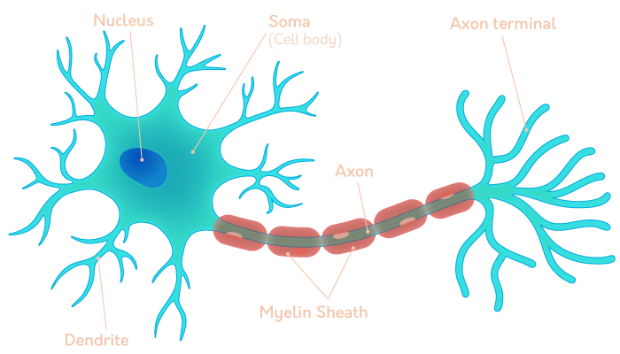

- communicate with each other through
    - *electrical impluses*
    - and then release *chemicals*
- limited ability to regenerate
    - lose more than gain (get rid of inefficient/damanged/unnecessary neurons)
    - **neuroplasticity**: structure can change in response to the environment
- *myelin*: insulation, keeps the electrical impluse flowing down the axon
    - *nodes of Ranvier*: gaps between each sheath, allow ions to flow into and out of the axon => speed up the process

### Dendrites Receives
- have proteins called **receptors** that bind with chemicals called **neurotransmitters**

### Soma + Axon Send
> 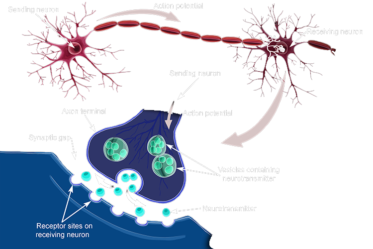
- neurons produce *action potential* (electical impluse)
    - `dendrite => soma => axon hillock => axon`
    - `=> axon terminal => terminal button/synaptic knobs`
    - hillock = beginning of the axon
    - button = very edge of the terminal
- sending neuron: *presynaptic*
- receiving neuron: *postsynaptic*

## Action Potential
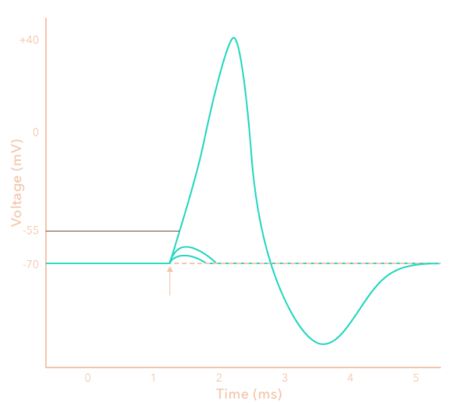
- steps
  1. NT binds to a receptor
  2. influx to positive ions into to cell body (from NT)
  3. open Na+ channels
  4. open K+ channels (pumps)
- *ions* produce electrical activity = action potential
- normally: `-70mV` (polarised)
- more positive particles = less polarised = *depolarisation*
- more deplarise = more likely to activate action potential

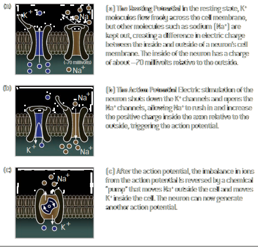
- a: resting, efflux of K+
- b: deplorisation, influx of Na+
- c: repolarisation, exchange
- Na+ channel: propagate the AP
- K+ channel (pump): maintain resting potential

## NT and Receptors
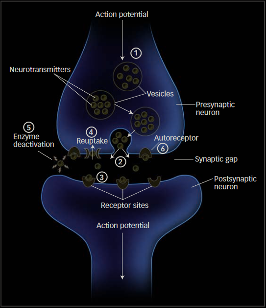
- NT: neurotransmitters (chemicals released from axon terminals)
    - *excitatory*: increase the probability of the neuron becoming electrically active
        - **GABA** binds its receptor to open a Cl- channel
        - ⇒ makes cell negative, aka inhibited
    - *inhibitory*: decrease
        - **Ach** binds ⇒ open Na+ channel
        - ⇒ makes cell negative, aka excited

<table>
    <tbody>
        <tr>
            <th><strong>Neurotransmitter</strong></th>
            <th>Excita/Inhibi tory</th>
            <th>Function</th>
            <th>Drugs</th>
        </tr>
        <tr>
            <td>Glutamate</td>
            <td>Excitatory</td>
            <td>Learning and movement</td>
            <td style="white-space: nowrap;">

PCP
(causes hallucinations)

Ketamine
(anesthetic)
</td>
        </tr>
        <tr>
            <td>GABA</td>
            <td>In</td>
            <td>Learning, anxiety regulation through inhibition of neurons</td>
            <td style="white-space: nowrap;">

Valium
(used to treat anxiety)

Flumazenil
(used to reverse anesthesia)
</td>
        </tr>
        <tr>
            <td>Acetylcholine</td>
            <td>Ex</td>
            <td>Learning, muscle action</td>
            <td style="white-space: nowrap;">

Botox
(Botulinum toxin, inhibits release of acetylcholine)
</td>
        </tr>
        <tr>
            <td>Dopamine</td>
            <td>Ex/In</td>
            <td>Learning, Reward/Pleasure</td>
            <td style="white-space: nowrap;">

Cocaine
(prevents reuptake of dopamine, produces euphoria)
</td>
        </tr>
        <tr>
            <td>Serotonin</td>
            <td>Excitatory/In</td>
            <td>Elevation / depression of mood</td>
            <td style="white-space: nowrap;">

Prozac
(prevents reuptake of serotonin, used to treat depression)
</td>
        </tr>
        <tr>
            <td>Norepinephrine</td>
            <td>Excitatory/In</td>
            <td>Elevation / depression of mood</td>
            <td>

Doxepin
(used for treating anxiety and depression)
</td>
        </tr>
        <tr>
            <td>Enkaphalins/Endorphins</td>
            <td>Ex</td>
            <td>Regulation of pain responses</td>
            <td>

Opiates
(Morphine, Heroin)
</td>
        </tr>
    </tbody>
</table>

### Drugs
- **agonist** drugs mimic the action of an *endogenous* NT
    - **antagonists** prevent
- **direct**(competitive) drugs will compete with the same binding site on the receptor as the NT
    - **indirect** will interfere with receptor function from some hidden location

> take drug ⇒ natural NT production decreases ⇒ addiction

## Glial Cells
> caretakers of the neuron
> - maintainance, support, speed up electrical impulses

- cells
    - *oligodendrocytes* produces **myelin**(protein + fat) wrapped around axons in the brain and spinal cord
    - *schwann cells* same as oligo but outside of the bain and spinal cord
    - *astrocytes*, *microglia* form the **immune** system, fight infections

# Anatomy

- *neural networks*: neurons organised in an interconnected group, dedicated to a set of functions 
    - *efferents*(axon): carry electrical impulses away from the CNS to an organ or muscle
    - *afferents*: carry back to the CNS fro the organs and muscles

- *(neuro)plasticity*: ability of the brain to adapt (aka learn new things)
    - *neocortex*: conscious thinking and high-level processing (outer layer of the brain)
    - *medulla*: control basic life-support functions (brainstem)

## CNS vs PNS
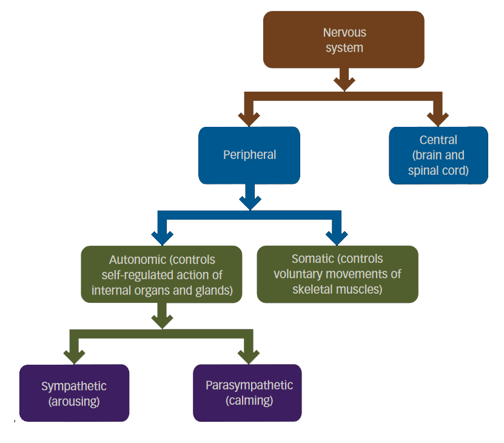

- cns
    - brain
    - spinal cord
        - simple reflex-level processing
        - communication with pns
- pns
    - outside and specialsid sensory endings (touch receptors, retinal cells)

### PNS
- *somatic* (sns)
    - control muscles for **voluntary** moveent
    - bring sensory information from the body to the brain
    - if spinal cord is injured, any body parts by the nerves from the segment below that point can no longer be controlled voluntarily, unable to receive information from those parts
- *autonomic* (ans) (**can be influenced by conscious thought?**)
    - *sympathetic*: excitment
        - dilate pupil, inhibit saliva prod, accelerate heart, stimulate glucose release, inhibit urination
    - *parasympathetic*: rest, digest, repair
        - constricts pupil, stimutlate saliva, etc

# Central Command Center
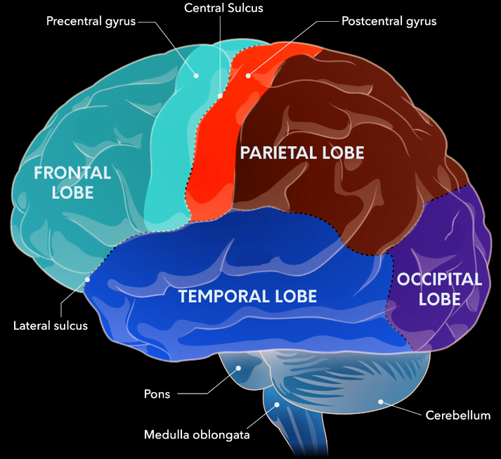
- top
    - *frontal lobe*
        - anterior/front: decision making
        - posterior/back: movement
    - *precentral gyrus/motor cortex*
        - voluntary movement
    - *postcentral gyrus/somatosenory cortex*
        - touch
    - *parietal lobe*
        - process touch and receive information from visual cortex
        - help orient in environment
- middle
    - *temporal lobe*
        - form memories and process sound
        - has auditory cortex
    - *occipital lobe*
        - has visual cortex
- bottom
    - *pons* (bridge)
        - connect info sent from spinal cord, send info from brain to the body
        - help regulate arousal, coordinate senses with cerebellum
        - control facial expressions and eye movements
    - *cerebellum* (little brain)
        - help coordinate movements and problem solving
    - *medulla*
        - regulate life functions

## Life Functions/Reflexes
### Medulla
> no medulla, no breath, heartbeat, nor swallowing

- upper spinal cord injuries
    - involves neurons in the medulla
    - ⇒ fatal
- alcohol overdose
    - ethanol depress activity in the medulla
    - ⇒ can't sustain the heart rate and respiration

### Reticular Activating System

- RAS allows to regulate
    - level of arousal(excitement)
    - focus of attention on tasks
- RAS
    - filters out irrevelant stimuli
    - dysfunction ⇒ ADHD

## Coordinators
> *network of neurons* and *glia/nuclei/ganglia* in the **limbic system**, **basal ganglia**, and **cerebellum** are designed to be modifiers of action and thought

### Limbic System
> regulate emotions, endocrine activity, form emotional memories

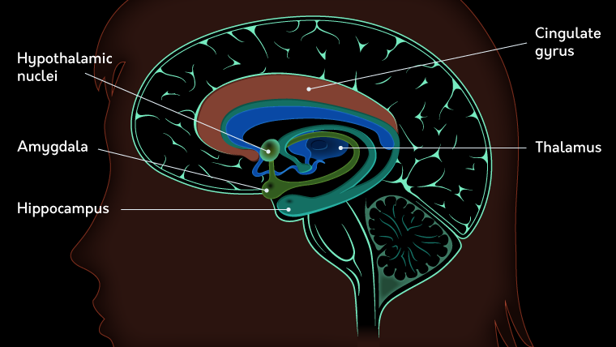

- includes
    - cortex (telecephalon)
    - midbrain (mesencephalon)
- *amygdala* (telencephalon)
    - increase electrical activity in its neurons when person under threat
    - make aggression responses to threats
    - increase secretion of *norepinephrine/adrenalin* during fight or flight response
    - form memories associated strong emotion
    - receive sensory input from all senses
        - make calculations about the emotional value
    - *amygalectomy*: destroy amygdala in animals
        - makes animals docile
        - lose awareness of their own emotion
        - respond inappropriately
- *hippocampus* (telencephalon): circular structure
    - essential to the formation of new memories
    - repeatedly activating its neurons is necessary for the cataloging of new memories
    - H.M. had *anterograde amnesia* because hippocampus removed
- *cingulate gyrus* (telencephalon): ventral to the neocortex
    - increase activity when physical pain and excluded socially
    - help focus attention and thoughts on things that are unpleasant(associated with potential damage and death)
- *hypothalamus* (diencephalon)
    - help control several functions in the autonomic and endocrine systems
    - regulate hunger responses, sexual behavior, temperature, aggression

### Coordinating Movement
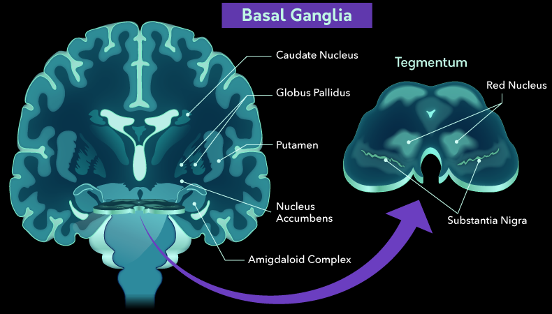
- *basal ganglia* (telncephalon &amp; diencephalon)
    - modulate movement commands
    - increase blood flow and electrical activity when initiating or terminating a movement
    - help learn to make complex movements more automatic
- *striatum*
    - inputs to the basal ganglia come in
    - ventral striatum neurons synapse with axons from the limbic system
        - help learn movements through practice
        - get a boost from emotion circuits
- *globus pallidus* and *substantia nigra*
    - send inhibitory outputs to the thalamus to help integrate sensory and motor information
    - internally: a direct pathway
        - excitatory effect on the thalamus
        - facilitates the activation of motor plans that are appropriate for the present situation
    - internally: indirect pathway
        - inhibitory effect on its targets
        - heps the basal ganglia shut down motor plans that are not right for the task at hand
- *Parkinson's disease*: impaired movement
    - have a hard time initiating and terminating movements
    - in *substantia nigra*, the axons secrete dopamine, but in Parkinson's, these cells die off
- *cerebellum* (metencephalon) (little brain)
    - rhythm and timing machine
    - simultaneously receive and organise input from multiple CNS networks
    - functionally seperated into 3 divisions:
        - *spinocerebellar* helps to match sensory input with motor plans to fine-tune movement patterns
        - *vestibulocerebellar* processes information from the inner ear to help adjust posture and balance
        - *cerebrocerebellar* manage connections with the pons and thalamus to adjust the timing and planning of movements

### Thalamus
- (diencephalon)
    - create packaged experiences
    - each cluster of neurons corresponds to a particular set of functions and locations in some part of the brain
    - is what the cortex uses to choose which thing we pay attention to

## Neocortex (High-Level)
> difference with our primates:
> - number of connections in teh neocortex and the area dedicated to the frontal lobes
> - decision making
>
> the thickness of neocortex makes humans capable of **abstract** thought

- features
    - *gyri* (ridges)
    - *sulci* (valleys)
    - *fissures* (space between lobes)
    - allow to fit more bain into a small space
    - has 6 layers
    - make sense of things

### Frontal Lobes
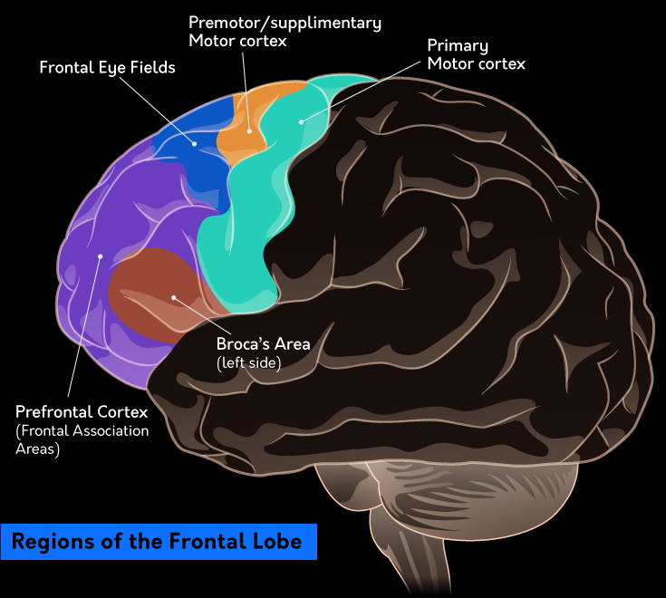
- **Phieas Gage**
    - prefrontal cortex destroyed
    - can't inhibit behavior
- *mortor cortex* (posterior/back)
    - primary neurons that initiate **voluntary movement**
    - *corticospinal* tract pathway: control movement of the muscles in the body (spinal)
    - *corticobulbar* tract pathway: muscles in the head/face (cobulbar)
- *prefrotal cortex* (PFC)
    - receive input from all parts of the cerebral cortex
    - help decide when, why, how we do things
    - has both **inhibitory**(hyperpolarising) and **excitatory**(depolarising) connections
        - able to integrate information and act as a coordinator
    - parts
        - *ventromedia PFC* (vmPFC) modulates behavior based on fear
        - *dorsolateral PFC* (DLPFC) maintains information in our working memory

### Parietal Lobes
> process numebrs and perform calculations
> - right side: navigate the space
> - left side: misinterpret sensation

- the sensory cortex in te anterior(front) portion
    - receive input frow the *contralateral*(opposite) side of the body (sensation cross at level of the brainstem, crossing helps coordinate both sides of the body)

### Temporal Lobes
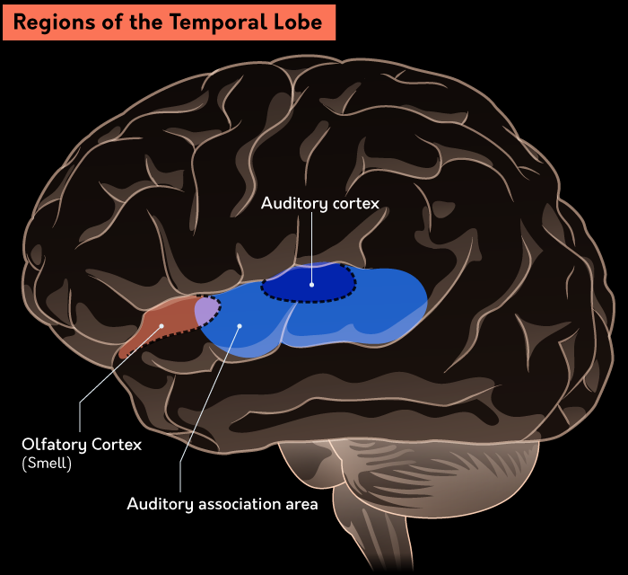
- *Wernicke's area* (left temporal lobe)
    - process language

### Occipital Lobes
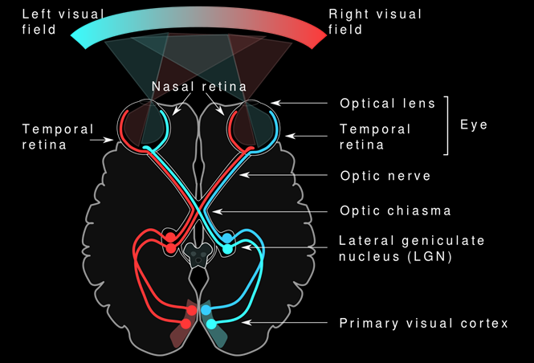

### Brain Laterality
> one hemisphere performs different function than the other

- right sees things globally, left responds to details
- left processes and produces language, but right is necessary to maintain sense of what is heard and said
- ~~right brained = creative, left = analytic~~

### Corpus Callosum
> connect the two hemispheres and share info

- transect(cut) to treat epilepsy/seizures (split-brain)

# Endocrine System
> glands that release hormones, have influences on behavior

- control centers
    - *hypothalamus*: secretes hormones and controls the pituitary gland via direct nerve stimulation/chemicals
    - *pineal gland*: secretes melantonin to regulate sleep cycles
    - *pituitary gland*: secretes hormones affecting sexual behavior, reproduction, circulatory function, hunger, responses to aggression

## HPA Axis and Stress
> chronic stress involves *hypothalamic-pituitary-adrenal axis*
> HPA Axis secretes hormones to control pituitary gland, which controls the adrenal glands

- experience chronic stress
    - ⇒ neurons in the hypothalamus become active more often
    - ⇒ drives the pituitary to tell the adrenal glands to produce more cortisol (stress hormone)
    - ⇒ drives energy and blood flow to muscles and increases alertness

# Research Methods in Neuroscience
## What Want to Know?
- can study the nervous system by
    - *structural imaging*: look at the structures in the NS in detail
    - *functional imaging*: visualise and measure changes in the NS activity simultaneously
    - *recording*: record the activity of neurons directly/indirectly
    - *dissection*: take tissue out of the system and tease it

### How Developed Current Methods
> simple, crude experiments

- Egyptians did research on the body int he name of funerary rites
- Otto Friedrich Karl Deiters separate neurons by hand with the *first microscopes* in late 1800s
- Camillo Golgi invented *staining method*(dye neurons/axons/dendrites to make them visible under a microscope)
- use *electroencephalogram* (EEG) in 1924 to record signals
    - use computer programs to reduce *signal-to-noise* ratio

## Whan Can Be Measured
> limitations of *machinery/techniques* and *ethical/ecological reasons*

- EEG: record neocortex, but no deeper structures (eg basal ganglia)
- fMRI: measures oxygen levels changes(blood flow)
- PET: inject a radioactively tagged molecule that competes with targeted NT
- inject inhibitory drug to keep neurons from firing action potentials (reversible)
- inject drug to overexicte neurons and kills them (irreversible)
- ablation: cut neurons out of the NS physically (irreversible)

<table>
  <tbody>
    <tr>
      <th>Method</th>
      <th>What Does It Do?</th>
      <th>Advantages</th>
      <th>Disadvantages</th>
      <th>Examples of Use</th></tr>
    <tr>
      <td>CT Scan (Computerized Tomography)</td>
      <td>Uses x-rays that pass through the body, and can generate images of “slices” of the body</td>
      <td>Fast, cheap, and noninvasive</td>
      <td>Radiation exposure</td>
      <td>Detect changes in structure due to disease</td></tr>
    <tr>
      <td>MRI (Magnetic Resonance Imaging)</td>
      <td>Uses magnetic fields to image alignments of hydrogen ions (different tissues have different amounts of water)</td>
      <td>Noninvasive, great precision, no radiation</td>
      <td>Really expensive, cannot have biomedical devices or metal in patients</td>
      <td>Detect changes in structure due to disease</td></tr>
    <tr>
      <td>fMRI (functional MRI)</td>
      <td>Uses magnetic fields to image alignments of hydrogen ions (different tissues have different amounts of water)</td>
      <td>Noninvasive, no radiation, no injections or ingestions</td>
      <td>Cardiovascular disease or compromised function can make measurements unreliable; delay between stimulus and output</td>
      <td>Can measure activation during a task or following stimulation</td></tr>
    <tr>
      <td>DTI (Diffusion Tensor Imaging)</td>
      <td>Tracks and images water movement along neural pathways, and can measure density of neural tracts (bundles of axons)</td>
      <td>Noninvasive, no radiation, no injections or ingestions needed</td>
      <td>The interpretation can be difficult in tracts that have different kinds of fibers</td>
      <td>Study white matter degeneration in disease</td></tr>
    <tr>
      <td>PET/SPECT (Single Photon Emission Computed Tomography)</td>
      <td>Uses an ingested radioactive compound to track molecular changes</td>
      <td>You can see molecular changes in real time</td>
      <td>Radiation exposure</td>
      <td>Visualize the activity of specific neurotransmitters, can measure binding</td></tr></tbody></table>
