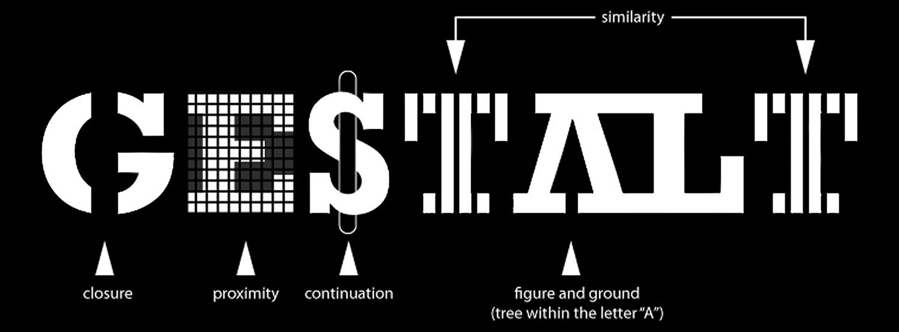
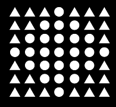
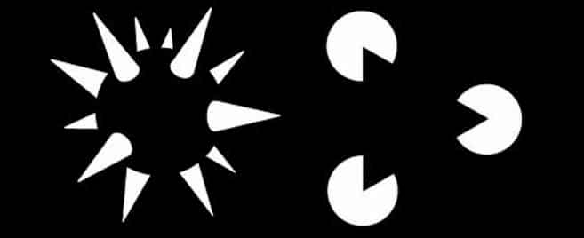
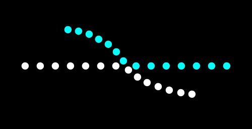
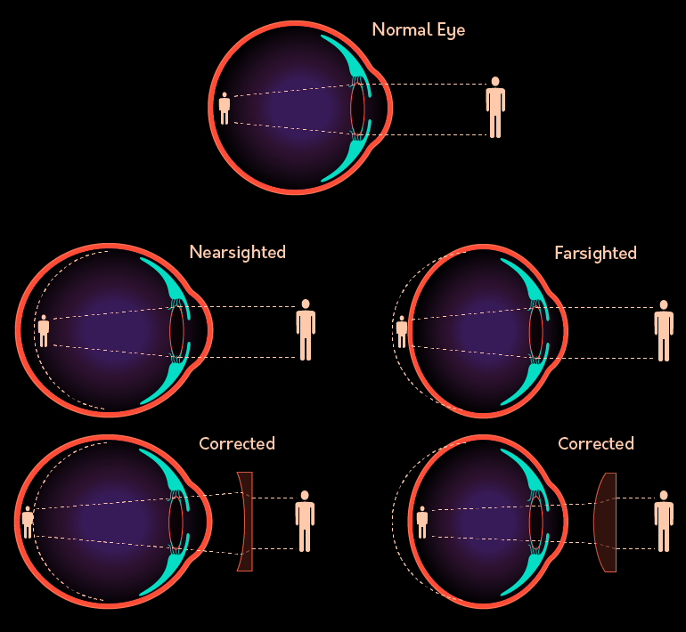
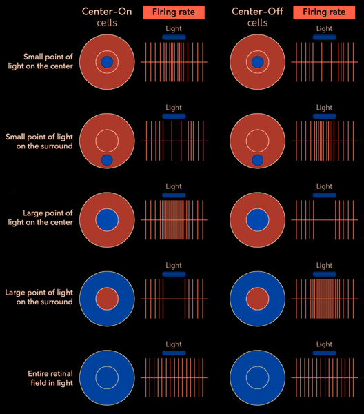
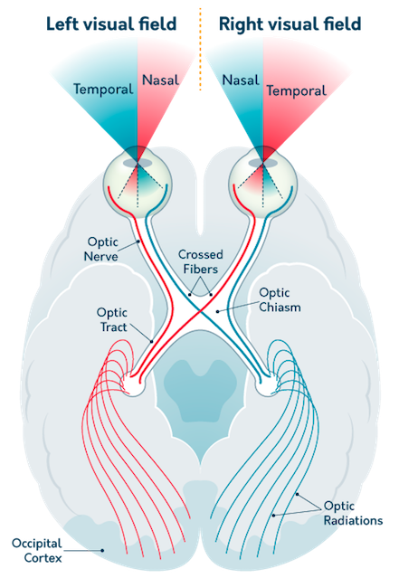
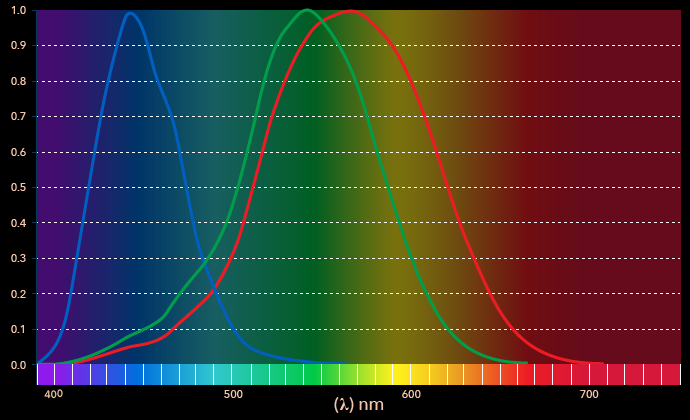
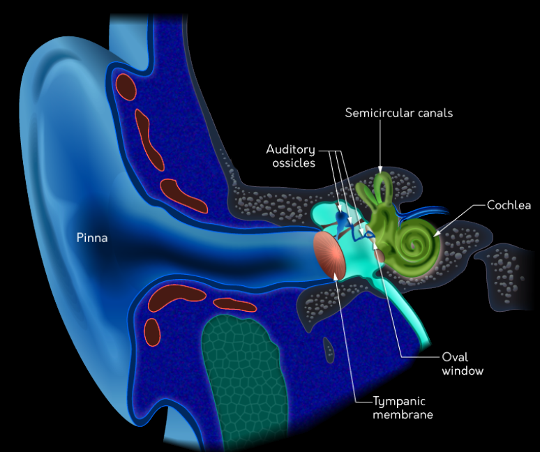

<!-- omit in toc -->
# Sensation and Perception
- [Summary](#summary)
- [Foundations](#foundations)
    - [TD and BU Processing](#td-and-bu-processing)
        - [The Principles of Gestalt](#the-principles-of-gestalt)
- [Vision: Light to Sight](#vision-light-to-sight)
    - [Retina](#retina)
    - [Visual Cortex](#visual-cortex)
    - [Color Vision (Cones)](#color-vision-cones)
        - [Opponent Process](#opponent-process)
    - [Perceiving Depth](#perceiving-depth)
        - [Monocular](#monocular)
        - [Binocular](#binocular)
- [Hearing and Sound](#hearing-and-sound)
    - [Auditory Cortex](#auditory-cortex)
    - [Sound Localisation](#sound-localisation)
    - [Music and Speech](#music-and-speech)
        - [Music](#music)
        - [Speech](#speech)
- [Chemical Senses](#chemical-senses)
    - [Smell](#smell)
        - [Chemical Process](#chemical-process)
    - [Taste](#taste)
- [Skin and Body Senses](#skin-and-body-senses)
    - [Temperature](#temperature)
    - [Pain](#pain)
        - [Gate-Control Theory](#gate-control-theory)
        - [Subjective Nature](#subjective-nature)
- [Kinesthetic and Vestibular Senses](#kinesthetic-and-vestibular-senses)
    - [Kinesthetic](#kinesthetic)
    - [Vestibular](#vestibular)
- [Methods of Investigating](#methods-of-investigating)
    - [Stimulus Detection](#stimulus-detection)
    - [Difference Threshold](#difference-threshold)

# Summary
- Sensation is the process of using our senses (i.e., vision, hearing) to detect stimuli or information in our environment, and perception is the process of identifying that sensory information and combining it with our previous knowledge to create our current experience.
- The primary purpose of sensation is to transform signals in the world (e.g., light, sound, and touch) into the electrochemical language of the brain.
- Bottom-up processing involves how we understand basic sensory information, while top-down processing involves recruiting our prior experience or our expectations to help us understand the sensory message.
- The eye is composed of several major structures, including the lens and the retina, which transduce light into the electrochemical language of the brain.
- Rod and cone cells are responsible for the transduction of light, and the resulting information is sent to the brain via the optic nerve, which is made up of specialized ganglion
- The occipital lobe processes visual information and contains feature detectors (such as simple cells and complex cells) that help us construct a picture of the world around us. This information is understood spatially by the dorsal stream (“where is it?”), while the ventral stream understands its content (“what is it?”).
- Trichromatic theory explains how we understand color via the “mixing” of light, while opponent process theory explains afterimages and the importance of the color yellow.
- Depth cues enable us to understand how far away objects are in space. Monocular cues require input from only one eye, while binocular cues require input from both eyes.
- The ear has three major sections: the outer, middle, and inner ear. The outer portion funnels sound into the ear, the middle portion amplifies it, and the inner portion transduces sound into the electrochemical language of the brain.
- Place theory describes how the location of neural firing on the basilar membrane indicates the pitch of a sound, while frequency theory describes how the firing rate of neural cells is also indicative of pitch.
- Chemoreceptors in the nose and tongue allow us to smell and taste; this is accomplished by olfactory receptor neurons in the nose and papillae on the tongue.
- Mechanoreceptors are responsible for the sense of touch, thermoreceptors allow us to sense temperature, and nociceptors process nociceptive pain.
- Pain can be interpreted through the gate-control theory, which implies that the perception of pain is controlled by the spinal cord and is both context dependent and can also be somewhat subjective.
- Sensory centers in the brain are organized based on space (retinotopic and somatotopic organization for vision and touch) as well as pitch (tonotopic organization for sound).
- We understand where our bodies are in space via our kinesthetic sense.
- The vestibular sense helps us keep our balance.
- Signal detection and its relationship to absolute thresholds allow us to understand the limits of when a person can detect a sensation.
- Weber’s Law describes that we are more likely to notice the difference between two stimuli when the difference between them grows proportionally larger.

# Foundations
- brain is completely isolated from the surrounding environment
    - bee uses ultraviolet light
    - aquatic mammals use low-frequency calls
    - owls use audition
    - turtles use magnetic field
    - ants use smelll
- there's nothing special about vision, smell, sound, or taste
    - it's **what we do with that information** that makes it special
- *sensation*: featurs of the environment the brain use to create an understanding of the world
    - transduced, translated by the sensory system into the *eletrochemical language* of the brain
    - the brain takes the message and combines it with previous experience to create *perception*
    - eg headbanging on the beats: *sensation*
    - eg drawing a person: *perception*

## TD and BU Processing
> perception is only **partly** based on the information coming from the world, but we also use **memories** about the way the world works to interpret the messages
> - once you make sense, you won't be able to see it as nonsense again

- *bottom-up processing*
    - starts with the physical message/sensations
- *top-down processing*
    - combine incoming neural message with our understanding of the world to interpret information

### The Principles of Gestalt

*Gestalt principles of organisation*
- principle of *figure-ground*: information is given priority over the background 
- principle of *proximity*: objects that are close to one another will be grouped together 
- principle of *similarity*: objects that are physically similar to one another will be grouped together 
- principle of *closure*: tend to perceive whole objects even when part of that information is missing 
- principle of *good continuation*: if lines cross each other or are interrupted, tend to still see continunously flowing lines 
- principle of *common fate*: moving together will be grouped together 

# Vision: Light to Sight
> 20% of the cortex plays a role in the interpretation of visual information

- light is a form of eletromagnitic radiation
    - we are only able to see 400-700 nanometers of light
- wave of light enters the eye
    - ⇒ light goes through the *cornea* (transparent covering of the eye)
    - ⇒ light enters eye through the *pupil* (hole that expands and contracts by the muscles attached tho the *iris*)
    - ⇒ behind pupil, light travels through the *lens* (flexible piece of tissue that focuses light on the retina)
    - ⇒ eye adjusts its behavior to maximise the quality of light that reaches the sensory cells (*photoreceptors*) in *retina* (thin layer of tissue on the back)
    - ⇒ in retina, *rods* and *cones* transduce energy into neural language
        - *rods*: highly sensitive, respond to low level of ligfht (periphery of the retina)
        - *cones*: high accuracy, process early information about color (*fovea*: highest concetration of cones, center)

    
corrected-vision

    
light to visual cortex

- cornea
- pupil
- lens
- rods/cones
- diffuse/midget bipolar cells
- M/P-cells (ganglion)
- optic chiasm
- LGN
- VC

## Retina
- rods and cones react to light
    - ⇒ send message to bipolar cells
    - *diffuse bipolar cells* receive messages from **multiple rods**
        - add together the experience of the photoreceptors and send a single message to the ganglion cell
    - *midget bipolar cells* receive from only **a single cone**
        - send message to only a single ganglion cell
- ganglion cells
    - *P(arvo)-cells*: smol, receive from the midget bipolar cells
        - 70% of the ganglion cells
        - send signals to the brain about qualities of color and detail
    - *M(agno)-cells*: large, in periphery, receive signals from diffuse bipolar cells
        - send information about motion and visual stimuli in the periphery

    
firing rate

- center-on
    - more light in center ⇒ more firing rate
    - more light in surround ⇒ less firing rate

- blind spot
    - the place where the axions of the ganglion cells leaves the eye

## Visual Cortex
> message from the optic nerve travels to the *optic chiasm* (optic nerves from each eye cross before the message is sent to the thalamus)
> 

> 
image

>
> 
> 

- LGN: *lateral geniculate nucleus* in **thalamus**
    - relay center
    - sensory information is analysed and reorganised before the message travels to the cortex
- visual cortex (VC) is located in the occipital lobe
    - important features of the visual world are assembled and identified
    - every neuron maintains a spatial organisation (*retinotopic organisation*)
    - *feature detectors* are specialised cells in the VC that respond most actively to specific stimuli
- eg of feature detectors
    - *simple cell* responds to small stationary bars of light oriented at specific angle
    - *complex cell* responds most vigorously to vertical lines in motion
- pathways
    - information travels along the *ventral stream* (What stream) to the **temporal lobe**
        - visual information is identified
        - you know what you are looking at
    - *dorsal stream* (Where pathway) carries visual information the the **parietal lobe**
        - understand the information
    - visual information travels to the *limbic system*
        - provide feelings

## Color Vision (Cones)
> color is the perception of *wavelength*

- *trichromatic theory* proposes that color information is identified by comparing the activation of different cones in the retina
    - *S(hort wl)-cones* respond to blue
    - *M(edium wl)-cones* respond to green
    - *L(ong wl)-cones* respond to red
- explains color blind: cells respond equally to the two wavelengths ⇒ cannot perceive a difference between them

### Opponent Process
- trichromatic theory doesn't explain all aspects
- *opponent process theory*: cells in the visual pathway increase their activation when receiving information from one kind of cone and decrease when they see a second color
    - maintained in the LGN (thalamus)
- *afterimage*: opposite color
    - white -- black
    - red -- green
    - blue -- yellow

## Perceiving Depth
> *monocular* depth cues requires only one eye 
> *binocular* depth cues requires two eyes

### Monocular
> aka *pictorial cues*, can be represented on a 2d canvas

- *occlusion*: the close object partially blocks the view of the far object
- *relative height*: the close object is closer to the horizon
- *relative size*: if two objects are the same size, the close one seems bigger
- *perspective convergence*: parallels lines that move aways from us seem to converge together
- *familiar size*: use previous knowledge of the object's size (eg buildings, stars)
- *atmospheric perspective*: far objects appear hazy/blue tint (eg mountains)

### Binocular
> making comparasions between the two eyes to understand depth

- *retinal disparity*: difference between the retinal image that falls on both eyes
    - used to calculate the distance

# Hearing and Sound
> mechanical energy

- *frequency*: rate of vibrations
    - hight freq = high pitch (20-20 000Hz)
- *intensity*: loudness/amplitude (dB)

- sound enters through *pinna*
    - help filter sound into the ear canal toward the *tympanic membrane* (eardrum)
    - transfers energy to *ossicles*(malleus, incus, stapes), help amplify the vibrations
    - staples is connected to *oval window*
    - transfers vibrations to *cochlea* (sound processor), transferred into neural language
        - trasnduction: vibration against the window cause fluid inside the cochlea to move
        - inside cochlea: *basilar membrane*
- *hair cells*: sensory neurons that convert sound into neural firing
- *place theory*: we understand pitch because of the location of firing on the basilar membrane
    - but doesn't explain the experince of hearing
    - hair cells don't operate independently, many are activated at the same time
- *frequency theory*: brain uses information related to the rate fo cells firing
    - fire faster = higher the perception of pitch

## Auditory Cortex
- different components of sound are organised and analysed in the *medial geniculate nucleus* (in thalamus)
    - majority of info is relay to the *auditory cortex* (in temporal lobe)
    - *tonotopic organisation*: has *what* and *where* stream

## Sound Localisation
- *binaural cues*: require comparasions from both ears to understand an object's location
    - interaural *time* difference
        - comparasion between the arrival time of a sound
        - localise sounds from left/right
        - eg *binaural recording* captures 3d soundscape, info about the size of the room, location of sources of noise
    - interaural *level* difference
        - closest ear perceive the sound louder

## Music and Speech
### Music
- *melody*: nothing special about a sequence of notes, but our experiences with music and the sequences of notes that give them coherence
- *involuntary musical imagery*: the experience of an inability to dislodge a song and prevent it from repeating itself in one's head
    - teach us about *auditory memory*

### Speech
- the production of speech has three basic component parts
    - respiration from the lungs
    - the vocal cords
    - vocal tract
- *McGurk effect*
    - auditory perceptions are influenced by visual information
    - use visual to understand ambiguous sounds

# Chemical Senses
> perceptions of smell and taste begin with activation of *chemoreceptors* (sensory cells that respond to properties in air molecules)

- sensations from both smell and taste are combined in to *orbitofrontal cortex* (OFC)
    - alse receive info from the visual *what* pathway
    - contains *bimodal neurons*: respond to more than one sense
    - where *flavor perception* occur

## Smell
> **dont first go through the thalamus**
### Chemical Process
- airbone molecuse interact with receptor sites in the mouth and nose
    - drawn into the upper nasal cavity
    - olfactory receptors (~400 types) bind to the cilia of hair celles embedded in the *olfactory mucosa* (chemoreceptors of the nose)
    - odorants will come into contact with the *olfactor receptor neurons* (ORN)
    - ORN sends their mesage to *glomeruli* (the olfactor blub) in the brain
- ORNs are sensitive to specific odorants
    - all ORNs of a particular type send signals to just one/tew glomeruli

## Taste
> relies on the correlation between the molecular properties of a substance and the effect of that substance on the body

- most people are aware of *sweet*, *salty*, *sour*, *bitter*
    - recently reseacher have also identified the tast *うまみ*(savory)
- taste begins on the tongue (coverd with little bumps called *papillae* (tastbuds))
    - *filiform papilae*: entire surface, gives tongue fuzzy appearance (no taste buds)
    - *fungiform papillae*: tips and side
    - *foliate papillae*: back
    - *circumvallante papillae*: back
- each taste bud has 50-100 taste-senstive cells (*taste pore*)
    - transduction: chemicals bind to the receptor sites on the taste pore
    - message sent through a systemo of afferent nerves to the brain *and to the stomach*

# Skin and Body Senses
- the physical message of touch is *pressure*
    - object makes contact with the body
    - receptor cells respond, message sent to the spinal cord to the *somatosensory cortex* of the parietal lobe
    - more info is derived from the responses of 4 types of *mechanoreceptors*
- *mechanoreceptors*
    - *Merkel receptor* and *Meissner corpuscle* (close to the surface) respond to pressure that is applied and then removed
        - Merkel fire continuously, Meissner fires only when the pressure is removed
    - *Ruffini cylinder* and *Pacinian corpuscle*
        - Ruffini is associated with interpreting the stretching of the skin
        - Pacinian feels vibration and texture
- *somatotopic organisation* two adjacent points on the skin are mapped by adjacent points on the cortex

## Temperature
- *thermoreceptors* detect changes in temperature
    - cold fibers respond by increasing their firing rate to objects that are cool to the touch
    - warm fibers increase firing to heat
- they also fire to chemical stimuli

## Pain
> tissue damage, but very subjective

- *nociceptors* dectect pain and send a signal to the brain

### Gate-Control Theory
- suggests that impulses that indicate painful stimuli can be blocked in the spinal cord by signals sent from the brain
    - small diameter fibers (S-fibers) fire to damaging and painful stimuli
        - transmission cell (T-cell) becomes activated
    - large diameter fibers (L-fibers) fire to the brain about stimulation that is not painful
    -   inhibit the activation of the T-cells

### Subjective Nature
- pain is susceptible to the placebo effect
-   the alleviation of pain is really a result of expectations of pain reduction

# Kinesthetic and Vestibular Senses
## Kinesthetic
> basic understanding of where the body is in space

- receptors in the joints and muscles both send and receive signals about where the body is in space
    - send to the somatosensory cortex

## Vestibular
> sense of balance
- sensory cells are located in the cochlea
    - respond to movement, posture, acceleration
- *semicircular canals* sense changes in acceleration and rotation of the head
    - filled with hair cells that respond to the force of gravity
- *vestibular sacs* responds to cues associated with a sense of balance and posture

# Methods of Investigating
> *psychophysics* attempts to evaluate the way the physical experience are translated into psychological perceptions

## Stimulus Detection
> what is the minimum about of stimulus required to generate a sensation

- *absolute threshold*: level of intesity required to create a conscious experience
    - it's not absolute
- *signal detection*: individual biases
    - they are likely to detect more stimuli when they are presented
    - likely to say that a stimulus was presend when it wasn't (*false alarms*)
- our brain is able to pick up and process info that we are not aware of perceiving

## Difference Threshold
> *just noticeable difference*(jnd): smallest amount of particular stimulus required for a difference in magnitude to be detected