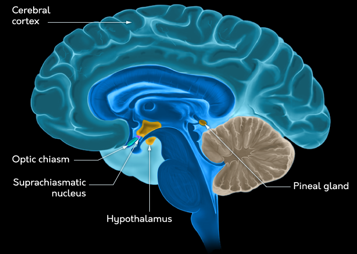
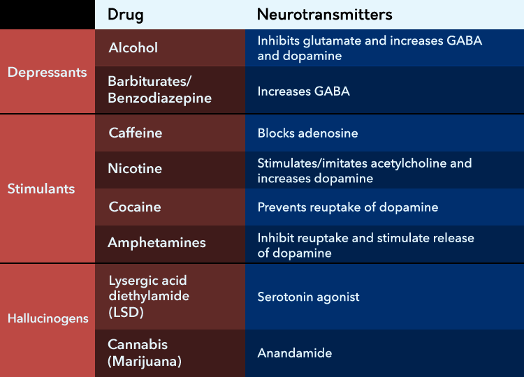

<!-- omit in toc -->
# States of Consciousness
- [Summary](#summary)
- [What is Consciousness](#what-is-consciousness)
    - [Split Brain](#split-brain)
    - [Components of Consciousness](#components-of-consciousness)
- [Attention](#attention)
    - [Selective Attention](#selective-attention)
    - [Divided Attention](#divided-attention)
    - [Inattentional Blindness](#inattentional-blindness)
    - [Subliminal](#subliminal)
    - [Disorders](#disorders)
        - [Visual Neglect](#visual-neglect)
        - [ADHD](#adhd)
        - [Attention Span](#attention-span)
- [Sleep](#sleep)
    - [Stages](#stages)
    - [Functions](#functions)
        - [SWS](#sws)
        - [REM](#rem)
    - [Dreams](#dreams)
    - [Disorders](#disorders-1)
        - [Dyssomnias](#dyssomnias)
        - [Parasomnia](#parasomnia)
    - [Biological Clocks](#biological-clocks)
- [Altered States of Consciousness](#altered-states-of-consciousness)
    - [Depressants](#depressants)
    - [Stimulants](#stimulants)
    - [Hallucinogens](#hallucinogens)
- [Hyponsis](#hyponsis)

# Summary
- Consciousness is referred to as having content (your immediate subjective experience) and state (the level of arousal and attention you are currently able to bring to bear on a situation)
- Split-brain patients illustrate how our brains have a hemispheric specialization, with the left hemisphere responsible for much of what we would consider conscious verbal thought
- Attention can be either active or passive, referring to directed goal-driven (top-down) efforts to process the environment and the ability to respond to demanding characteristics of the environment (bottom-up efforts), respectively
- When something captures attention because it influences our bottom-up passive attention system, this is due to stimulus salience: bold text, sudden loud noises, and contrasting “popping” colors are examples of this phenomenon
- Selective attention occurs when resources are devoted to processing one piece of information about the environment at the expense of other information and can lead to us “missing” information in the environment because we did not process it effectively
- Dichotic listening is an example of a selective attention task in which you attend to information presented to one ear and ignore information presented to the other; some of the unattended information can be consciously processed, however, such as when you hear your name in a crowded room
- Divided attention occurs when two (or more) things in your environment must be done or processed simultaneously; people typically perform poorly in these situations unless one of the tasks is automatic (requiring little processing effort)
- Attentional “errors” can occur when we are processing information: inattentional blindness and studies of intentional change detection illustrate some of these
- Cases of visual neglect illustrate how the parietal lobe is involved in attentional processing; parietal lobe damage can lead to people being unable to process parts of the world around them
- Attention deficit hyperactivity disorder (ADHD) is a disorder of attention in which focused attention becomes difficult and impulsivity/hyperactivity increase; it can be manageable with medication
- Sleep is divisible into four stages plus rapid eye movement (REM) stage sleep; techniques, including electroencephalography, are used to delineate these stages from one another, while hypnograms plot out how long a person spends in each stage of sleep
- Brain activity during sleep becomes progressively more coordinated across the cortex as sleep moves from earlier stages into later slow-wave sleep stages; various wave types show this progression (desynchronized alpha and beta waves when awake moving to slower and more regular theta and delta activity)
- REM-stage sleep is an exception to the typically slow brain activity seen during sleep and is when dreams occur; REM is also thought to be one of the most important parts of sleep for improving cognitive functioning and performance
- Freud thought dreams were a manifestation of the unconscious mind; however, modern psychologists are more likely to endorse the activation-synthesis hypothesis of dreaming or the evolutionary hypothesis of dreaming
- Dyssomnias are a class of sleep disorder related to the quality of sleep a person gets, including various kinds of insomnia, hypersomnia, apnea, and narcolepsy
- Parasomnias are a class of sleep disorder related to disturbances that can occur during sleep and include REM sleep behavior disorder, bedwetting, night terrors, and somnambulism (sleep walking)
- Circadian rhythms, also known as biological clocks, help us regulate our sleep/wake cycle and can be influenced by things like jet lag and melatonin; the suprachiasmatic nucleus appears to regulate circadian rhythms
- Psychoactive drugs, including stimulants, depressants, and hallucinogens, can alter the state of consciousness a person is in, changing levels of arousal and ability to attend to the world around them
- Depressants include drugs such as alcohol and barbiturates, which influence the level and effectiveness of neurotransmitters such as GABA, glutamate, and dopamine. Depressants slow reaction time and reduce wakefulness
- Stimulants include drugs like caffeine, nicotine, cocaine, and amphetamines and typically act on the neurotransmitters adenosine, acetylcholine, and dopamine to increase arousal and alertness, while also reducing feelings of hunger and fatigue
- Hallucinogens (or “psychedelics”) include drugs such as LSD and mescaline. They typically act on the neurotransmitter serotonin and their effects include hallucinations and other breakdowns in a person's conscious experience, such as an “out-of-body” feeling

# What is Consciousness
<blockquote>

- Wilhelm Wundt is the first psychologist
    - used *introspection* to study human mind (self-report)
- consciousness definitions
    - (medical) state/condition of being conscious
    - (self-awarenss) a sense of personal/collective identity
    - (subjective experience) awarenes of one's own feelings
- subsets `(unconscious (conscious))`
    - info + attention => perception with awareness => conscious mind
    - info => perception without awareness => unconscious mind
- often habits control behavior
    - conscious => when we *don't have the habits* yet, or the *habits are wrong* (frontal lobe)
</blockquote>
<blockquote>

- experiment (Stroop effect)
    - first see word of color, then see another color, ask to say color
    - unconsciousness mind read the word, generate sound
    - easy to say the word, hard to say the color
    - but if the conscious mind learned the opposite pattern, it will react color quicker, because it expects it (strategy)
- unconscious can also bias thoughts (dichotic listening task)
</blockquote>

## Split Brain
> to reduce the freq and severity of seizures associated with epilepsy
> - conseq: two hemispheres are unable to share info

- hemispheric specialisation (2 hemis have different functinos)
    - right brain/left eye can read language, but left brain/right eye can't

## Components of Consciousness
- philosopher Dan Dennett
    - consc is the result of several processes in the brain that can operate independently and interact  with one another depending on what the task demands

<blockquote>

- mirror (not very natural) to animals
    1. (all) react as a new member of their species
    2. (some) ignore the reflection (no info value, habituation) (eg. no smells)
    3. (few) use mirror as a tool to inspect themself
- formal method (Mirror/Rouge test)
    - anethesize the animal
    - put a red mark on one eye and on one ear
    - let it recover from anethesise
    - show it its reflection, count times touching red mark vs the other side
</blockquote>

- psychologists discuss 2 components of conscious exp
    - *conscious content* (subjective exp of your internal and external world)
    - *states of consciousness* (different levels of arousal and attention)

# Attention
> process of selecting info from the internal and external envs to prioritise for processing

- *passive* attention
    - bottom-up information from the external environments requires a response
    - eg hear a loud noise in a quiet room => attention changes passively
- *active* attention
    - attention is directed by goals and top-down processing

## Selective Attention
> attend to one source of information while  simultaneously ignoring other stimuli

- *stimulus salience*: some stimulus in the env capture attention bc of their physical properties
    - *attentional capture*: when attention is diverted because of the salience of a stimulus
- *cocktail party effect*: at a party, a person can be engaged in a conversation and suppress all the info on around them and attend to the conversation
    - but some info (not part of consc awareness) are still processed (eg someone yells your name at a party)
- *dichotic listening* (listen different content on 2 sides but only pay attention to one side)
    - process in to just blocking

<blockquote>

- passive attention
    - things suddenly pop up
    - the env can take your attention
    - pro/antisaccade:
        - show movincg blue/pink dot, if blue, eye follows the dot, if pink, don't follow
        - takes time to ovecome instinct
        - follows the dot: passive attention
        - don't follow: active attention
</blockquote>

## Divided Attention
> multitasking

- *automacity*: fast effortless processing of information without consciousness thought
    - automatic: when performance is not impaired by other tasks
- not all automatic tasks created equal
    - *predictable* tasks are easier
    - that causes severe *consequence* are harder

## Inattentional Blindness
> tendency to miss changse to some kinds of info when your attention as engaged elsewhere

- *flicker task*: used to measure inattentional blindness
    - show image 1
    - show white screen (prevent from using motion cues)
    - show modified image 1
    - participants requires a long time to locate the difference
- *intentional change detection*
    -  requires participants to search for changes
-  *inhibition*: actively reducing processing of some infomation while the brain attends to a specific task

## Subliminal
> sensory stimulus that is processed, but doesn't reach the threshold for consciousness perception

- *subconscious processing*: infor we are aware of, but not aware that it is influencing our behavior
    - *subvisual* message: presented to quickly for the visual system to perceive
    - *subaudible* message: played at a low volume

<blockquote>

- lecture: there is perception without awareness, and it biases perception with awareness
    - Congnitive unconsciousness: habits
    - consciousness takes time to train the data for AI
        - once program works, it will give the trained data to unconsciousness to execute automatically => habits
    - unconsciousness is build by consciousness
- textbook: doesn't have an effect
    - Freudian unconscious: has its own goals (eg keeping certain things out of your consciousness)
</blockquote>

## Disorders
### Visual Neglect
> right inferior parietal lobe of the cortex

- lose awareness of visual stimuli on the **left**
    - shave half of their face
    - draw half of the image
- stimuli in the neglected field can inflence behavior even if they are not consciously aware of it
    - show house 1 normal, house 2 left on fire
    - participant will say the houses are the same
    - but will say want to live in house 1
    - can't say why

### ADHD
> can't focus

### Attention Span
<blockquote>

- during war, people could not staring at a radar for a long time *cannot sustain attention on a boring task*
    - started cognitive revolution
</blockquote>

- depends person by person
    - if finds interesting => longer attention span

# Sleep
> altered state of consciousness

- *fatal familial insomnia*
    - affect the thalamus, causes to die from lack of sleep
- *EEG* measure activity across the surface of the brain
- *electrooculograms* captures eye movemnent while sleeping
- *electromyograms* measure the tension in the muscles of the jaw

## Stages
- awake
    - active: *beta waves*: irregular, low amp, 13-30 Hz
    - relaxed: *alpha wave/activity*: regular, predictable, 8-12 Hz
- relaxed to sleep stage 1
    - *alpha waves* to *theta activity* (3.5-7.5 Hz)
    - cortex firing rate becomes more synchronised
- stage 1 to 2
    - irregular theta activity
    - *sleep spindles* and *K-complexes* appear
        - spindles: bursts of activity (12-14Hz) 2-5 times/min during non-REM stages during memory consolidation
        - complexes: bursts of activity once/min, can be trigged by unexpected noises
    - prepare to enter *delta wave* activity
- stage 2 to slow-wave sleep (*SWS*)
    - firing becomes coordinated, transition to *delta activity*
    - delta: <4Hz, regular, high-amp waves
    - SWS: deepest stage of sleep
- non-REM(1+2+SWS) to rapid eye movement *REM*
    - desync theta waves
    - eye move beneath closed eyelids
    - brain highly active
    - EGG looks like awake/alert
    - generaly paralysed during REM (*REM sleep Antonia*)
    - blood flow reduced, but visual cortex receive oxygenated blood
        - bc vivid visual images/hallucinations

<blockquote>

- altered states: sleep, hypnosis, drugs
- why sleep: evolution-based arguments
    1. cant see at night => conserve energy at night
    2. sleep is critical (no reason?)
- more sleep != more physical repair
- sleep doesn't effect *habitual/unconsious* tasks
    - but sleep deprivation hurts conscious thinking
- during deep sleep: memory consolidation
    - hippocampus becomes active and reorganises data
- during REM sleep: learning skills
- disorders
    - insomnia: can't sleep, can make everything worse, can cause worse sleeps
    - parasomnia: sleep walking, happens in deep sleep => not awake
- deep sleep -> REM: brain paralyse the body so you don't move during dream
</blockquote>

## Functions
### SWS
> no sws => irritable, disoriented, hard to complete congnitive tasks
> sws => explicit memories

### REM
> consolidate info

## Dreams
- problems
    - people don't always remember their dreams
    - can't always describe them
- nightmare often occur during sws
    - narrative-based occur during REM
- *activation-synthesis hypothesis*
    - exp of dreaming has no explicit/reliable meaning
    - conseq of other processes
- *evolutionary hypothesis of dreams*
    - dream about things related to survival
    - lead to enhanced performance

<blockquote>

- characteristics
    - illogical content
    - acceptance of strangeness
    - odd sensory experienc
    - intense emotions
    - difficulty remembering
- Freudian dreams
    - *manifest*(actual dream, symbolic) vs *latent*(unconscious issue) content
        - unconsciousness has its own goals
        - true motivations might hide in dreams (somehow related, not directly)
- Cognitive dreams
    - cerebral cortex tries to interpret random electrical activity
</blockquote>

## Disorders
### Dyssomnias
> problems with the *quality* of sleep

- insomnia
    - stress or medical abuse, etc
    - cause: env, sleep hygiene (good habits to sleep well)
- *conditioned insomnia*
    - cues that used to make people relax create axiety
    - => cant sleep
- *idiopathic insomnia* (child onset insomnia)
    - neurophysiological abnormality/inability to sleep
- *hypersomnia*: sleep too much
    - common cause: poor sleep quality
    - *sleep apnea*: oxgyen intake is reduced during sleep
- *narcolepsy*
    - sudden, extreme, uncontrollable need to sleep
    - *cataplexy*: muscle weakness/paralysis during waking hours
- *hypnagogic* hallucination: experienced just before falling asleep
- *hypnopompic* hallucination: before waking from sleep

### Parasomnia
> problems occurs *during* sleep

- *nocturnal enuresis*(bedwetting)
- *night terrors*: panicked screaming (childhood)
- *somnambulism*(sleep walking): cant paralyse the body during sleep during SWS

## Biological Clocks
> internal clocks that prepare the body for daily seasonal, and annual rhythms

- *circadian rhythms*: daily clock
    - close to *25* hours
    - but reset by *zeitgebers* (time givers) (eg presence/absence of light)
- chemically regulate the clock : *superchiasmatic nucleus* 
    - SCN sends signals to pineal gland
    - PG secrets melatonin

# Altered States of Consciousness
- *psychoactive drugs*: substance than influence mood/thoughts/behavior
- *drug tolerance*: after repeated ingestion of the substance
- *dependence*: requires drug to maintain normal functioning
- *withdrawal*: symtoms of distress/restlessness/irritablitity

## Depressants
> slow/depress the arousal of the CNS (eg alcohol)

- alcohol influences NTs
    - inhibits *glutamate* in hippocampus, affect memories
    - excits *GABA*, create relax effect
    - produce *dopamine*: rewards the brain
- *barbiturates* and *benzodiazepine*
    - treat anxiety/epilepsy
    - create subjective relaxation

## Stimulants
> increase activity of the nervous system

- caffeine
    - increase energy, creativity, ability to focus
    - blocks *adonesine*(inhibitory)
- nicotine(cigarettes)
    - highly addictive stimulant
    - stimulate the release of *acetylcholine* (excitatory)
    - cause release of dopamine
    - increase activyt in areas of the brain related to cognition
    - inhaled into the lungs => aborbs fast
- cocaine/amphetamines
    - enhance dopamine
    - combats hunger/fatigue
    - create grandeur/euphoria

## Hallucinogens
> psychedelic drugs, directly influnce the sensory systems

- cause distortions in sense of time/space
- *Lysergic acid diethylamide* (LSD)
    - cause vivid sensory hallucinations
    - acts as agonist of *serotonin*
- *mescaline* (from peyote cactus)
    - use in religious ceremonies
    - enhance color perception
- *canabis*
    - increase appetite, euphoria, relaxation, paranoia

# Hyponsis
<blockquote>

- given up executive control over other's consciousness
- dissociation theory of hypnosis
    - hyponised people are willing to do that violates their own ethic
- socio-cogntitive theory of hypnosis
    - you are offered to do crazy things you never do, but wish to do, now you can do without penalty/ownership
    - eg behave differently bc of alcohol, then blame alcohol
- clinical (started from Freud)
    - begin with progessive relaxation
    - make the client open to suggestion, can experience *rich imagery*
    - works for classical conditioning, talk to the consciousn mind to change behavior
</blockquote>
