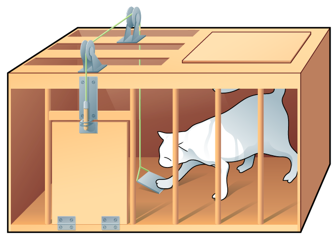
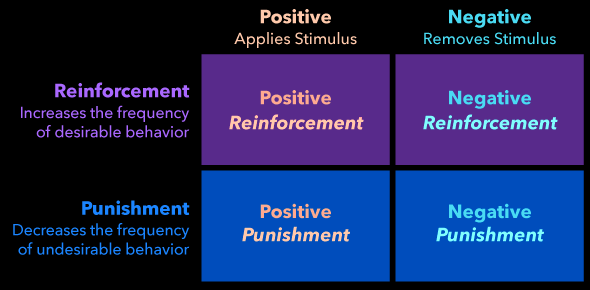
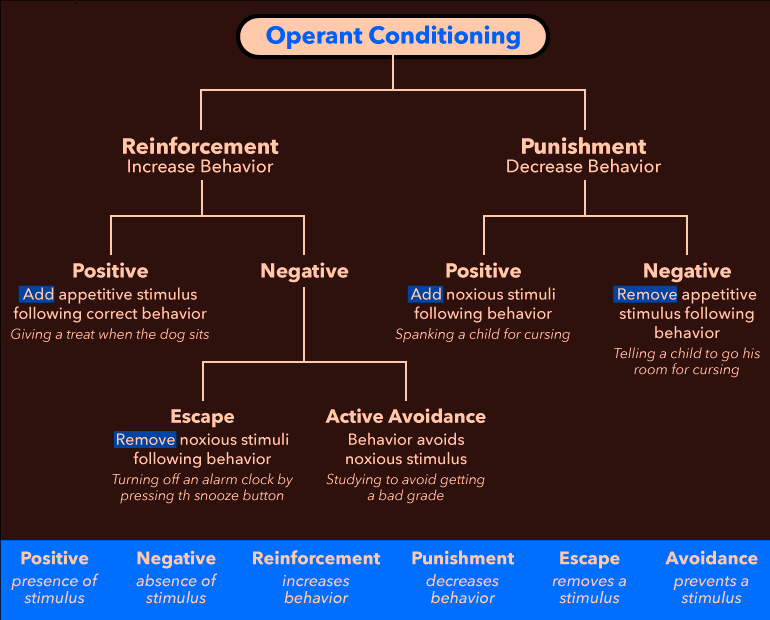
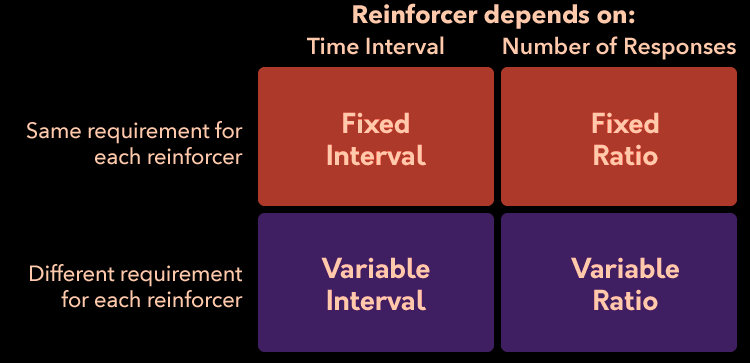
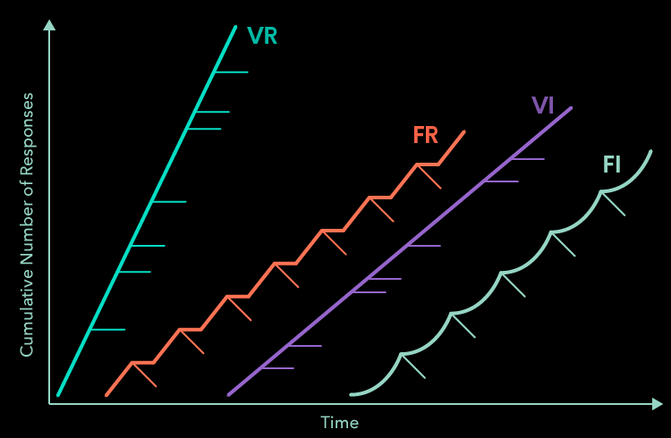
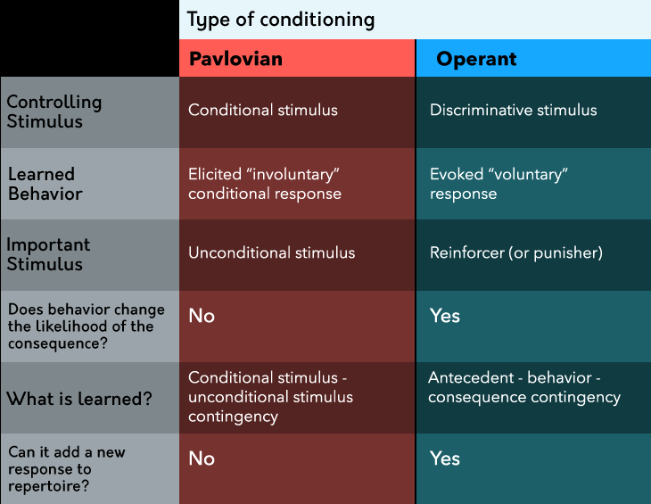

<!-- omit in toc -->
# Learning
- [Summary](#summary)
- [Intro](#intro)
- [Pavlovian Conditioning](#pavlovian-conditioning)
    - [Temporal Conditioning Methods](#temporal-conditioning-methods)
    - [Taste Aversion Learning](#taste-aversion-learning)
    - [Classical Extinction](#classical-extinction)
    - [Conditioned Inhibition](#conditioned-inhibition)
    - [Evaluative Conditioning](#evaluative-conditioning)
    - [Other Stimulus Principles](#other-stimulus-principles)
        - [Generelisation](#generelisation)
        - [Discrimination](#discrimination)
        - [Higher-Order](#higher-order)
    - [Behaviorism](#behaviorism)
        - [Little Albert](#little-albert)
        - [Systematic Desensitisation](#systematic-desensitisation)
- [Operant Conditioning](#operant-conditioning)
    - [Throndike](#throndike)
    - [Skinner](#skinner)
    - [Reinforcement](#reinforcement)
    - [Extinction](#extinction)
    - [Shaping](#shaping)
    - [Reinforcers](#reinforcers)
    - [Scheduling Conseq](#scheduling-conseq)
- [Comparing CC and OC](#comparing-cc-and-oc)
- [Cognitive Psychology](#cognitive-psychology)
    - [Latent Learning](#latent-learning)
    - [Social Learning](#social-learning)

# Summary
- There is a difference between learning and innate responses: Learning is when behavior changes as a result of experience, while innate responses are inborn
- Reflexes can be learned or innate and can be conditioned to occur in response to novel situations
- A stimulus can be any measurable and detectable part of the environment that can produce a response—a behavioral consequence of the stimulus. Unconditional stimuli and responses are produced without learning; that is, they are innate. Conditional stimuli, meanwhile, are signals that predict the occurrence of unconditional stimuli, and conditional responses are behavioral reflexes that occur in anticipation of these unconditional stimuli
- Pavlovian conditioning works to change neutral stimuli into conditional stimuli that predict the occurrence of unconditional stimuli and produce a conditional response
- The time course of conditioning matters: Excitatory conditioning occurs for short-delayed, long-delayed, and trace conditioning, while inhibitory conditioning occurs for simultaneous and backward conditioning
- Superstitions can often be the result of conditioning
- Taste aversion learning appears to be a special case of Pavlovian conditioning related to the relationship between the sense of taste and intestinal distress
- Pavlovian relationships can be unlearned through the process of extinction, although they can spontaneously recover
- Conditioned inhibition is a kind of Pavlovian conditioning related to learning about signals related to safety (the absence of an aversive stimulus)
- Evaluative conditioning helps us relate our positive and negative experiences to neutral stimuli in the environment and shapes the way we emotionally feel toward things based on our experiences; advertising companies often exploit this kind of learning.</li>
- Stimulus generalization and stimulus discrimination are opposites, with the former helping us generalize what we’ve learned to similar circumstances and the latter helping us be more discerning about specific responses
- Higher-order conditioning occurs when neutral stimuli are paired with conditional stimuli we have already learned and is important for explaining phenomena such as the effectiveness of spokespeople in advertisements.</li>
- John B. Watson was an influential figure in the history of psychology for his views about the extent to which conditioning shapes children into the people they eventually become as adults; the “Little Albert” study he and Rosalie Rayner conducted is a strong example of this
- Systematic desensitization is a therapeutic tool that uses the principles of Pavlovian conditioning to treat phobic responses
- Operant (instrumental) conditioning is a kind of learning that explains how we learn about the consequences of our behavior, and therefore, what to do (and what not to do) in certain circumstances
- E. L. Thorndike is famous for his foundational work on operant conditioning with cats in puzzle boxes and establishing the law of effect’s description of the relationship between a situation and the “stamping in” or “stamping out” of a behavior
- B. F. Skinner is the founder of radical behaviorism, which is a perspective that treats cognitive and affective processes (thinking and feeling) like any other physical behavior.</li>
- Skinner’s work on operant conditioning described antecedents as signals that tell us about when our behavior will (or won’t) produce certain consequences.</li>
- When consequences are differential, we learn about the relationship between an antecedent, our behavior, and the consequence more rapidly than when consequences are non-differential.</li>
- There are four types of contingencies between responses and their consequences: positive reinforcement, negative reinforcement, positive punishment, and negative punishment
- Differentiating between these contingencies can be done by asking first whether a behavior is increased (reinforcement) or decreased (punishment), then by whether the consequence was added (positive) or removed (negative) after the behavior
- Escape and avoidance conditioning occur in response to negative reinforcement
- Positive reinforcement is the preferred operant process because it has longer-lasting effects on behavior, and it can be used to direct a person or animal to a “correct” response; punishment should be used as a last resort because it can lead to a host of negative outcomes
- Operant extinction has three behavioral effects: an extinction burst, emotional and aggressive responding, and (eventually) the cessation of responding
- Shaping can be employed to teach a person or animal a new response by rewarding successive approximations of the desired behavior and can result in the learning of complex behaviors, such as landmine-sniffing rats
- Reinforcer tests can determine whether a specific consequence is a reinforcer or a punisher; they are especially useful for evaluating secondary reinforcers.</li>
- Consequences can be scheduled in different ways: The requirement for reinforcement can be fixed or variable and can be based on a number of responses (ratio schedules) or the amount of time that has passed between reinforcements (interval schedules)
- Different kinds of consequence schedules produce different rates of responding and resistance to extinction, with intermittent (variable) reinforcement being more effective in creating long-term behavioral change compared to continuous reinforcement&nbsp;</li>
- Pavlovian and operant conditioning often occur simultaneously; the most important difference is that in Pavlovian conditioning the unconditional stimulus will occur regardless of our behavior, while in operant conditioning the consequence is dependent on the production of the behavior
- Edward C. Tolman first demonstrated latent learning through his experiments with rats’ learning of cognitive maps; rats learned maze layouts, but their learning wasn’t demonstrated until they were motivated to run through the maze
- Albert Bandura demonstrated the process of social learning through his studies of kindergarten students’ tendency to imitate adults who modeled “beating up” a toy called a Bobo doll
- Biological constraints exist on learning, such as biological preparedness to learn specific relationships (such as certain phobias)
- Learned helplessness can occur when an organism learns that its behaviors in a situation are pointless or ineffective

# Intro
<blockquote>

- eugenics: how to artificially breed better human (nazi)
    - adult behavior is complex, children are simple, what happened
    - learning study started 1900 to 1950, the era of nature
- learning: revenge of nurture
</blockquote>

> learning: permanent change in behavior not due to drugs/maturation/injury/disease

- *innate* skills: we're born with them, can't be stopped
    - pull hands away from hot objects
    - => *reflexes*: automatic and simple responses, but can be conditioned
- types of learning
    - *classical/Pavlovian* conditioning
    - *operant* conditioning
    - *latent* learning
    - *social* learning

# Pavlovian Conditioning
<blockquote>

- stimulus/response are paired (eg wife/husband)
- *unconditioned* stimulus/response: starting place (hardwired)
    - food (UCS) -→ digest (UCR)
- *habituation*: UCS -→ UCR weakens
    - eg background noise
    - eg dog with its reflection
</blockquote>

> init: UCS -→ UCR 
> conditioning trials: UCS + CS -→ UCR 
> result: CS -→ CR(UCR but less intense) 

- stimulus: detectable, measurable, can evoke a response

## Temporal Conditioning Methods
- *excitatory* conditioning: CS presented before the UCS
    - *short-delayed*: CS, short delay, UCS
    - *long-delayed*: CS, long delay, UCS
    - *trace*: CS, a VERY LONG TIME, UCS
- *inhibitory*: CR is suppressed
    - *simultaneous*: CS+UCS
    - *backward*: UCS, UCR, CS

## Taste Aversion Learning

- for new food, trace(HUGE delay) works
    - UCS: bacteria
    - UCR: sickness
    - CS: taste
    - CR: nausea

## Classical Extinction
> present CS without UCS => loss of associative strength

- is not unlearning, if stopped for a while, and then present CS, *spontaneous recovery* will happen

## Conditioned Inhibition
> used in horror films/games

- find *safty signals*(conditioned inhibitors) to indicate something will not occur

## Evaluative Conditioning
- UCS can be *appetitive*(pleasant) or *aversive*(unpleasant)
    - people rather choose the pleasant stimulus (emotional)
- EC changes attitudes without aware that we are learning

<blockquote>

- emotional persuasion message
    - central route
        - motivated audience
        - high effort processing (rational)
        - lasting change in attitude
    - peripheral route (use appetitive CC to associate with positive emotion)
        - not motivated
        - low effort (no need to be logical/reasonable)
        - temporary change
</blockquote>

## Other Stimulus Principles
### Generelisation
> notice similarities between stimulus and respond the same

- assimilating something into a category
### Discrimination
> notices differences between stimulus and respond differently

### Higher-Order
> already paired CS is paired with a neutral stimulus

## Behaviorism
> *Watson* (influenced by Pavlov) states psychology should focus only on behavior under various stimilus

### Little Albert
1. shows rat
    - likes rat
3. shows rat with loud noise
    - scared of lound noise
3. repeat
    - scared of rat

### Systematic Desensitisation
> develops *phobias* (irrational fear)

# Operant Conditioning
> operant/instrumental conditioning: the conseq of our behavior matter

## Throndike
> cats learned how to get rewards

- *instrumental* process:
    - interacting with some response option has an effect on the env

- *law* effect:
    - we tend to learn something that associates with what we like
    - tend to not learn what we don't like
    - behavior that yielded satisfying conseq are more likely to recur
    - result in discomfort => less likely
- conseq
    - *satisfaction*: associate a situation with behavior that leads to pleasant
    - *discomfort*: leads to unpleasant

## Skinner
> founded behaivorism

- *antecedents*: situation that makes it possible for us to respond/tells us what we might get for that response
- *behavior*: observable repeatable action
- *conseq*: outcome of behavior
    - *differential* consequences: do 1 receives good, do 2 don't
    - *non-diff* conseq: receive the same
- Ogden Lindsley
-   *dead man test*: if a dead man can do it, it's not a behavior

## Reinforcement
> Skinner deved 4 *contingencies*(if..then..)

- eg PR
    - turn key, start engine
    - check email, receive message
- eg NR
    - leave party, avoid people
    - turn off light, avoid electric cost
- eg PP
    - touch metal surface, receive static shock
    - answer call, meet scammer
- eg NP
    - drive drunk, lose license
    - lie to friend, lose friend

type of NR
- *escape*: something you want to stop is happenening because of your response, you will respond more
    - aversive stimulus present -→ operant response occur -→ stimulus removed
    - eg
        - go to doctor, get medicine (stop sick)
        - run to building, avoid rain (stop be wet)
- *avoiddance*: dont want to happen will happen unless respond, therefore will respond more
    - warning stimulus present -→ operant response-→ scheduled aversive event cancelled
    - eg
        - get vaccine, avoid *potential* flu
        - take umbrella, avoid *potential* rain

- punishment alone doesnt teach what to do to get reinforcers
- punishment = aversive stimulus = pain
- person who uses punishment successfully once will use again
- person who got punished leans to use punishment to control others
- punishment only decrease behavior if applied *immediately*, *every time*, or *large aversive*

## Extinction
> conseq previously followed behavior but not now -→ response less likely to occur

- res prod reinforcer -→ res no longer has effect -→ res decreases
- behavioral effects
    - temporary increase in responding: *extinction burst*
    - emotional/aggressive responding
    - stop responding
- *partial reinforcement extinction effect*
    - when extinct, behavior reinforced *occasionly* lasts longer without conseq than every time

## Shaping
> generate new behavior by breaking down a complex response into smaller steps, and reinforce approx

- typically use a combination of instruction/demostration/shaping to teach new responses

## Reinforcers
> event/stimuli that increases res

- *reinforcer test*(contingency analysis) determine if the conseq is a reinforcer and increases res freq
- *primary*(unconditioned): biologically important conseq
    - eg heat/pain
- *secondary*(conditioned) paired with primary reinforcers

## Scheduling Conseq
> when earn reinforcers

# Comparing CC and OC

# Cognitive Psychology

## Latent Learning
> Tolman: learning that happened but hasn't had an opportunity to be demonstrated

- rat run maze, develop *cognitive map*, then always use shortest path

## Social Learning
> Bandura: *observational learning*, understand what to do by watching others

- phases
    - *attential*: notice model's behavior, might *imitate* the model
    - *retention*: think about performing model's actions
    - *production*: perform the model's action
    - *motivational*: imitated behavior produces same reward as the model -→ will do more

