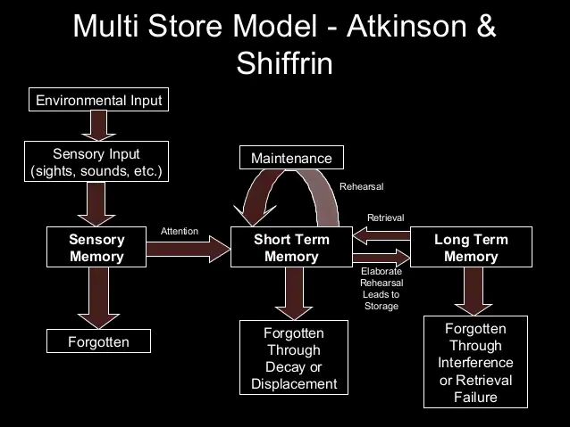
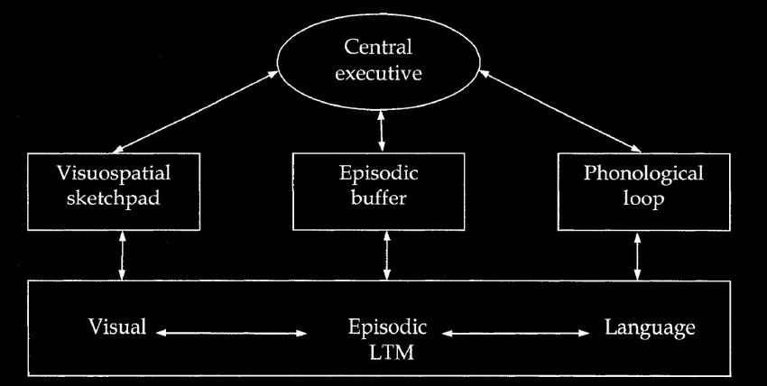
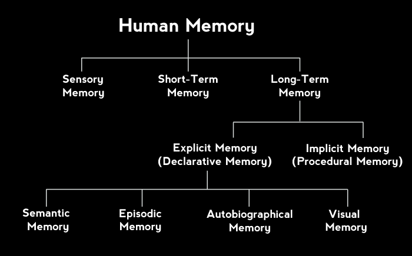

<!-- omit in toc -->
# Memory
- [Summary](#summary)
- [What For?](#what-for)
    - [Search Metaphor](#search-metaphor)
    - [Questioning Search Metaphor](#questioning-search-metaphor)
    - [Thinking about Function](#thinking-about-function)
    - [History](#history)
- [Encoding Memories](#encoding-memories)
    - [Sensory Memory](#sensory-memory)
    - [Immediate Memory](#immediate-memory)
        - [Characteristics](#characteristics)
        - [Model](#model)
- [Long-term Memory](#long-term-memory)
    - [Types](#types)
    - [Transfer to LTM](#transfer-to-ltm)
    - [Effective Encoding Strats](#effective-encoding-strats)
- [Retrieval](#retrieval)
    - [Centrality of Cues](#centrality-of-cues)
        - [Specificity Principle](#specificity-principle)
        - [Transfer Appropriate](#transfer-appropriate)
    - [Implicit Memory](#implicit-memory)
    - [Frederic Barlett](#frederic-barlett)
- [Error and Forgetting](#error-and-forgetting)
    - [Memory Errors](#memory-errors)
        - [Omission](#omission)
        - [Commission](#commission)
- [Forgetting](#forgetting)

# Summary
- Search metaphors are inadequate to describe how our memorysystems work: Reconstruction metaphors, such as “putting together a dinosaur skeleton,” are far moreaccurate
- Sensory memory consists of iconic and echoic functions andallows us to “hold on” to transient information for a brief period of time
- Immediate memory can be described as the “contents ofconsciousness” and can be characterized by representation, duration, and capacity
- The inner eye and inner voice describe two ways in whichimmediate memory are represented; these concepts are analogous to the visuospatial sketchpad andphonological loop of Baddeley’s working memory model, respectively
- The duration of immediate memory is fleeting, lasting only afew seconds without a person employing active rehearsal
- The capacity of immediate memory can be described by measuringmemory span and can be improved through the process of chunking
- Long-term memory can be examined by looking at its threeprimary types: episodic (memory for events), semantic (memory for facts), and procedural (memory foractions or processes)
- Elaborative rehearsal helps transfer information fromimmediate memory to long-term memory, and imagery, organization, distinctiveness, and self-reference areeffective ways to engage in elaborative rehearsal
- Several strategies for effectively encoding informationinclude spacing out learning (spaced practice), using mnemonic techniques, adaptive memory strategies,and retrieval practices
- The cues that are present at encoding and retrieval caninfluence and determine whether we will remember a piece of information, with the encoding specificityprinciple and transfer-appropriate processing describing the role of both context and type of mentalprocessing, respectively
- There are seven “sins” of memory that can be divided into twogroups: errors of omission and errors of commission; these errors describe whether information cannot berecalled (omission) or is recalled incorrectly/inappropriately (commission)
- Interference (both proactive and retroactive) best explainswhy we forget information, and it plays a role in the errors of omission: transience, absent-mindedness,and blocking
- Errors of commission (misattribution, suggestibility, bias,and persistence) occur when we recall information incorrectly or inappropriately and can occur even formajor life-altering events, as is seen in flashbulb memories
- The hippocampus contributes to the formation of long-termmemories: It is heavily involved in episodic memory, but plays a smaller role in proceduralmemory
- Retrograde amnesia refers to refers to losing one's memory ofpast events (e.g., someone hitting their head and not remembering who they are); anterograde amnesiaoccurs when someone cannot form new memories.

# What For?
## Search Metaphor
> *memory*: structures+processes involved in storage+retrieval of information
> *search metaphor*: describe the processes involved in memory using relatable terms and phrases

- remembering: search through the contents of our minds

## Questioning Search Metaphor
- *failure of search*: inability to remember something
- search metaphor is insufficient

## Thinking about Function
> *reconstruction metaphor*: how we primarily use memory to cobble together a useful response using what we know + the situation around us
> *autobiographical memory*: gives continuity to your life as an individual

## History
Weber - perception 
Ebbinghous - forgetting

# Encoding Memories
- *encoding*: transform an experience into memory
- *storage*: maintain information about an event over time

## Sensory Memory
> - keeps information translated by the senses briefly active in a relatively unaltered, unexamined form
> - is thought to feed into the more general immediate memory

- visual: *iconic memory*
- auditory: *echoic memory*
    - sometimes longer than visual

<blockquote>

- *sensory trace*: stimulus remains after is gone
    - termed sensory memory, very short-term
    - studied by George Sperling (iconic memory)
</blockquote>

## Immediate Memory
> actively holds on to a limited amount of information so that it can be manipulated and processed

- aka *short-term/working memory*

### Characteristics
- *inner voice*: talk in your head, evidence for verbal representation in immediate memory
- *inner eye*: see stuff using imagination, evidence for visual representation in immediate memory
- *rehearsal*: repeat information
- *duration*: how long the memory system can contain information
    - indefinite with rehearsal
    - ~3 sec without
- *capacity/memory span*: amount of information held at once
    - 7±2 things
- *chunking*: arrange information into compact and meaningful chunks

### Model

- visuospatial: *iconic memory* (inner eye)
- episodic: *immediate memory*
- phonological lookup: *echoic memory* (inner voice)

# Long-term Memory
> store and recall information over extended periods of time

## Types
- *episodic*: pertain to specific events
- *semantic*: specific facts not based on personal experience
- *procedual*: how something is done (eg motor skills)

## Transfer to LTM
- *elaborative rehearsal*: actively manipulating information in the immediate memory to meaningfully connect it to other information already stored in LTM
- level of processing
    - *deep*: encoding new information through making meaningful connections to existing knowledge
    - *shallow/structural*: based only on its surface characteristics

| Types of Elaboration |            Procedure            |                                 Caution                                  |
| :------------------- | :-----------------------------: | :----------------------------------------------------------------------: |
| **Imagery**          |         imagine a story         | not prefect, not exact representation of reality, tend to be generalised |
| **Organisation**     |      group into categories      |               often leads to mistakes within the category                |
| **Distinctiveness**  | remember the exclusion of order |       time-consuming, hard to remember large amount, use with org        |
| **Self-Reference**   |       Relate to yourself        |      hard with more detailed material, for individualistic cultures      |

## Effective Encoding Strats
memory is the result of processes, can become more effective with practice
- *massed practice*: repreated exposure over a very short period of time/without gaps
    - not effective
    - *spacing effect*: learning is most robust when repeated exposure occurs over a longer timeframe
- *mnemonics*: provide a framework for encoding and recall
- *adaptive memory*: evolutionary, the way that brains are designed to use
- *retrieval practice*: repeated retrieval
- *memory cue*: use something we know to help retrieve

# Retrieval
## Centrality of Cues
> *cue*: helps retrieve information

- *free recall*: without cues
- *cued recall*: with cues

### Specificity Principle
> *encoding specificity principle*:cue is only useful if it matches the original context during encoding

### Transfer Appropriate
> *transfer-appropriate processing*: engaging in similar processes at both encoding and retrieval tends to enhance recall

## Implicit Memory
> remeber without conscious

## Frederic Barlett
- memory is reconstructive
- people remember gist of things, not details

# Error and Forgetting
## Memory Errors
- *error of omission*: information cannot be brought to mind
- *error of commission*: wrong/unwanted information is brought to mind

### Omission
Schacter identified 3 errors of omission:
- *transience*: unable to retrieve information because it has been forgotten (memory decay)
    - 2 interferences that cause forgetting (leads to transience)
        - *retroactive* interference: inability to retrieve older information due to influnce of newer+similar information
        - *proactive* interference: old information interferes with new information
    - time/decay is **not** responsible for transience
- *absent-mindness*: memories sometimes are unavailable because failure to encode them
- *blocking*: not enough distinct cues are available to help recover a specific memory
    - *tip-of-the-tongue*

### Commission
- *misattribution*: incorrectly recall the source of the information
    - *deja vu*: can't remember the source
    - *flashblub memories*: memories for the details surrounding events that are surprising + significant
- *suggestibility*: memories can be altered by context (remembered to better fit the current context)
    - *misinformation effect*: misleading information alters a subsequent memory
- *bias*: memories can change as a result of the influence of knowledeg and beliefs
    - *schemas*: complex knowledge structures that help put information in context, but often leads to overgenerealisation
- *persisitence*: memories can be retrieved when they are not wanted

# Forgetting
- *hyperthymesia*: near perfect autobiographical call
    - has additional connections between amygdala and hippocampus
- *amnesia*: memory loss due to physical damage/problems in the brain
    - *retrograde* amnesia: loss of memories prior to a traumatic event
    - *anterograde* amnesia: inability to encode new information into LTM
        - alcohol => Korsakoff syndrome => anetograde amnesia
    - H.M.
        - had seizure
        - hippocampus removed
        - had anterograde and retrogade amnesia
        - shows distinction between immedaie/LTM and procedural/semantic memory