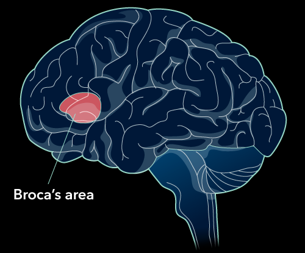
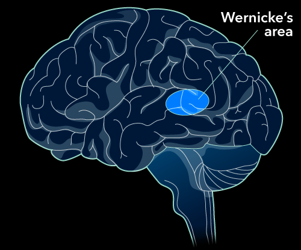

<!-- omit in toc -->
# Languauge And Thoughts
- [Summary](#summary)
- [What is](#what-is)
- [Development](#development)
    - [Theories](#theories)
        - [Nurture](#nurture)
        - [Nature:](#nature)
        - [Emergentist](#emergentist)
- [Language](#language)
    - [Broca's Area](#brocas-area)
    - [Wernicke's Area](#wernickes-area)
- [Classifying Words+Objects](#classifying-wordsobjects)
    - [Influence on Classification](#influence-on-classification)
- [Problem Solving](#problem-solving)
    - [Functional Fixedness](#functional-fixedness)
    - [Strategy](#strategy)
        - [Heuristic](#heuristic)
    - [Creativity](#creativity)
- [Decision Making](#decision-making)
    - [Dual Process](#dual-process)

# Summary
- Language is not only mimicking words, signs, or sounds, but the ability to use grammar, symbols, and demonstrate productivity.
- Productivity is the ability to create novel messages that communicate new ideas.
- Children show a cross-cultural trajectory in the development of language ability, with rapid acquisition occurring in the first years of life and grammatical fine-tuning occurring by age 4–5. (See Table 9.1 for the full sequence.)
- Infants’ auditory systems fine-tune themselves to be sensitive to the sounds present in their native language, as well as important tonal differences in a language (such as in the Mandarin word “ma”).
- Grammar refers to the systematic rules of a language, which importantly includes syntax: The ordering of words in an utterance is important for meaning.
- Behaviorist B.F. Skinner believed that language, or as he called it, “verbal behavior,” could be learned through the application of operant learning theories (e.g., reinforcement of appropriate sounds and non-reinforcement or punishment of inappropriate sounds).
- Child-directed speech is typically more abbreviated and uses a wider range of pitches, which is thought to facilitate the processing of word recognition in infants.
- Environmental factors alone do not seem to be able to explain children’s rapid acquisition of language; as a result, Noam Chomsky and language nativists have argued that our brains have evolved to be specially prepared to acquire language (i.e., they have a built-in "language acquisition device"). Children appear to experience a critical period before age two and a sensitive period after age two when it comes to language acquisition; beginning to learn a language before two results in typical language development, while learning a language in childhood after two is still more effective than attempting to do so later in life.
- Word order tends to be consistent within a language (e.g., subject-verb-object (SOV); boy-dumps-water), and gestural languages tend to use SOV word order.
- The emergentist perspective on language acknowledges the roles of both biology and experience, pointing toward the role of genetics to prepare us for language and the environment’s role in specializing us for the language(s) we hear as children.
- The left hemisphere of the brain appears to be specialized in producing and consciously understanding language.
- Broca’s area in the lower left frontal lobe is responsible for language production, and damage to this area results in non-fluent aphasia (a difficulty producing words).
- Wernicke’s area in the temporal lobe is responsible for conscious language comprehension, and damage to this area results in fluent aphasia (difficulty in conveying meaningful utterances). The average person has 50,000–100,000 words in their mental lexicon, which is organized into related groups using pieces of sound information (phonemes) and pieces of meaningful information (morphemes).
- Semantic networks organize the mental lexicon meaningfully by relating concepts based on their defining features.
- Family resemblance theory argues that we categorize new things in the world by comparing them to “prototypes,” or ideal members of a category; if the new thing resembles the prototype well enough, then it is likely a member of the category.
- The Sapir-Whorf hypothesis, also known as the linguistic relativity hypothesis, posits that the language(s) we speak can also change the way we understand and perceive the world around us.
- Interference with language ability (such as through a mandatory shadowing task) can negatively impact reasoning ability.
- Problems consist of an initial state and a desired goal state and are solved through the application of a particular strategy (an algorithm or heuristic).
- Luchin’s water jar task is an example of a mental set, as participants who perform many iterations of the task tend to prefer a solution that has worked repeatedly, even when another simpler solution exists.
- The Duncker candle problem is an example of functional fixedness, as participants who saw a box presented as a container were less likely to think of using it as a shelf (its function was “fixed” as a container) compared to participants who saw the box presented without anything inside it.
- Algorithms are step-by-step methods of producing a correct solution, while heuristics are short-cuts that often, but not always, lead to correct solutions.
- Common heuristics include the means-end heuristic (continually attempting to minimize the distance between where you are and where you want to be) and the representativeness heuristic (we believe that things are more likely to belong to a category if they are similar to our prior experiences with that category).
- The availability heuristic is based in memory: The more instances of a particular kind of information are available to us, the more common and correct we think that information likely is. Creative processes require preparation (the ability to act) and incubation (time spent not thinking about the problem)—these two stages often result in the illumination stage (a Eureka moment); evaluation is the final step of the creative process in which a potential solution is tested.
- Our decision-making process is often biased, whether because of confirmation bias, framing effects, or other forms of cognitive bias.
- Confirmation bias is the tendency to seek out evidence that confirms our current beliefs and to ignore evidence that does not support our beliefs.
- Framing bias tells us that people's decision-making processes are influenced by the way in which a question is framed.
- System 1 is a quick and automatic component of our reasoning processes that is often simply called intuition; it relies on emotional systems and past experience to help guide the kinds of everyday, automatic decisions we make.
- System 2 is a slow, effortful, and logical component of our reasoning processes that can override the initial instincts of System 1 to help us make more rational decisions based on evidence.

# What is
> grouping of spoken/written/gestured symbols used to convey information

- *productivity*: creation o new messages
- difference between human and animals
    - humans consider long-term consequences of actions
    - humans understand from an early age that they will one day die

# Development
- tonal language rely on pitch and inflection for specific word meaning
- *grammar*: general rules of language
- *syntax*: structure and order of words

- children
    - born: recognise voice of parents (nurture, learning in the womb)
        - lose ability to make distinctions not relevant to the culture (r/l in jpn)
    - 3 mo: make sounds, not mimic the morphemes in any language
    - 4-10 mo: babble
        - not using words, but feels like it (turn-taking, inflection, emotional reaction)
        - learning conversation without knowing the words
    - 8-10 mo: understand some words
    - 9 mo: distinguish between speech and non-speech
        - can attend to speech consistently

## Theories
### Nurture
> B.F.Skinner: speech = verbal behavior (operant conditioning to child's language acquisition)

### Nature:
> *nativism*: certain abilities are build into our brains

- nativists searched for a *language acquisition device* (LAD)
- 1-5 y: *critical/sensitive* period: fully develop language skills
    - necessary for children to receive environmental stimulation to promote healthy development
    - neurological system is more malleable during early development but is still modifiable later in life
- after puberty, if an ind has not learned a second language, they will struggle to learn another later

### Emergentist
> attepmts to bridge the divide between nativist and more environmentalist/behavioral approaches

- humans have a unique, biological capacity for language and exposure
- social pressures and culture can interact with how language develops

# Language
- *Broca's area*: frontal lobe, speech production
- *Wernicke's area*: temporal lobe, speech comprehension

## Broca's Area

- Patient Tan had *Broca's aphasia*: inability to produce speech
- Broca
    -  there may be a module in the brain controlling the production of speech (motor cortex)
    -  language production is predominantly controlled by the left hemisphere (helped explain *hemispheric lateralisation*)

## Wernicke's Area

- Wernicke's patient had *Wernicke's/fluent aphasia*: inability to understand speech
    - prosody(speech patterns) stays intact, but ability to convey meaning is lost

# Classifying Words+Objects
- *mental lexicon*: the storage of words and related concepts
    - organised by using phonemes(smallest unit of sound) and morphemes(smallest unit of language)
- *semantics*: meaning

## Influence on Classification
- *Sapir-Whorf* hypothesis: language can change how we understand and perceive the world around us
    - aka linguistic relativity
    - e.g. russians can see different blues than americans

# Problem Solving
> initial problem + strategy application = desired

- *mental set*: expectation on how to solve a problem can be influnced by prior interaction

## Functional Fixedness
> tendency to view an object as only having one function, negleting to see other usages

## Strategy
> human uses algorithms: set of rules in order to solve a problem

### Heuristic
> short-cut rules that often, but not always, lead to correct solutions

- save time and energy
- *reprenstitive* heuristic: compare something to our stored prototype of an event
- *availability* heuristic: make judgements based on how easily we can remember information

## Creativity
- *preparation*: gather knowledge and proficiency in the task
- *illumination*: peroid of slight pre-awareness, come as a surprise
- *evaluation/incubation*: apply the strategy to the problem

# Decision Making
- *confirmation bias*: tendency to seek out evidence that confirms our current beliefs and to ignore evidence that does not support our beliefs

## Dual Process
- *system 1 thinking* (intuitive): emotional systems, store experience to guide thinking
- *system 2 thinking* (rational): logical thinking
- emotion would likely win over logical thinking